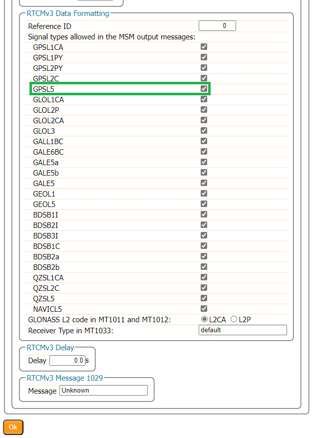

## Supported GNSS Signals
The mosaic-X5 module is capable of receiving most of the GNSS signals from the various frequency bands of each constellation. By default, the module is only configured to track and receive signals (marked in green, in the table below) from specific satellites and frequency bands. Whereas, the signals marked in grey are also supported by the module, but each signal needs to be enabled before they can be utilized for *(differential)* positioning or output RTK correction data as well. Meanwhile, any ~~signals colored in red and striked out~~ are not supported by the mosaic-X5 module; likely due to their proprietary nature, existence outside the module's frequency range, or are under development/recently implemented.

<article style="text-align: center;" markdown>

<table border="1">

<tr>
	<th align="center" rowspan="2" colspan="2" style="min-width: 3rem;"></th>
	<th align="center" colspan="14">Frequency Band</th>
</tr>

<tr>
	<td align="center">L5/E5</td>
	<td align="center" colspan="6">L2</td>
	<td align="center" colspan="2">L6/E6</td>
	<td align="center" colspan="4">L1/E1</td>
	<td align="center">S</td>
</tr>

<tr>
	<th rowspan="7" class="rotate-cell" style="min-width: 3rem;">
		
GNSS Constellation

	</th>
	<td align="center">GPS</td>
	<td align="center" style="background-color:var(--md-default-fg-color--lighter);">L5</td>
	<td align="center" style="background-color:green;color:white;" colspan="2">L2PY</td>
	<td align="center" style="background-color:green;color:white;" colspan="2">L2C</td>
	<td align="center" style="color:red;" colspan="2"><s>L2M</s></td>
	<td align="center" colspan="2"></td>
	<td align="center" style="background-color:green;color:white;">L1CA</td>
	<td align="center" style="background-color:green;color:white;">L1PY</td>
	<td align="center" style="color:red;"><s>L1M</s></td>
	<td align="center" style="color:red;"><s>L1C</s></td>
	<td align="center"></td>
</tr>

<tr>
	<td align="center">GLONASS</td>
	<td align="center"></td>
	<td align="center" style="background-color:var(--md-default-fg-color--lighter);" colspan="2">L3</td>
	<td align="center" style="background-color:green;color:white;" colspan="2">L2P</td>
	<td align="center" style="background-color:green;color:white;" colspan="2">L2CA</td>
	<td align="center" colspan="2"></td>
	<td align="center" style="background-color:green;color:white;" colspan="2">L1CA</td>
	<td align="center" style="color:red;" colspan="2"><s>L1P</s></td>
	<td align="center"></td>
</tr>

<tr>
	<td align="center">Galileo</td>
	<td align="center" style="background-color:green;color:white;">E5a</td>
	<td align="center" style="background-color:green;color:white;" colspan="6">E5b</td>
	<td align="center" style="background-color:var(--md-default-fg-color--lighter);">E6BC</td>
	<td align="center" style="color:red;"><s>E6PRS</s></td>
	<td align="center" style="background-color:green;color:white;" colspan="2">E1BC</td>
	<td align="center" style="color:red;" colspan="2"><s>E1PRS</s></td>
	<td align="center"></td>
</tr>

<tr>
	<td align="center">Beidou</td>
	<td align="center" style="background-color:var(--md-default-fg-color--lighter);">B2a</td>
	<td align="center" style="background-color:var(--md-default-fg-color--lighter);" colspan="3">B2b</td>
	<td align="center" style="background-color:green;color:white;" colspan="3">B2I</td>
	<td align="center" style="background-color:green;color:white;" colspan="2">B3I</td>
	<td align="center" style="background-color:green;color:white;" colspan="2">B1I</td>
	<td align="center" style="background-color:var(--md-default-fg-color--lighter);" colspan="2">B1C</td>
	<td align="center"></td>
</tr>

<tr>
	<td align="center">SBAS</td>
	<td align="center" style="background-color:green;color:white;">L5</td>
	<td align="center" colspan="6"></td>
	<td align="center" colspan="2"></td>
	<td align="center" style="background-color:green;color:white;" colspan="4">L1</td>
	<td align="center"></td>
</tr>

<tr>
	<td align="center">QZSS</td>
	<td align="center" style="background-color:var(--md-default-fg-color--lighter);">L5</td>
	<td align="center" style="background-color:green;color:white;" colspan="6">L2C</td>
	<td align="center" style="color:red;"><s>L6E/LEX</s></td>
	<td align="center" style="color:red;"><s>L6D</s></td>
	<td align="center" style="background-color:green;color:white;">L1CA</td>
	<td align="center" style="background-color:green;color:white;">L1C</td>
	<td align="center" style="color:red;"><s>L1S/SAIF</s></td>
	<td align="center" style="color:red;"><s>L1Sb</s></td>
	<td align="center" style="color:red;"><s>S</s></td>
</tr>

<tr>
	<td align="center">Navic</td>
	<td align="center" style="background-color:var(--md-default-fg-color--lighter);">L5</td>
	<td align="center" colspan="6"></td>
	<td align="center" colspan="2"></td>
	<td align="center" colspan="4"></td>
	<td align="center" style="color:red;"><s>S</s></td>
</tr>

</table>

</article>

!!! info "Legend for GNSS Signals"
	- Supported; Enabled by default
	- Supported; Not enabled by default
	- ~~**Not supported**~~

## Enabling Signal Reception
Below, are instructions to configure the mosaic-X5 module to receive any of the supported GNSS signals that aren't enabled by default.

### Web Interface

!!! warning "Enabling the GPS-L5 Signal"
	Currently, the GPS-L5 service is pre-operational and marked as *"unhealthy"*; therefore, extra configuration steps are required to enable this frequency band.

	From the **Admin** tab, click on **Expert Control** from the drop-down menu. Then, navigate through the **Control Panel** > **Navigation** > **Receiver Operation** > **Masks** menus to find the `Discard unhealthy satellites` setting. Set both the **Tracking** and **PVT** options to `off`, from their drop-down menus.

	<figure markdown>
	[{ width="400" }](./assets/img/hookup_guide/L5_step1.png "Click to enlarge")
	<figcaption markdown>
	Enabling the tracking and PVT use of signals from "unhealthy" satellites.
	</figcaption>
	</figure>

Through the web interface, users will need to access the advanced settings of the configuration menu by clicking on the **Expert Control** option from the **Admin** tab's drop-down menu. Then, navigate through the **Control Panel** > **Navigation** > **Advance User Settings** menus.

> **Tracking** > **Signal Tracking** : Enable GPSL5 signal tracking

<figure markdown>
[{ width="400" }](./assets/img/hookup_guide/L5_step2.png "Click to enlarge")
<figcaption markdown>
[L5 Configuration - Step 2 (PNG)](./assets/img/hookup_guide/L5_step2.png).
</figcaption>
</figure>

**Navigation > Advance User Settings > PVT > Signal Usage** - Enable GPSL5 in both “PVT” and “navigation data decoder”

<figure markdown>
[{ width="400" }](./assets/img/hookup_guide/L5_step3.png "Click to enlarge")
<figcaption markdown>
[L5 Configuration - Step 3 (PNG)](./assets/img/hookup_guide/L5_step3.png).
</figcaption>
</figure>

!!! info
	Make sure to click the ++"OK"++ button at the bottom of each page, where you are making changes to update the current configuration. Also, don’t forget to save it to boot, if you want the configuration to persist when you cycle power.

### Command Interface

!!! warning "`GPS-L5` Signal"
	Since the GPS-L5 service is currently pre-operational and marked as *"unhealthy"*, it takes some extra configuration steps to enable the GPS-L5 frequency band and corrections.

	- **`setHealthMask, Tracking, off`**
	- **`setHealthMask, PVT, off`**

- **`setSignalTracking, +GPSL5`**
- **`setSignalUsage, +GPSL5, +GPSL5`**

## Output L5 Corrections
Below, are instructions for outputting RTK corrections for the GPS L5 frequency band, from the RTK mosaic-X5.

!!! warning
	The RTK mosaic-X5 must be configured to receive those GNSS signals *(see instructions above)*; otherwise, it won't have any data to provide the corrections with.

### Web Interface

From the drop-down menu of the **Corrections** tab of the web interface, select **Corrections** > **Corrections Output** to bring up the corrections output settings. On this page, locate the **Advanced Settings** menu, where users can define the data intervals and formatting. Clicking on this will prompt a security dialog box to pop up, click the ++"Proceed"++ button to make changes to these settings. RTK corrections for the GPS L5 frequency band are only available in the RTCMv3 messages; therefore, users will need to select the **RTCMv3** tab.

<figure markdown>
[{ width="400" }](./assets/img/hookup_guide/RTCM_output_2.png "Click to enlarge")
<figcaption markdown>
[Advanced settings for RTCMv3 Output (PNG)](./assets/img/hookup_guide/RTCM_output_2.png).
</figcaption>
</figure>

Scroll down to the **RTCMv3 Data Formatting** section, select the box next to the `GPSL5` to enable the RTK corrections for the GPS L5 frequency band. In the example below, we have enable all the available signals to be included in the MSM output messages.

<figure markdown>
[{ width="400" }](./assets/img/hookup_guide/RTCM_output_2.png "Click to enlarge")
<figcaption markdown>
[Advanced settings for RTCMv3 Data Formatting (PNG)](./assets/img/hookup_guide/RTCM_output_3.png).
</figcaption>
</figure>

!!! tip
	Make sure to click the ++"OK"++ button at the bottom of each page, where you are making changes to update the current configuration. Also, don’t forget to save it to boot, if you want the configuration to persist when you cycle power.

### Command Interface

* **`setRTCMv3Formatting, 0, +GPSL5`**
