Commercial RTK correction services are great. But there will be times when you want to generate your own correction data so you can share it with your Rover(s) with the shortest baselines. Put simply, an RTK Base knows where it is and - based on its location - can share satellite signal correction data with local Rovers, to allow them to achieve centimeter-level positioning.

For RTK to work, the Base station antenna location is needed to calculate an accurate and reliable position. How do we do that?

In this section, we discuss two different ways of establishing the Base station antenna position: temporary and fixed.

## Temporary Base

The mosaic-X5 can be set to "Static" mode and can determine the antenna location (reference position) *automatically*. This is equivalent to "Survey-In" on u-blox GNSS modules. The module will refine its estimate of the antenna position and use that to generate correction data for Rovers.

<figure markdown>
[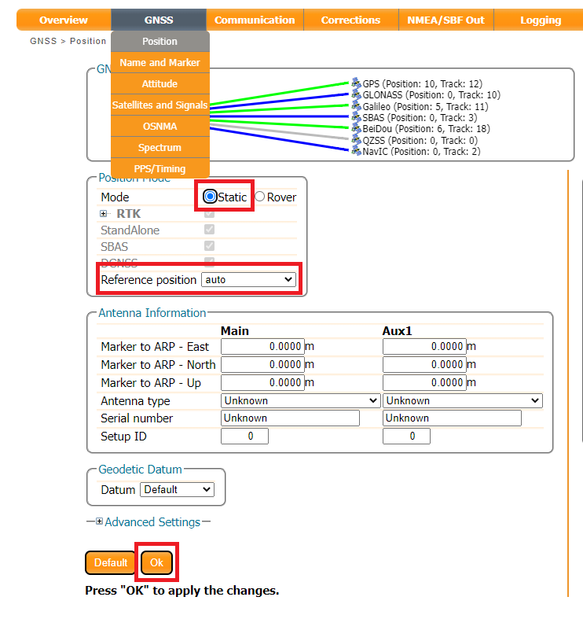{ width="400" }](./assets/img/hookup_guide/auto_reference_position.jpg "Click to enlarge")
<figcaption markdown>
[Selecting the auto reference position (JPG)](./assets/img/hookup_guide/auto_reference_position.jpg).
</figcaption>
</figure>

!!! info
    In this mode the module refines its estimate of the antenna position; a new antenna position will be calculated each time the mosaic-X5 is restarted. For this reason, the auto function should only be used to generate a temporary base antenna location.

## Fixed Base

The best way to determine the base antenna location is to: log raw GNSS signal data for typically 24 hours, convert it to RINEX format and then submit it to a Precise Point Positioning (PPP) post-processing service such as:

* [NRCAN](https://webapp.csrs-scrs.nrcan-rncan.gc.ca/geod/tools-outils/ppp.php)
* [OPUS](https://www.ngs.noaa.gov/OPUS/)
* [APPS](https://pppx.gdgps.net/)

There are some great articles written about PPP. Here we are just covering the essentials. For more information check out:

* Gary Miller’s great [PPP HOWTO](https://gpsd.gitlab.io/gpsd/ppp-howto.html)
* Suelynn Choy, [GNSS PPP](https://www.unoosa.org/documents/pdf/icg/2018/ait-gnss/16_PPP.pdf)

Once the precise antenna position is known, it can be programmed into the module. The corrections the module generates will then be based on that precise, fixed antenna position.

First, let's check what Datum the module is using. It defaults to **WGS84/ITRS**. In North America, it might be better to select **NAD83** but here we'll go with the default.

<figure markdown>
[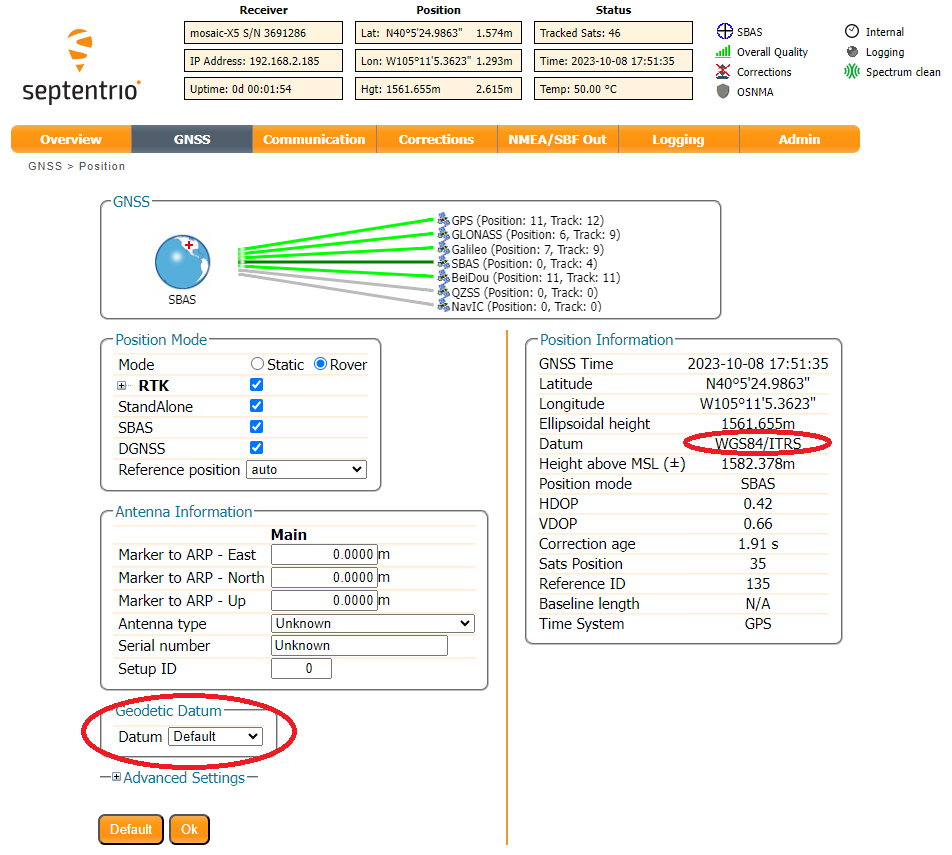{ width="400" }](./assets/img/hookup_guide/RINEX0.png "Click to enlarge")
<figcaption markdown>
[Check the datum (PNG)](./assets/img/hookup_guide/RINEX0.png).
</figcaption>
</figure>

Set up an SBF logging stream to log **PostProcess**, **Rinex**, **Rinex (meas3)** with an interval of 1 sec:

<figure markdown>
[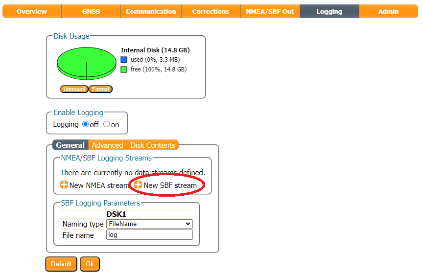{ width="400" }](./assets/img/hookup_guide/RINEX1.png "Click to enlarge")
<figcaption markdown>
[Selecting the logging stream (PNG)](./assets/img/hookup_guide/RINEX1.png).
</figcaption>
</figure>

<figure markdown>
[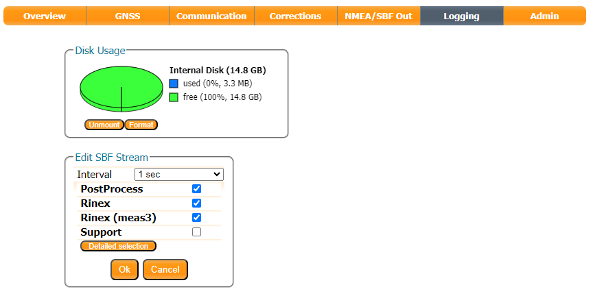{ width="400" }](./assets/img/hookup_guide/RINEX2.png "Click to enlarge")
<figcaption markdown>
[Selecting the logging stream (PNG)](./assets/img/hookup_guide/RINEX2.png).
</figcaption>
</figure>

The **IGS24H** Naming Type is useful. When selected, the mosaic-X5 will log data in intervals of 24 hours, opening a new file at UTC midnight.

<figure markdown>
[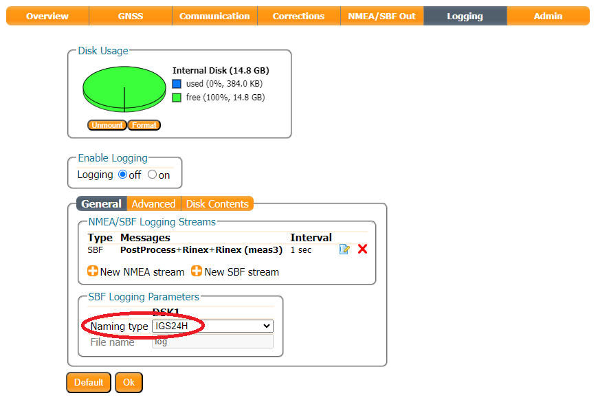{ width="400" }](./assets/img/hookup_guide/RINEX3.png "Click to enlarge")
<figcaption markdown>
[Selecting the logging stream (PNG)](./assets/img/hookup_guide/RINEX3.png).
</figcaption>
</figure>

Use the **Enable Logging** radio button to start logging data, or press the **LOG** pushbutton. The red LOG LED will blink while data is being logged.

Use the **Disk Contents** tab to download the SBF data to your computer. Click the green arrow to download an individual file. Or - if the file is large - dismount the disk, eject it and use your computer to copy the files from microSD manually.

<figure markdown>
[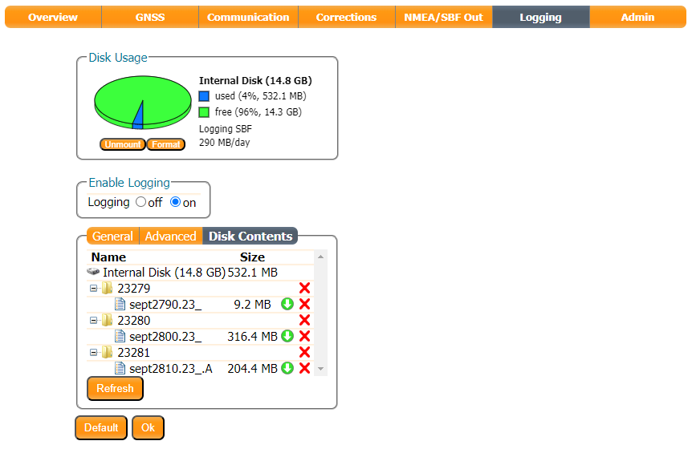{ width="400" }](./assets/img/hookup_guide/RINEX4.png "Click to enlarge")
<figcaption markdown>
[Downloading the logging data (PNG)](./assets/img/hookup_guide/RINEX4.png).
</figcaption>
</figure>

Use the **RxTools** \ **SBF Converter** utility to convert the data to RINEX format.

<figure markdown>
[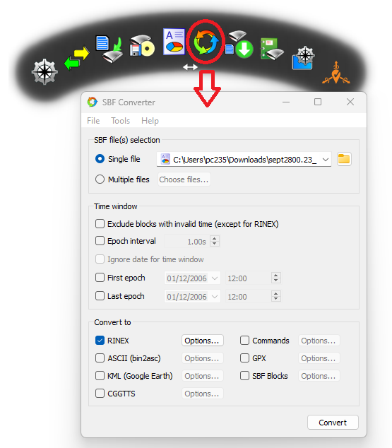{ width="400" }](./assets/img/hookup_guide/RINEX5.png "Click to enlarge")
<figcaption markdown>
[Convert to RINEX (PNG)](./assets/img/hookup_guide/RINEX5.png).
</figcaption>
</figure>

Upload the RINEX data to your chosen PPP post-process service. We have found [NRCAN](https://webapp.csrs-scrs.nrcan-rncan.gc.ca/geod/tools-outils/ppp.php) is very easy to use and produces excellent results. We select the **ITRF** tab because we are using the WGS84/ITRS datum. (If you are using NAD83, select that tab instead.)

<figure markdown>
[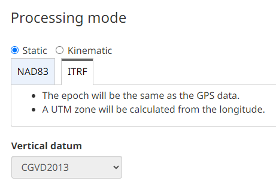{ width="400" }](./assets/img/hookup_guide/CSRS-PPP.png "Click to enlarge")
<figcaption markdown>
[Select the datum for post-processing (PNG)](./assets/img/hookup_guide/CSRS-PPP.png).
</figcaption>
</figure>

After you have uploaded your RINEX data, it only takes a few minutes to receive your antenna position:

<figure markdown>
[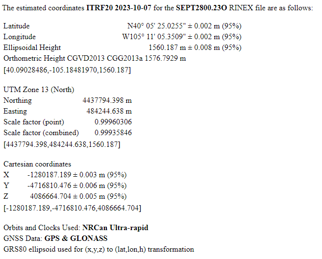{ width="400" }](./assets/img/hookup_guide/RINEX6.png "Click to enlarge")
<figcaption markdown>
[Precise antenna position (PNG)](./assets/img/hookup_guide/RINEX6.png).
</figcaption>
</figure>

Both [OPUS](https://www.ngs.noaa.gov/OPUS/) and [APPS](https://pppx.gdgps.net/) have file size limits. You can shrink the size of the RINEX file by selecting (e.g.) a 30-second Epoch Interval in **SBF Converter**:

<figure markdown>
[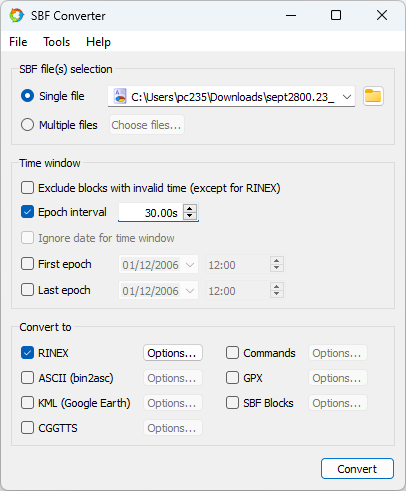{ width="400" }](./assets/img/hookup_guide/epoch_30.png "Click to enlarge")
<figcaption markdown>
[Setting the Epoch interval (PNG)](./assets/img/hookup_guide/epoch_30.png).
</figcaption>
</figure>

Using a smaller, 30-second file [OPUS](https://www.ngs.noaa.gov/OPUS/)' ITRF results match NRCAN to within a cm:

<figure markdown>
[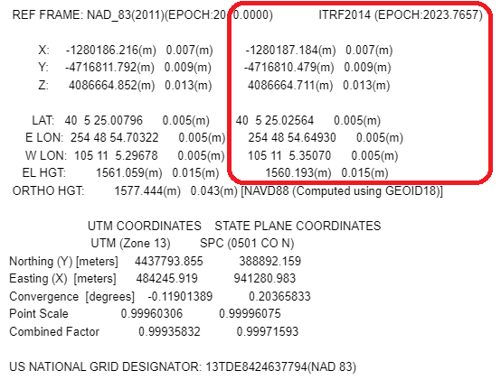{ width="400" }](./assets/img/hookup_guide/OPUS.png "Click to enlarge")
<figcaption markdown>
[Precise antenna position (PNG)](./assets/img/hookup_guide/OPUS.png).
</figcaption>
</figure>

We can now store those coordinates in the mosaic-X5 module memory, either as **Geodetic** (Latitude, Longitude, Altitude) or **Cartesian** (ECEF X/Y/Z) coordinates. The mosaic-X5 allows you to store 5 of each.

<figure markdown>
[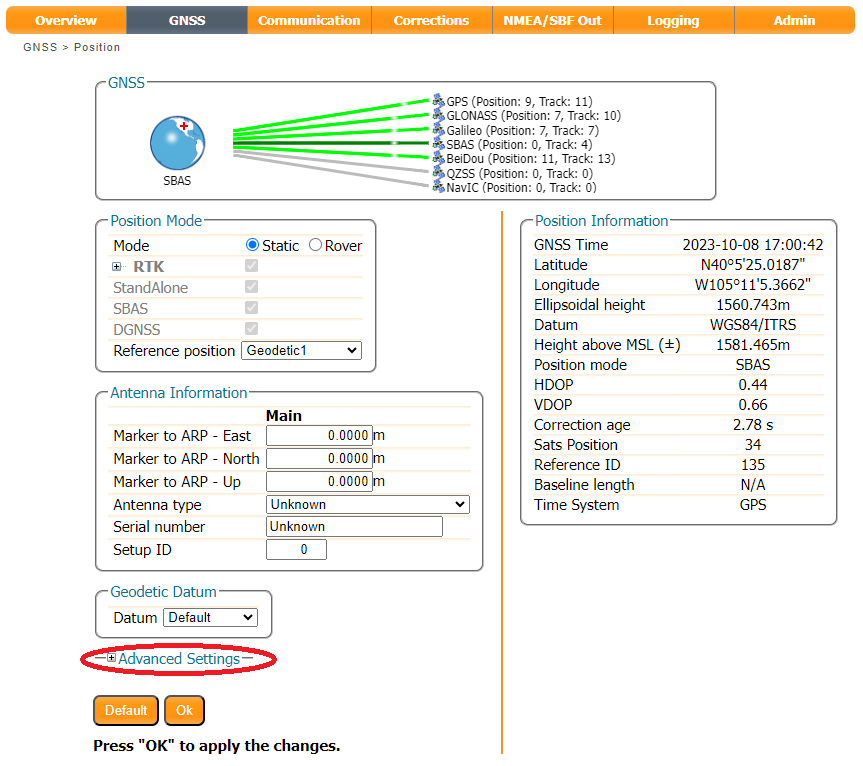{ width="400" }](./assets/img/hookup_guide/RINEX7.png "Click to enlarge")
<figcaption markdown>
[Setting the fixed position (PNG)](./assets/img/hookup_guide/RINEX7.png).
</figcaption>
</figure>

<figure markdown>
[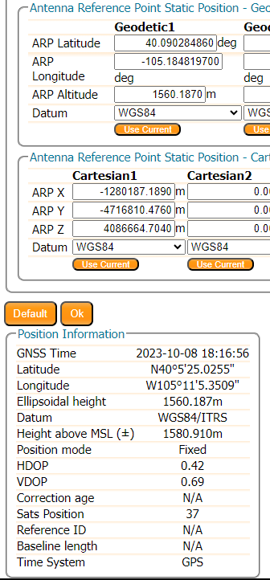{ width="400" }](./assets/img/hookup_guide/RINEX8.png "Click to enlarge")
<figcaption markdown>
[Setting the fixed position (PNG)](./assets/img/hookup_guide/RINEX8.png).
</figcaption>
</figure>

We can now generate corrections using that static / fixed antenna position.

<figure markdown>
[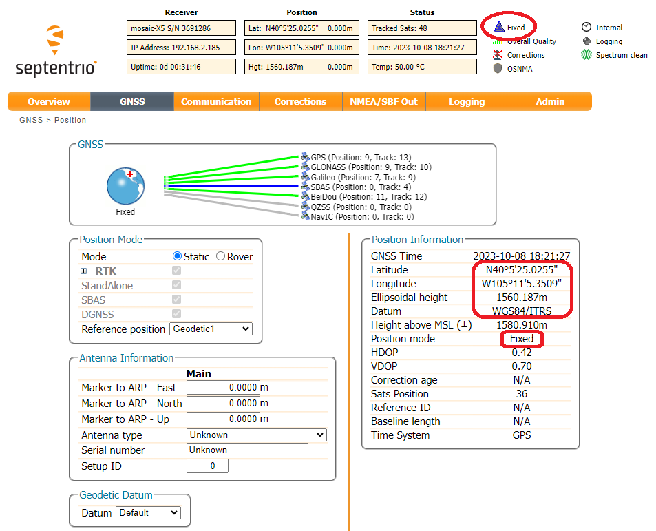{ width="400" }](./assets/img/hookup_guide/RINEX9.png "Click to enlarge")
<figcaption markdown>
[Setting the fixed position (PNG)](./assets/img/hookup_guide/RINEX9.png).
</figcaption>
</figure>

