!!! warning
	When assembling the RTK mosaic-X5, users should attach any power connections last. While there shouldn't be any issues with hot-swapping peripherals, it is common practice to power electronics as the last step of the assembly process *(and the power should be disconnected before removing components)*.

??? info "What is in the Box?"
	The RTK mosaic-X5 comes packaged as a complete kit, with all the accessories you'd need to set up an RTK base station.

	<figure markdown>
	[{ width="300" }](https://cdn.sparkfun.com//assets/parts/2/4/0/7/2/23748-RTK-Mosaic-X5-Kit-All-Feature.jpg "Click to enlarge")
	<figcaption markdown>
	Everything that is included in the RTK mosaic-X5 kit.
	</figcaption>
	</figure>

	Inside the box, users will find the [GNSS antenna](https://www.sparkfun.com/products/21801), RTK mosaic-X5 in its aluminum enclosure, and another box containing additional accessories. Inside, the accessory box, users will find the [CAT-6 Ethernet cable](https://www.sparkfun.com/products/8915), [USB cable](https://www.sparkfun.com/products/15424), [SMA to TNC cable](https://www.sparkfun.com/products/21740), [USB power supply](https://www.sparkfun.com/products/11456), [WiFi antenna](https://www.sparkfun.com/products/145), and [32GB SD card](https://www.sparkfun.com/products/19041).

	

	

	<figure markdown>
	[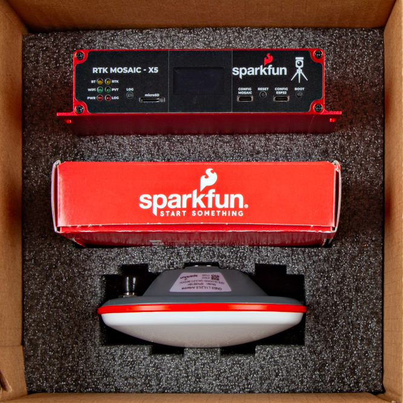{ width="300" }](./assets/img/hookup_guide/packaged_box.jpg "Click to enlarge")
	<figcaption markdown>
	The contents of the RTK mosaic-X5 package.
	</figcaption>
	</figure>

	

	

	<figure markdown>
	[{ width="300" }](https://cdn.sparkfun.com//assets/parts/2/4/0/7/2/23748-RTK-Mosaic-X5-Kit-Accessories.jpg "Click to enlarge")
	<figcaption markdown>
	Products in the accessories box.
	</figcaption>
	</figure>

	

	

## USB-C Ports
The USB ports are utilized to configure the mosaic-X5 module and ESP32 WiFi settings. Additionally, the USB ports can also be used as a power source for the RTK mosaic-X5.

<!-- Reworded
The USB port for the mosaic-X5 is used for serial communication to stream the GNSS data and to access the SD card as a mass storage device. With the default firmware, the USB port for the ESP32 is used for serial communication to configure the network settings of the Ethernet-to-WiFi bridge.
-->

The USB port to the mosaic-X5 can be used to configure the module through an IP port, for serial communication to stream the GNSS data, and access the SD card as a mass storage device. To connect to the mosaic-X5, users only need to plug a USB-C cable into the `CONFIG MOSAIC` USB port and their computer.

<figure markdown>
[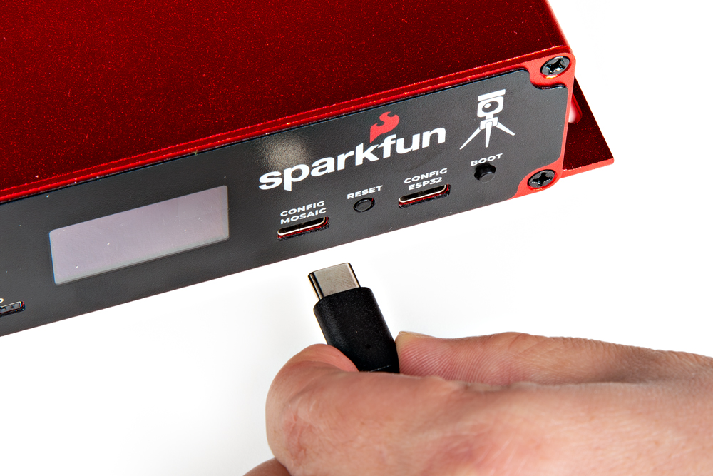{ width="400" }](./assets/img/hookup_guide/assembly-usb-mosaic.jpg "Click to enlarge")
<figcaption markdown>The RTK mosaic-X5 with USB-C cable being attached.</figcaption>
</figure>

With the default firmware, the USB port for the ESP32 is used for serial communication to configure the network settings of the Ethernet-to-WiFi bridge. To configure the network settings for the ESP32, users only need to plug a USB-C cable into the `CONFIG ESP32` USB port and their computer.

<figure markdown>
[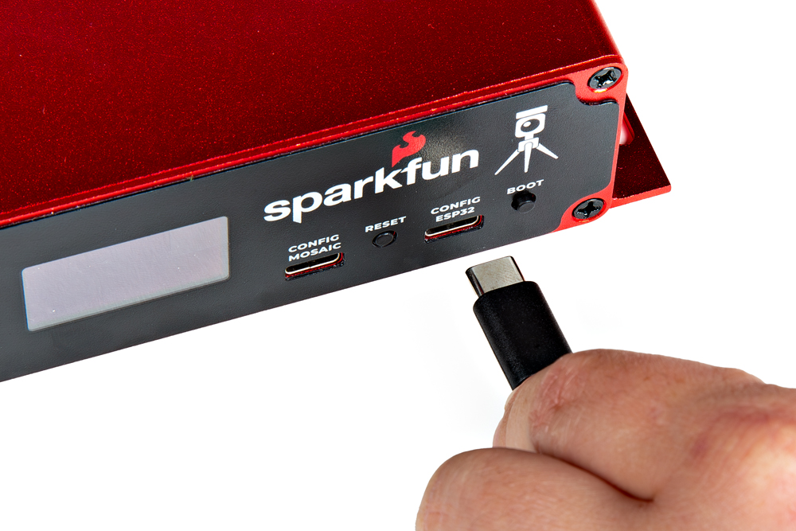{ width="400" }](./assets/img/hookup_guide/assembly-usb-esp32.jpg "Click to enlarge")
<figcaption markdown>The RTK mosaic-X5 with USB-C cable being attached.</figcaption>
</figure>

!!! tip "Software Requirements"
	Depending on their computer's operating system, users may need to install USB drivers to interface with the mosaic-X5 and/or the ESP32. Users may also need to install a terminal emulator for serial communication with the mosaic-X5 and the ESP32.

## Antennas

In order to receive [GNSS](https://en.wikipedia.org/wiki/Satellite_navigation "Global Navigation Satellite System") signals, users will need a compatible antenna. With the parts included in this kit, connect the L1/L2/L5 (tri-band) GNSS antenna to the RTK mosaic-X5 using the TNC-to-SMA cable.

<figure markdown>
[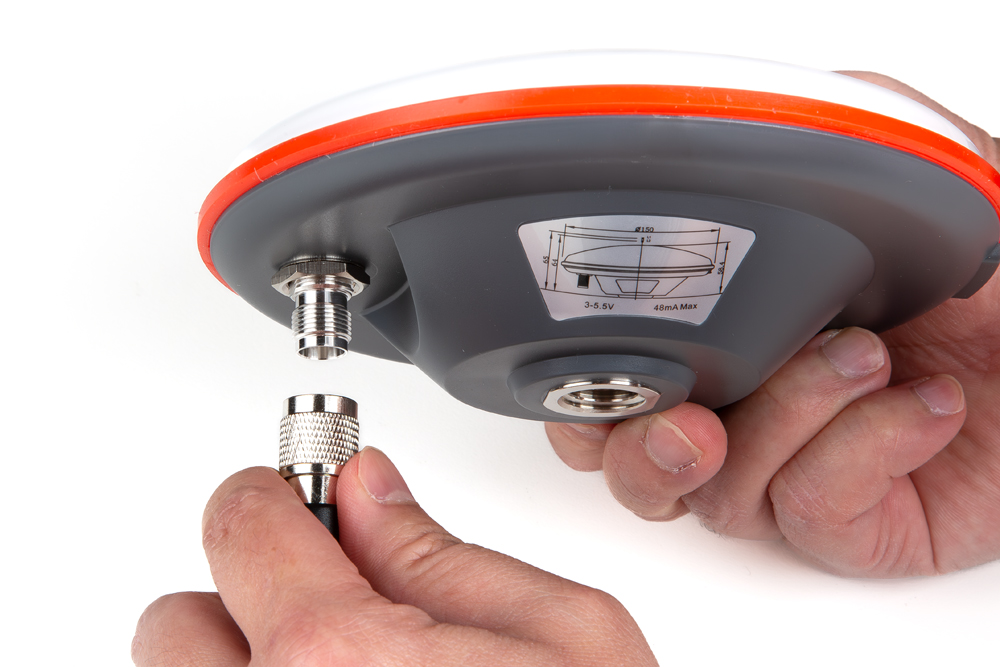{ width="400" }](./assets/img/hookup_guide/assembly-gnss-tnc.jpg "Click to enlarge")
<figcaption markdown>Attaching a tri-band GPS antenna to the TNC-SMA cable.</figcaption>
</figure>

<figure markdown>
[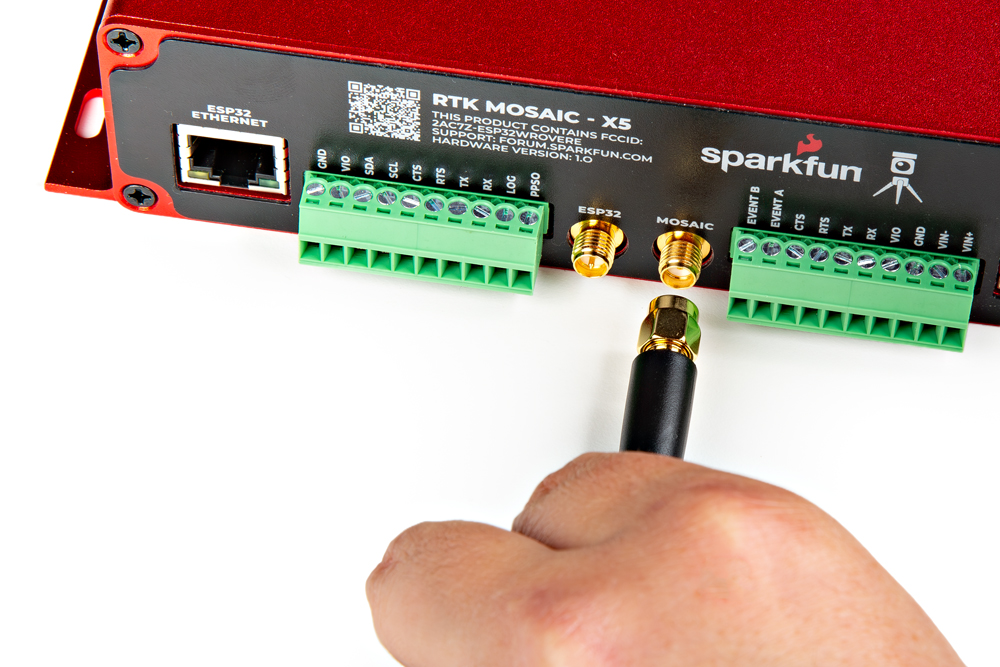{ width="400" }](./assets/img/hookup_guide/assembly-gnss_antenna.jpg "Click to enlarge")
<figcaption markdown>Attaching a TNC-SMA cable to the SMA connector on the RTK mosaic-X5.</figcaption>
</figure>

For the WiFi connection, users will need a compatible antenna. Connect the WiFi antenna, included in this kit, to the RTK mosaic-X5.

<figure markdown>
[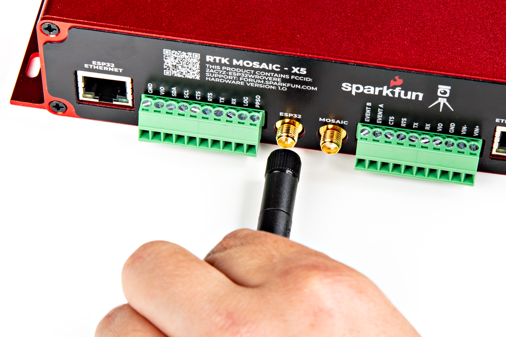{ width="400" }](./assets/img/hookup_guide/assembly-wifi_antenna.jpg "Click to enlarge")
<figcaption markdown>Attaching a 2.4GHz WiFi antenna to the RP-SMA connector on the RTK mosaic-X5.</figcaption>
</figure>

!!! warning "WiFi Network Compatibility"
	The ESP32 is only compatible with 2.4GHz bands and cannot access the 5GHz band.
	The ESP32 firmware we provide is only compatible with basic `SSID` and `Password` WiFi authentication.

	* The firmware is not compatible with networks that implement other provisioning methods such as a [captive portal](https://en.wikipedia.org/wiki/Captive_portal), a QR code, or [Wi-Fi protected setup](https://en.wikipedia.org/wiki/Wi-Fi_Protected_Setup "WPS").

??? tip "Mounting Location"
	Users should mount their GNSS antenna outside, where it will have a clear, unobstructed view of the sky. Avoid areas with nearby buildings, EMF structures (i.e. radio towers or power lines), and vegetation (i.e. trees). These objects can increase errors due to signal muti-path, interference, and elevated noise plane.

	<figure markdown>
	[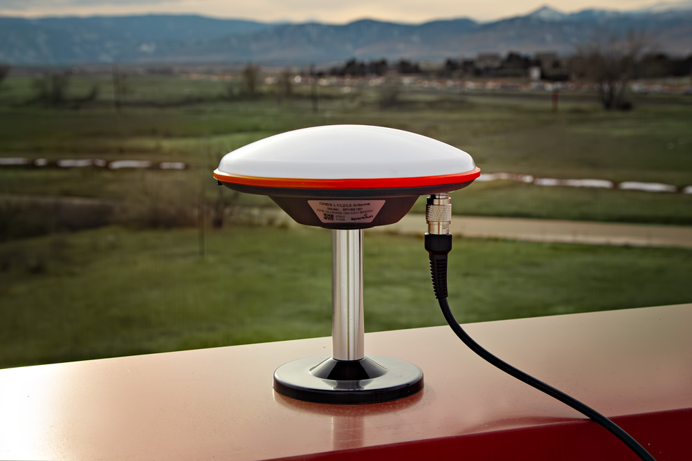{ width="400" }](./assets/img/hookup_guide/assembly-gnss-mount_location.jpg "Click to enlarge")
	<figcaption markdown>The tri-band GPS antenna, mounted outside with an unobstructed view of the sky.</figcaption>
	</figure>

??? tip "Connector Polarity"
	When selecting antennas and/or cables for the RTK mosaic-X5, double-check the polarity of the connection.

## Ethernet Jacks
There are two ethernet jacks on the RTK mosaic-X5, which can be used to provide network access to the mosaic-X5 module. In addition, one of the ethernet jacks supports [power over ethernet (PoE)](https://en.wikipedia.org/wiki/Power_over_Ethernet "PoE") to power the device.

=== "Basic Network"
	The jack to the mosaic-X5 allows users to provide internet access and power; it supports [PoE](https://en.wikipedia.org/wiki/Power_over_Ethernet "Power over Ethernet"). To provide network access, users should connect the RTK mosaic-X5 from the `MOSAIC ETHERNET (PoE)` jack to their local network with the (CAT-6) ethernet cable provided in the kit.

	* To power the device, a PoE network switch or PoE injector should be installed in between the network connection to the RTK mosaic-X5.
	<!-- * For a WiFi connection, connect the provided (CAT-6) ethernet cable between the `MOSAIC ETHERNET (PoE)` and `ESP32 ETHERNET` jacks on the RTK mosaic-X5. -->

	<figure markdown>
	[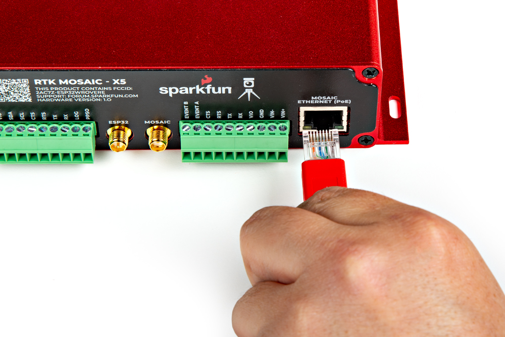{ width="400" }](./assets/img/hookup_guide/assembly-ethernet-mosaic.jpg "Click to enlarge")
	<figcaption markdown>The RTK mosaic-X5 with ethernet cable being attached to the `MOSAIC ETHERNET (PoE)` jack.</figcaption>
	</figure>

=== "WiFi Bridge"
	The jack to the ESP32 allows users to provide WiFi access to the mosaic-X5, by utilizing the ESP32 as a WiFi network bridge.

	<figure markdown>
	[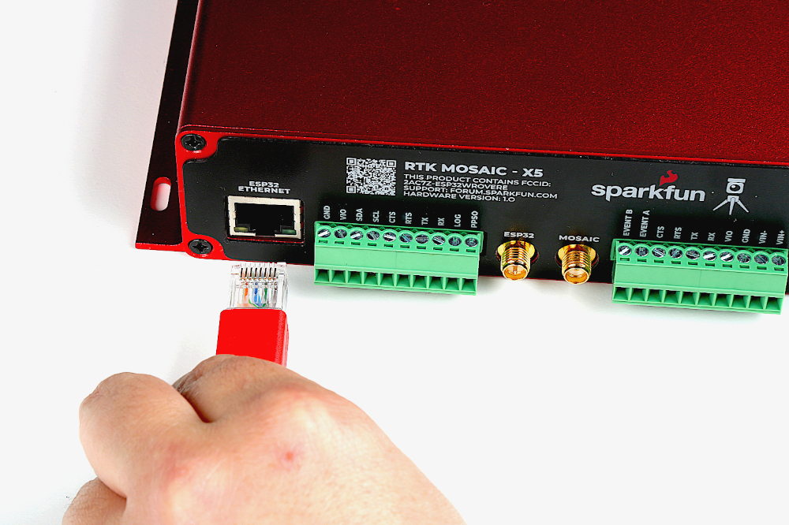{ width="400" }](./assets/img/hookup_guide/assembly-ethernet-esp32.jpg 	"Click to enlarge")
	<figcaption markdown>The RTK mosaic-X5 with an ethernet cable being attached to the `ESP32 ETHERNET` jack.</figcaption>
	</figure>

	To set up the WiFi bridge, connect the provided (CAT-6) ethernet cable between the `MOSAIC ETHERNET (PoE)` and `ESP32 ETHERNET` jacks on the RTK mosaic-X5.

	<figure markdown>
	[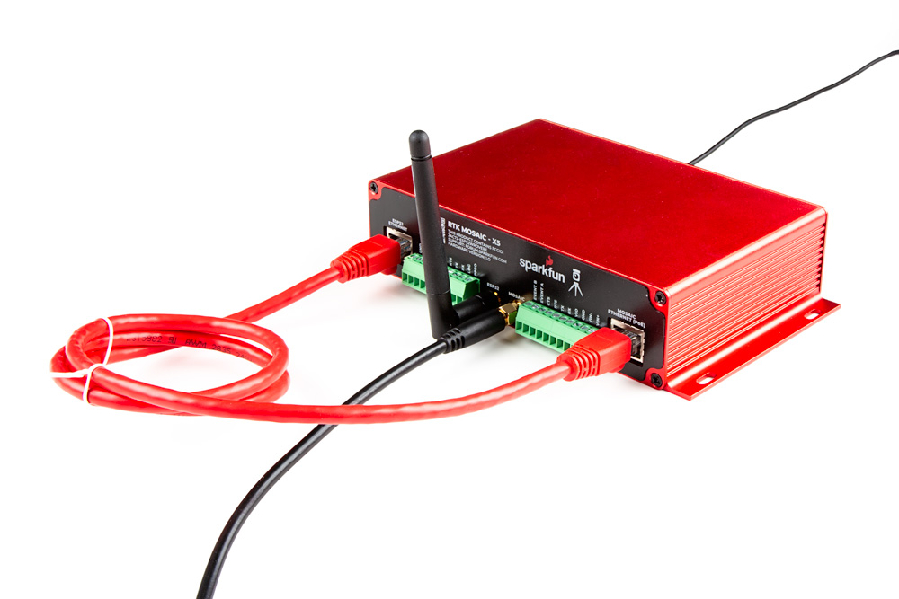{ width="400" }](./assets/img/hookup_guide/assembly-wifi_bridge.jpg "Click to enlarge")
	<figcaption markdown>The RTK mosaic-X5 with an ethernet cable connected between the `MOSAIC ETHERNET (PoE)` and `ESP32 ETHERNET` jacks.</figcaption>
	</figure>

	??? tip "Configure WiFi Connection"
		Users will need to configure the WiFi connection for the ESP32, through the `CONFIG ESP32` USB-C port.

	??? warning "Cable Management"
		Users should avoid wrapping the ethernet cable around the WiFi antenna; doing so will result in the loss of data packets and cause the web page to freeze. If users must coil the wiring, we recommend that the coil be placed at least 2-3" away from the WiFi antenna.

		<figure markdown>
		[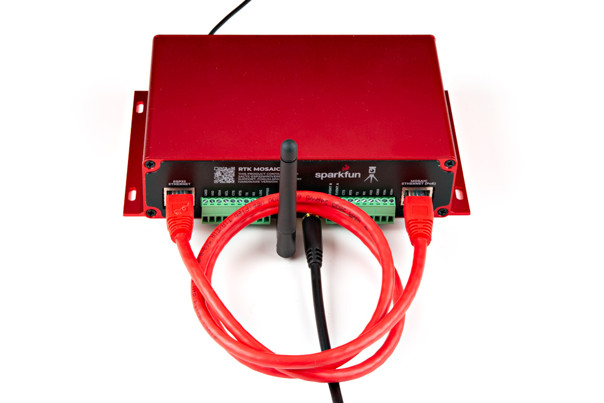{ width="400" }](./assets/img/hookup_guide/assembly-bad_ethernet.jpg "Click to enlarge")
		<figcaption markdown>Do not wrap/coil the ethernet cable around the WiFi antenna.</figcaption>
		</figure>

??? tip "Configuration: mosaic-X5 Settings"
	Users can configure the mosaic-X5 module through the network connection (i.e. ethernet or WiFi).

## SD Card Slot
An &micro;SD card slot is available for users to log and store data, locally on the board. Users will need to insert a compatible SD card and configure the mosaic-X5 module for data logging.

<figure markdown>
[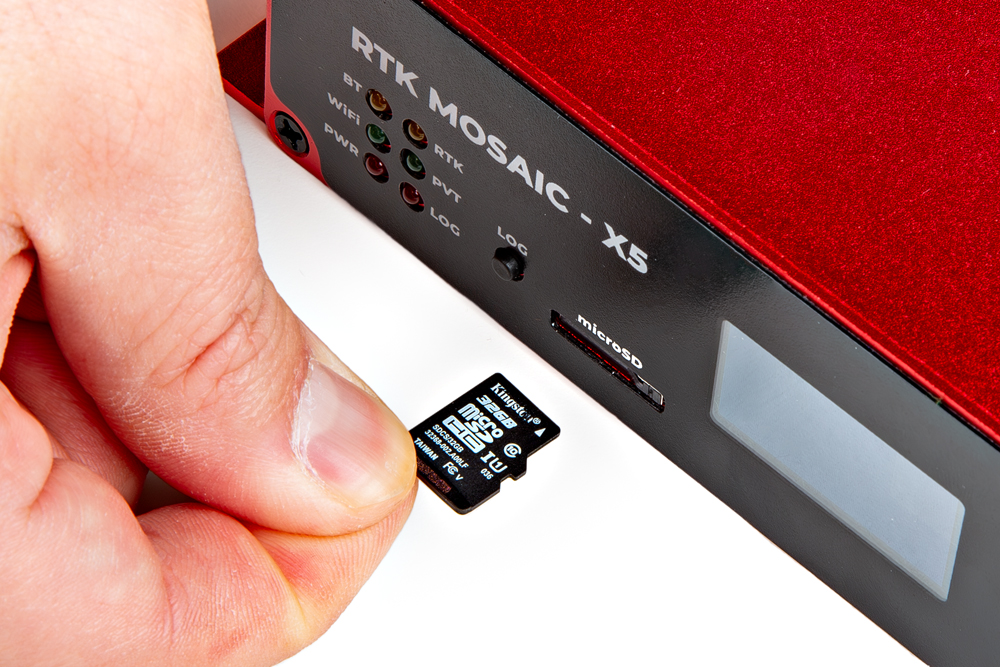{ width="400" }](./assets/img/hookup_guide/assembly-sd_card.jpg "Click to enlarge")
<figcaption markdown>Inserting an SD card into the RTK mosaic-X5.</figcaption>
</figure>

!!! info "SD Card Compatibility"
	The mosaic-X5 supports &micro;SD cards with a **FAT32** file system *(i.e. only cards **up to 32GB** in size)*.

??? warning "Initial Configuration"
	Before logging can take place, it is necessary to define a "logging stream" using the **Logging** page or **RxTools**. Streams can contain NMEA or SBF (Septentrio Binary Format) data; SBF can contain RTCM and/or RINEX.

	<figure markdown>
	[{ width="400" }](./assets/img/hookup_guide/Logging.png "Click to enlarge")
	<figcaption markdown>microSD logging stream configuration.</figcaption>
	</figure>

	!!! tip "Instructional Video"
		:material-youtube: [How to log data to the SD card of the Septentrio mosaic receiver module](https://youtu.be/Y9tvOebnoxk)

??? tip "Button Operation"
	There are multiple ways to configure and enable data logging to an SD card. However, the simplest method is with the ++"LOG"++ button. Once the stream is defined,

	* Pressing the ++"LOG"++ button *(< 5s)* toggles data logging to the SD card on and off.
	* Holding the ++"LOG"++ button for more than 5 seconds *(> 5s)* and then releasing it, will force the board to:
		* Unmount the SD card if it was mounted
		* Mount the SD card if it was unmounted

	For more information, please reference the [SD Card Slot](../hardware_overview/#sd-card-slot) section.

## IO Terminals
Users can easily attach accessories to the RTK mosaic-X5 by wiring them into the terminal blocks on the back of the enclosure.

<figure markdown>
[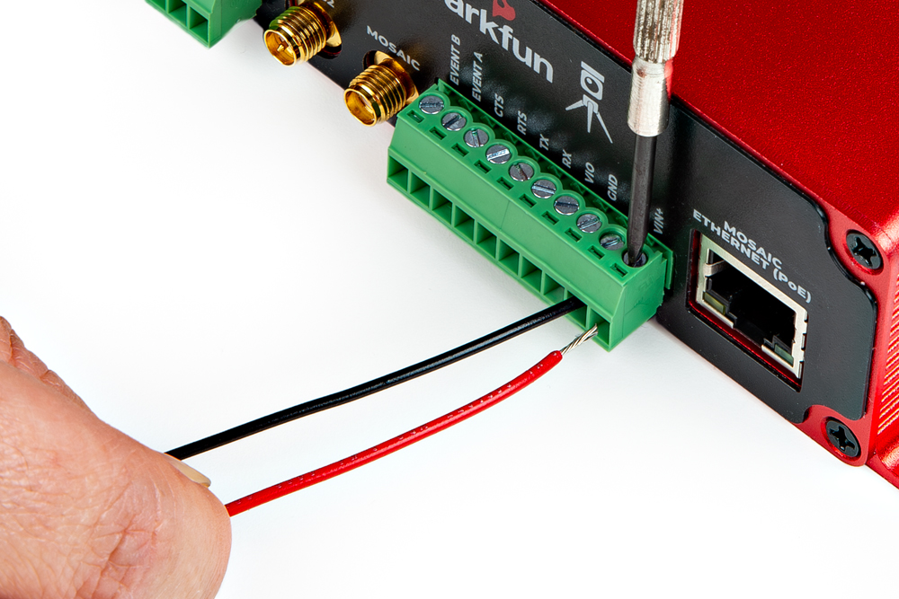{ width="400" }](./assets/img/hookup_guide/assembly-terminal_block2.jpg "Click to enlarge")
<figcaption markdown>Connecting a wire to the terminal block.</figcaption>
</figure>

??? tip "Multiple Connections"
	For multiple connections or wiring harnesses, users can disconnect the terminal blocks from their sockets on the RTK mosaic-X5.

	<figure markdown>
	[{ width="400" }](https://cdn.sparkfun.com/assets/parts/2/2/5/2/5/22461-_PRT_10-Way_Terminal___Socket-_01.jpg "Click to enlarge")
	<figcaption markdown>Components of the terminal block.</figcaption>
	</figure>

	Users can wiggle or use a soft/rigid object to carefully pry the terminal block off from its connector. In the picture below, a plastic name tag (~1.5mm thick) is used to carefully pry the terminal block up. We have also found the edge of a [PCB ruler](https://www.sparkfun.com/products/15295) works great too.

	<figure markdown>
	[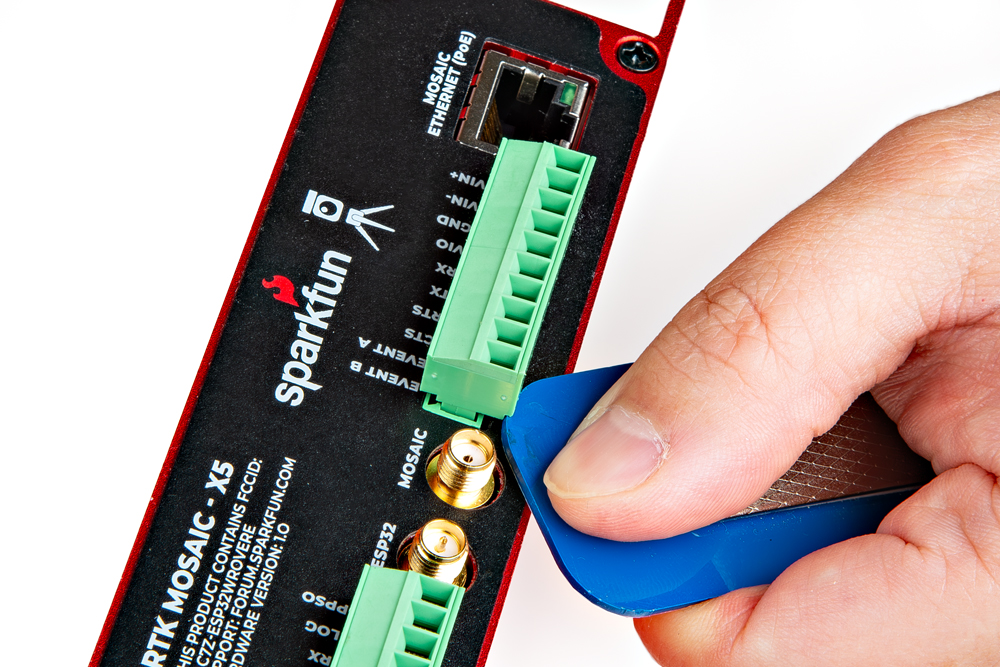{ width="400" }](./assets/img/hookup_guide/disassembly-terminal_block.jpg "Click to enlarge")
	<figcaption markdown>Using a soft/rigid object to carefully pry the terminal block free from its socket.</figcaption>
	</figure>

	Once wired up, users can simply push the terminal block back into its socket.

	

	

	<figure markdown>
	[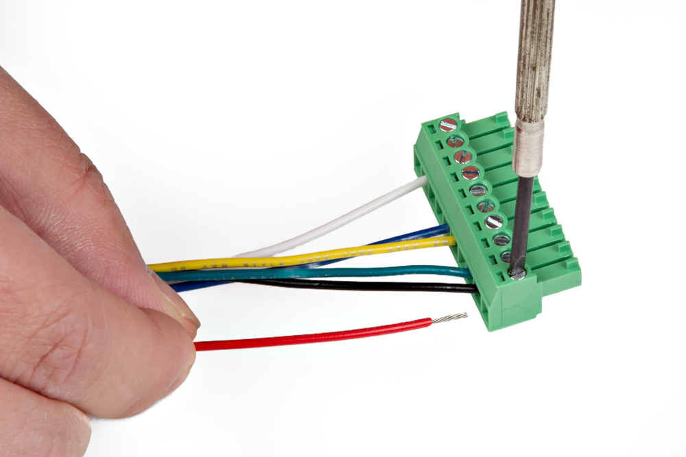{ width="400" }](./assets/img/hookup_guide/assembly-terminal_block.jpg "Click to enlarge")
	<figcaption markdown>Connecting a wire to the terminal block.</figcaption>
	</figure>

	

	

	<figure markdown>
	[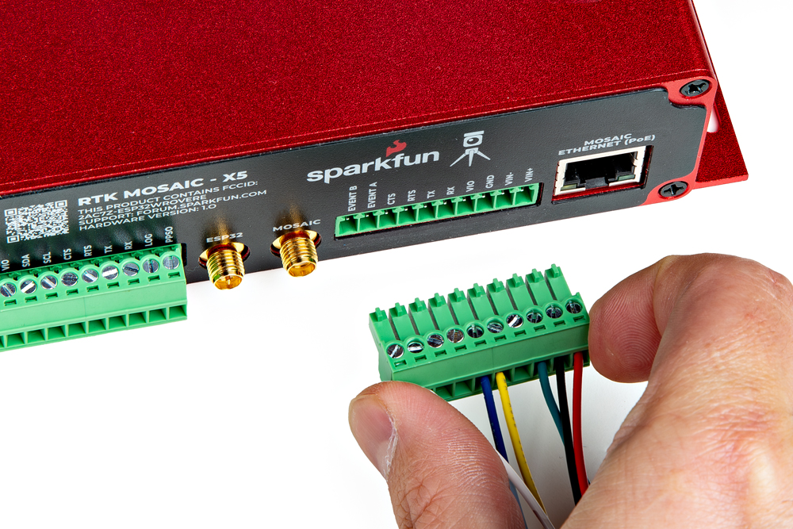{ width="400" }](./assets/img/hookup_guide/assembly-terminal_block-attach.jpg "Click to enlarge")
	<figcaption markdown>Attaching the terminal block to its socket on the RTK mosaic-X5.</figcaption>
	</figure>

	

	

	!!! warning
		To avoid shorts or damaging the RTK mosaic-X5, verify the wiring with the labels on the back of the enclosure.

??? tip "Connecting a Radio"
	### Radio Transceivers
	Users can also utilize the terminal blocks to interface with one of our radio transceivers for RTK correction data. We recommend utilizing our [breadboard cable](https://www.sparkfun.com/products/23353) to connect those radios to the RTK mosaic-X5.

	

	-   <a href="https://www.sparkfun.com/products/19032">
		<figure markdown>
		
		</figure>

		---

		**SiK Telemetry Radio V3 - 915MHz, 100mW** 
		WRL-19032</a>

	-   <a href="https://www.sparkfun.com/products/20029">
		<figure markdown>
		
		</figure>

		---

		**SparkFun LoRaSerial Kit - 915MHz (Enclosed)** 
		WRL-20029</a>
	
	-   <a href="https://www.sparkfun.com/products/23353">
		<figure markdown>
		
		</figure>

		---

		**Breadboard to JST-GHR-06V Cable - 6-Pin x 1.25mm Pitch (For LoRaSerial)** 
		CAB-23353</a>

	

	!!! info "Wiring the Connections"
		When connecting the RTK mosaic-X5 to one of our radio transceivers, users need to be aware of the pin connections between the products. Although the labels on each device may vary, their pins will function the same *(except for the power input/output pins)*.

		!!! warning
			Please remember that the power output (`VIO`) is preset to **3.3V** by default. When utilizing the SiK telemetry radios, users will need to open the enclosure and move the [`VIO` switch](../hardware_overview/#vio--gnd).

		=== "Radios"
			Below is a diagram of the pin connections for the 6-pin JST GH connector on the radios, which should be also labeled on their enclosure.

			<figure markdown>
			[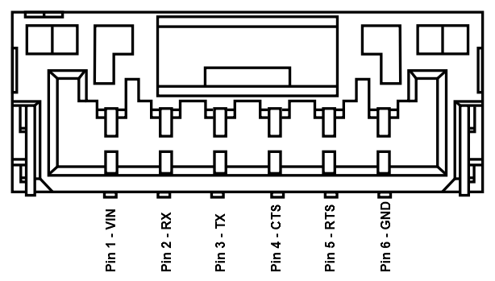{ width="400" }](./assets/img/hookup_guide/assembly-radio_jst.png "Click to enlarge")
			<figcaption markdown>The pin connections for the JST connector on the radios.</figcaption>
			</figure>

			

			<table border="1" markdown>
			<tr>
			<th style="vertical-align:middle;">Label</th>
			<td align="center">`5V`</td>
			<td align="center">`RX/RXI`</td>
			<td align="center">`TX/TXO`</td>
			<td align="center">`CTS`</td>
			<td align="center">`RTS`</td>
			<td align="center">`GND`</td>
			</tr>
			<tr>
			<th style="vertical-align:middle;">Function</th>
			<td>**Voltage Input** 
				- SiK: 5V 
				- LoRaSerial: 3.3 to 5V</td>
			<td align="center" style="vertical-align:middle;">UART - Receive</td>
			<td align="center" style="vertical-align:middle;">UART - Transmit</td>
			<td align="center" style="vertical-align:middle;">Flow Control 
				*Clear-to-Send*</td>
			<td align="center" style="vertical-align:middle;">Flow Control 
				*Ready-to-Send*</td>
			<td align="center" style="vertical-align:middle;">Ground</td>
			</tr>
			</table>

			

		=== "RTK mosaic-X5"
			Below are the UART pin connections to the mosaic-X5 GNSS receiver, which are labeled for the terminal blocks on the RTK mosaic-X5 enclosure.

			<figure markdown>
			[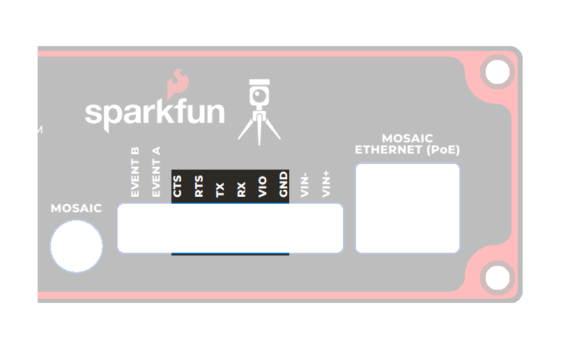{ width="400" }](./assets/img/hookup_guide/assembly-radio_io.png "Click to enlarge")
			<figcaption markdown>The pin connections for the radio on the RTK mosaic-X5.</figcaption>
			</figure>

			

			<table border="1" markdown>
			<tr>
			<th style="vertical-align:middle;">Label</th>
			<td align="center">`VIO`</td>
			<td align="center">`RX`</td>
			<td align="center">`TX`</td>
			<td align="center">`CTS`</td>
			<td align="center">`RTS`</td>
			<td align="center">`GND`</td>
			</tr>
			<tr>
			<th style="vertical-align:middle;">Function</th>
			<td>**Voltage Output** 
				- 5V or 3.3V *(see [switch](../hardware_overview/#vio--gnd))*</td>
			<td align="center" style="vertical-align:middle;">UART - Receive</td>
			<td align="center" style="vertical-align:middle;">UART - Transmit</td>
			<td align="center" style="vertical-align:middle;">Flow Control 
				*Clear-to-Send*</td>
			<td align="center" style="vertical-align:middle;">Flow Control 
				*Ready-to-Send*</td>
			<td align="center" style="vertical-align:middle;">Ground</td>
			</tr>
			</table>

			

		When connecting the RTK mosaic-X5 to either of the radios, the wiring connections should follow the table below. If the flow control is not enabled, then only the `RX`, `TX`, and `GND` pins are utilized. As an example, the wiring between a host system *(i.e. RTK mosaic-X5)* and the LoRaSerial Kit radio is shown in the image below; as documented in the [LoRaSerial product manual](https://docs.sparkfun.com/SparkFun_LoRaSerial).

		

		

		

		<table markdown>
		<tr>
		<th>RTK mosaic-X5</th>
		<td align="center">RX</td>
		<td align="center">TX</td>
		<td align="center">RTS</td>
		<td align="center">CTS</td>
		<td align="center">GND</td>
		</tr>
		<tr>
		<th>Radio</th>
		<td align="center">TX</td>
		<td align="center">RX</td>
		<td align="center">CTS</td>
		<td align="center">RTS</td>
		<td align="center">GND</td>
		</tr>
		</table>

		

		

		
		

 
		<figure markdown>
		[{ width="400" }](https://docs.sparkfun.com/SparkFun_LoRaSerial/img/SAMD21%20Flow%20control.png "Click to enlarge")
		<figcaption markdown>Wiring instructions for the LoRaSerial radio. Source: [LoRaSerial product manual](https://docs.sparkfun.com/SparkFun_LoRaSerial)</figcaption>
		</figure>

		

		

		??? tip "Pairing Radios"
			By default, the radios in the LoRaSerial Kit - 915MHz are pre-configured for [point-to-point](https://docs.sparkfun.com/SparkFun_LoRaSerial/operating_modes/#point-to-point) communication and a paired with each other. *For instructions on other configurations, please reference the [product manual](https://docs.sparkfun.com/SparkFun_LoRaSerial/) for the LoRaSerial Kit.*

