!!! warning "Read Before Handling PCB!"
	!!! danger "ESD Sensitivity"
		The mosaic-X5 module is sensitive to [ESD](https://en.wikipedia.org/wiki/Electrostatic_discharge "Electrostatic Discharge"). Use a proper grounding system to make sure that the working surface and the components are at the same electric potential.

	??? info "ESD Precaution"
		As recommended by the manufacturer, we highly encourage users to take the necessary precautions to avoid damaging their module.

		- The RTK mosaic-X5 features ESD protection on the USB-C connectors and ethernet jacks.
		- The mosaic-X5 module features internal ESD protection to the `ANT_1` antenna input.

		

		

		

		<article class="video-500px">
		<iframe src="https://www.youtube.com/embed/hrL5J6Q5gX8?si=jOPBat8rzMnL7Uz4&amp;start=26;&amp;end=35;" title="Septentrio: Getting Started Video (playback starts at ESD warning)" frameborder="0" allow="accelerometer; autoplay; clipboard-write; encrypted-media; gyroscope; picture-in-picture" allowfullscreen></iframe>
		</article>
		

		

		-   <a href="https://www.sparkfun.com/products/25572">
			<figure markdown>
			
			</figure>		

			---

			**iFixit Anti-Static Wrist Strap** 
			TOL-25572</a>

		

!!! code "ESP32 Firmware"
	We have intentionally kept the ESP32 firmware as simple as possible - supporting only two modes: Ethernet *(**Mode: `1`**)* and WiFi *(**Mode: `2`**)*. The intention is that you can easily develop your own firmware for the RTK mosaic-X5 using the Espressif ESP IDF if the SparkFun firmware does not meet your needs.

	You can of course modify the hardware too, should you want to. The design is completely open-source.

	!!! warning "Limitations"
		The ESP32 firmware we provide is only compatible with basic `SSID` and `Password` WiFi authentication. The firmware is not compatible with networks that implement other provisioning methods such as a [captive portal](https://en.wikipedia.org/wiki/Captive_portal), a QR code, or [Wi-Fi protected setup](https://en.wikipedia.org/wiki/Wi-Fi_Protected_Setup "WPS").

# Hardware Overview

In this section, we walk you through the hardware design, interfaces, I/O connections, power options and more.

!!! info
	The RTK mosaic-X5 is inspired by the [Septentrio mowi (mosaic wireless) open-source design](https://github.com/septentrio-gnss/mowi). The SparkFun design builds upon [mowi](https://github.com/septentrio-gnss/mowi "mosaic wireless"), adding: separate Ethernet ports with mag jacks and Power-over-Ethernet; robust I/O headers with screw cage connections and configurable I/O voltage (3.3V or 5V); &micro;SD data storage; and an OLED display.

## Schematic
Users can download the [full schematic for the RTK mosaic-X5](./assets/board_files/schematic.pdf) in `*.pdf` format.

## Dimensions

=== ":material-package-variant-closed: Metal Enclosure"
	Details about the aluminum enclosure can be found on the [Metal Enclosure - Custom Aluminum Extrusion (6in. x 4in. PCB)](https://www.sparkfun.com/products/22640) product page.

	<figure markdown>
	[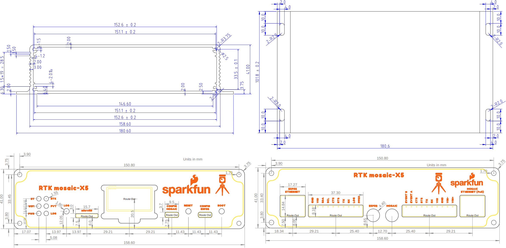{ width="700" }](./assets/board_files/dimensions-enclosure.png "Click to enlarge")
	<figcaption markdown>
	[Dimensions (PDF)](./assets/board_files/dimensions-enclosure.pdf) of the RTK mosaic-X5 aluminum enclosure and the front/rear panels, in millimeters.
	</figcaption>
	</figure>

=== ":fontawesome-solid-microchip: Printed Circuit Board"
	The circuit board dimensions are illustrated in the drawing below; the listed measurements are in inches.

	<figure markdown>
	[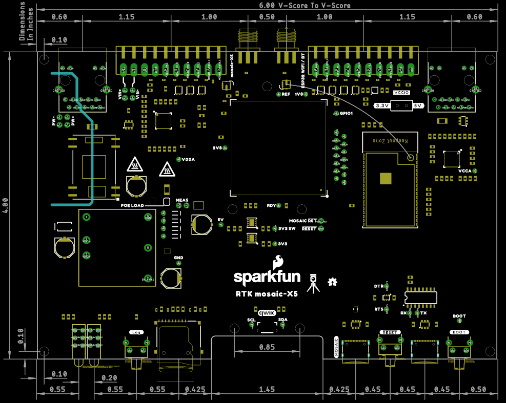{ width="400" }](./assets/board_files/dimensions.png "Click to enlarge")
	<figcaption markdown>
	[Dimensions (PDF)](./assets/board_files/dimensions.pdf) of the RTK mosaic-X5 PCB, in inches.
	</figcaption>
	</figure>

	??? tip "Need more measurements?"
		For more information about the board's dimensions, users can download the [**Eagle files**](./assets/board_files/eagle_files.zip) for the board. These files can be opened in Eagle and additional measurements can be made with the dimensions tool.

		??? info ":octicons-download-16:{ .heart } Eagle - Free Download!"
			Eagle is a [CAD]("computer-aided design") program for electronics that is free to use for hobbyists and students. However, it does require an account registration to utilize the software.

			

			[Download from :autodesk-primary:{ .autodesk }](https://www.autodesk.com/products/eagle/free-download "Go to downloads page"){ .md-button .md-button--primary width="250px" }
			

		??? info ":straight_ruler: Dimensions Tool"
			This video from Autodesk demonstrates how to utilize the dimensions tool in Eagle, to include additional measurements:

			

			

			<iframe src="https://www.youtube.com/embed/dZLNd1FtNB8" title="EAGLE Dimension Tool" frameborder="0" allow="accelerometer; autoplay; clipboard-write; encrypted-media; gyroscope; picture-in-picture" allowfullscreen></iframe>
			

=== ":material-video-input-antenna: Antenna"
	The dimensions and technical specifications of the GNSS antenna can be found on the [GNSS Multi-Band L1/L2/L5 Surveying Antenna - TNC (SPK6618H)](https://www.sparkfun.com/products/21801) product page.

	<figure markdown>
	[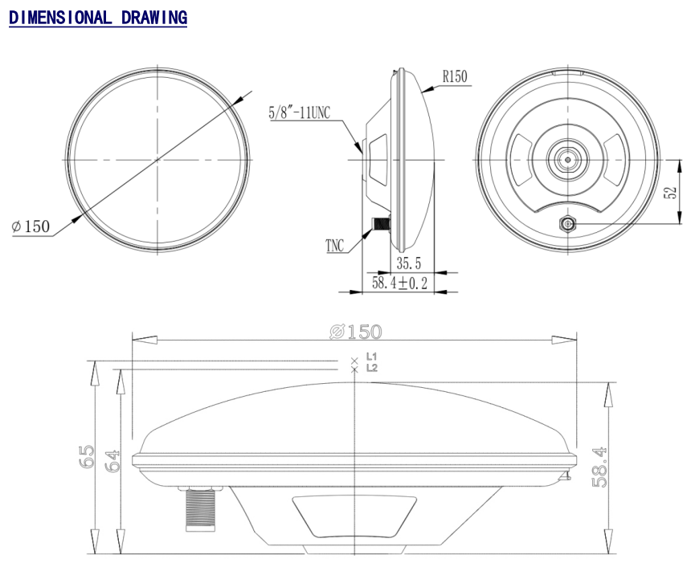{ width="400" }](./assets/board_files/dimensions-antenna.png "Click to enlarge")
	<figcaption markdown>
	Dimensions of the included GNSS antenna, in mm. 
	Source: [SPK6618H Datasheet (PDF)](https://cdn.sparkfun.com/assets/f/f/5/1/7/SparkFun_SPK6618H_Datasheet.pdf)
	</figcaption>
	</figure>

## Power Options
The mosaic-X5 and the ESP32 both required 3.3V power. To simplify the power circuitry, the four power sources are combined into a common 5V rail which then feeds individual 3.3V 1A regulators for the mosaic-X5 and the ESP32.

<figure markdown>
[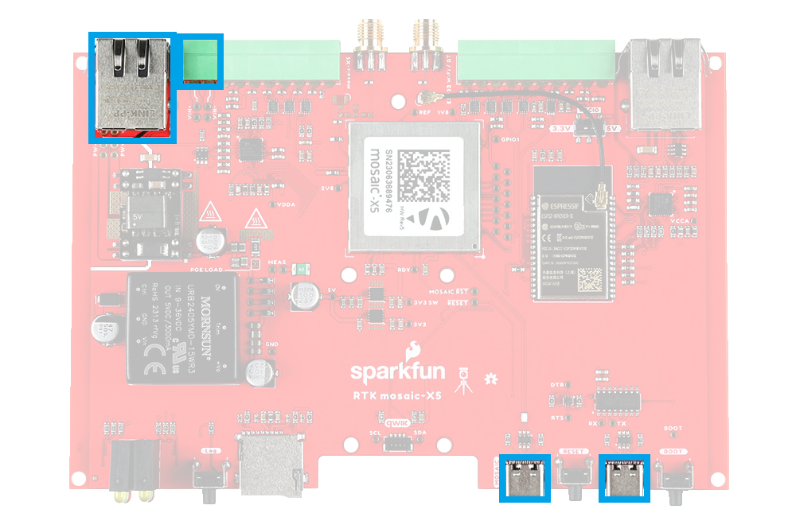{ width="400" }](./assets/img/hookup_guide/Power.png "Click to enlarge")
<figcaption markdown>Power connections on the RTK mosaic-X5 PCB.</figcaption>
</figure>

The RTK mosaic-X5 can be powered individually or in combination, with any of the following:

* **`USB Ports`** - **5V**; delivered via the `MOSAIC CONFIG` and/or `ESP32 CONFIG` USB-C connectors.
* **`Power-over-Ethernet`** - **Range: 36 to 57V**; delivered via the `MOSAIC ETHERNET` RJ45 MagJack connector.
* **`External DC Power`** - **Range: 9 to 36V**; delivered via the `VIN+` and `VIN-` screw cage terminals.

??? tip "Measure Current Draw"
	If you want to measure the board's current draw, you can open the `MEAS` jumper and measure the current via a pair of breakout pads *(see the **[Jumpers](#jumpers)** section)*.

??? info "Protection Components"
	Diodes are used to combine and protect the power sources from each other. Also, a 2A resettable fuse (green) provides additional protection.

!!! info
	For more details, users can reference the [schematic](./assets/board_files/schematic.pdf) and the datasheets of the individual components on the board.

=== ":material-usb-port: USB-C Connectors"
	The mosaic-X5 and ESP32 both have USB-C connections. These USB ports can be used to power the RTK mosaic-X5 during the initial configuration when the mosaic-X5 or ESP32 are connected to a computer.

	

	

	<figure markdown>
	[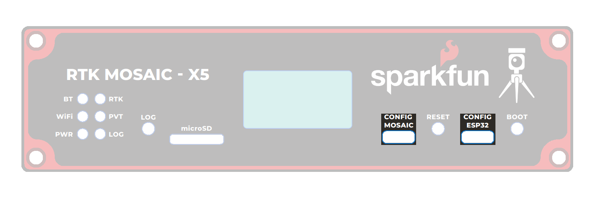{ width="750" }](./assets/img/hookup_guide/USB.png "Click to enlarge")
	<figcaption markdown>USB-C connectors on the RTK mosaic-X5.</figcaption>
	</figure>

	

	

	<figure markdown>
	[{ width="400" }](./assets/img/hookup_guide/USB-PCB.png "Click to enlarge")
	<figcaption markdown>The USB-C device connections on the RTK mosaic-X5 PCB.</figcaption>
	</figure>

	

	

	!!! info "CH340 Driver"
		The CH340 allows the ESP32-WROVER to communicate with a computer/host device through the USB-C connection. This allows the ESP32 to show up as a device on the serial (or COM) port of the computer. Users will need to install the latest drivers for the computer to recognize the CH340 *(see **[USB Driver](../software_overview/#espressif-logoesp32)** section)*.

=== ":material-ethernet: Power-over-Ethernet (PoE)"
	The mosaic-X5 Ethernet port supports Power-over-Ethernet ([PoE](https://en.wikipedia.org/wiki/Power_over_Ethernet "Power Over Ethernet")), allowing the RTK mosaic-X5 to be powered by the network. This is very useful when the RTK mosaic-X5 is mounted remotely - perhaps in a weatherproof box up on the roof. Data and power can be delivered through a single cable, avoiding the need for a separate power connection.

	

	

	<figure markdown>
	[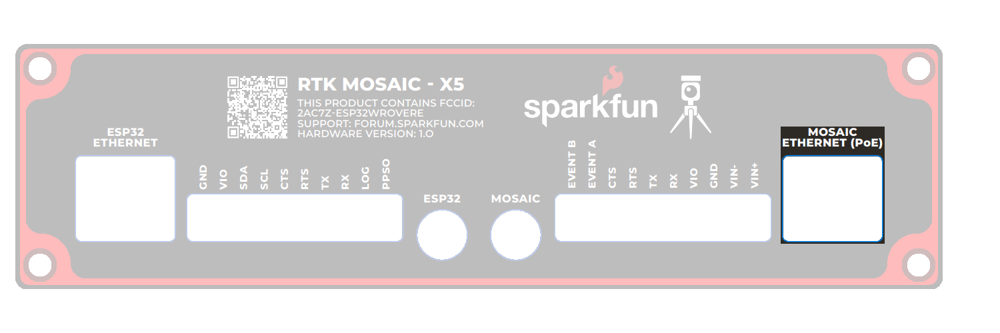{ width="750" }](./assets/img/hookup_guide/POE.png "Click to enlarge")
	<figcaption markdown>The Power-over-Ethernet (PoE) jack on the RTK mosaic-X5.</figcaption>
	</figure>

	

	

	<figure markdown>
	[{ width="400" }](./assets/img/hookup_guide/POE-PCB.png "Click to enlarge")
	<figcaption markdown>The PoE power input circuit on the RTK mosaic-X5 PCB.</figcaption>
	</figure>

	

	

=== ":material-car-battery: External DC Power (VIN)"
	The RTK mosaic-X5 includes a fully-isolated DC-DC converter, for applications where you may want to power the unit from a vehicle. The DC-DC converter accepts DC voltages between **9V and 36V**, regulating this down to 5V. The converter is fully isolated to 1.5kV and operates with ~90% efficiency.

	

	

	<figure markdown>
	[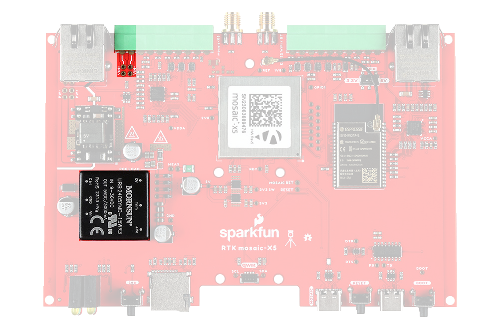{ width="750" }](./assets/img/hookup_guide/VIN.png "Click to enlarge")
	<figcaption markdown>The `VIN+` and `VIN-` screw terminal pins for the external DC power input.</figcaption>
	</figure>

	

	

	<figure markdown>
	[{ width="400" }](./assets/img/hookup_guide/VIN-PCB.png "Click to enlarge")
	<figcaption markdown>The DC-DC power converter and external power inputs on the RTK mosaic-X5 PCB.</figcaption>
	</figure>

	

	

	??? tip "Vehicle Power"
		For **12V** or **24V** vehicle power:

		* Connect 12V or 24V to the `VIN+` screw cage terminal
		* Connect 0V (chassis) to the `VIN-` screw cage terminal

		!!! warning "Power Source"
			Additionally, make sure that the power source from the vehicle is not directly tied to the vehicle's battery, `Always On`, or accessory circuits. Otherwise, users will risk killing the battery while the engine is off.

			We recommend locating the *ignition on* or *switched power* circuit, which is only powered when the key is in the `On` position *and the engine is running*.

			!!! note
				The `On` position, is where a key normally rests after the engine is started. However, users can still move the key from the `Off` position and into the `On` position without starting the engine. In this case, the alternator is not running and keeping the battery charged.

				Modern *eco-efficient* vehicles may automatically shut down the engine if the vehicle is idling too long. Therefore, cutting off the vehicle's alternator that keeps the battery charged. Luckily, most vehicles with this *automatic start/stop* technology will monitor the battery's voltage and restart the engine when required. With this in mind, users may want to initially monitor their battery voltage, in case their vehicle isn't *"so smart"* :sweat_smile:.

	??? warning "Ground Loop"
		If desired, users can link `VIN-` to the adjacent `GND` screw cage terminal. However, this will bypass the voltage isolation and could introduce an unwanted ground loop, particularly if the GNSS antenna ground (shield, 0V) is also connected to the chassis.

## :septentrio-logo:&nbsp;mosaic-X5
The heart of our product is of course the mosaic-X5 GNSS module from Septentrio. It is a _very_ sophisticated chip with multiple interfaces: UARTS, USB and Ethernet. The `COM2` and `COM3` UART pins, plus `GPIO1` and `GPIO2`, are available as 0.1" test points should you need access to them.

<figure markdown>
[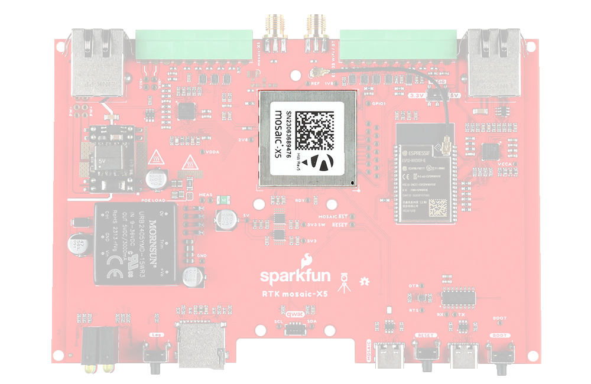{ width="400" }](./assets/img/hookup_guide/X5.png "Click to enlarge")
<figcaption markdown>The Septentrio mosaic-X5 GNSS module.</figcaption>
</figure>

## :espressif-logo:&nbsp;ESP32-WROVER
The only interface the mosaic-X5 doesn't offer is WiFi and that's why we've included an Espressif ESP32-WROVER processor (16MB flash, 8MB PSRAM) with its own Ethernet connection. You can connect the mosaic-X5 directly to your Ethernet network - our product supports Power-over-Ethernet too. Or you can link the mosaic-X5 Ethernet port to the ESP32 Ethernet port and have the ESP32 provide WiFi connectivity. In that mode, the ESP32 becomes an Ethernet to WiFi Bridge, seamlessly passing WiFi traffic to and from the mosaic-X5 via Ethernet.

<figure markdown>
[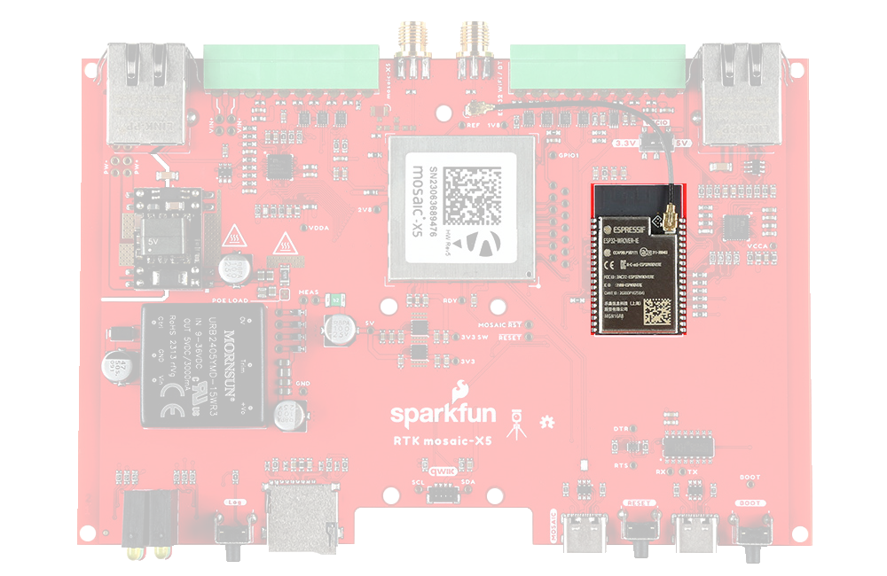{ width="400" }](./assets/img/hookup_guide/ESP32.png "Click to enlarge")
<figcaption markdown>The Espressif ESP32-WROVER processor.</figcaption>
</figure>

Think of the ESP32 as a co-processor, or riding shotgun... The mosaic-X5 `COM4` UART is linked to the ESP32, allowing the two to communicate directly without needing the Ethernet link. In our firmware, the ESP32 requests NMEA GGA data over this link and then displays it on the I2C OLED display.

!!! warning "WiFi Network Compatibility"
	The ESP32 is only compatible with 2.4GHz bands and cannot access the 5GHz band.

??? code "ESP32 Firmware"
	We have intentionally kept the ESP32 firmware as simple as possible - supporting only two modes: Ethernet *(**Mode: `1`**)* and WiFi *(**Mode: `2`**)*. The intention is that users can easily develop their, own firmware for the RTK mosaic-X5 using the Espressif ESP IDF if the SparkFun firmware does not meet their needs.

	!!! info "Provisioning Limitations"
		* The ESP32 firmware we provide is only compatible with basic `SSID` and `Password` WiFi authentication.
		* The firmware is not compatible with networks that implement other provisioning methods such as a [captive portal](https://en.wikipedia.org/wiki/Captive_portal), a QR code, or [Wi-Fi protected setup](https://en.wikipedia.org/wiki/Wi-Fi_Protected_Setup "WPS").

## Ethernet PHY Interfaces
The mosaic-X5 and ESP32 have identical KSZ8041NLI Ethernet PHY interfaces, both connected using Reduced Media-Independent Interfaces (RMII). These allow the mosaic-X5 and ESP32 to be linked directly to your Ethernet network or router, or to each other when the ESP32 is acting as an Ethernet-to-WiFi Bridge.

<figure markdown>
[{ width="750" }](./assets/img/hookup_guide/PHY.png "Click to enlarge")
<figcaption markdown>Ethernet connections: ESP32 (left) and mosaic-X5 (right).</figcaption>
</figure>

<figure markdown>
[{ width="400" }](./assets/img/hookup_guide/PHY-PCB.png "Click to enlarge")
<figcaption markdown>The two Ethernet physical layer interfaces and connections.</figcaption>
</figure>

## USB-C Connectors
The mosaic-X5 and ESP32 both have USB-C connections. The MOSAIC USB port is high-speed and connected to the X5 through a balancing transformer. The ESP32 USB port is connected through a CH340 USB-UART IC.

<figure markdown>
[{ width="750" }](./assets/img/hookup_guide/USB.png "Click to enlarge")
<figcaption markdown>USB-C connections: mosaic-X5 (left) and ESP32 (right).</figcaption>
</figure>

<figure markdown>
[{ width="400" }](./assets/img/hookup_guide/USB-PCB.png "Click to enlarge")
<figcaption markdown>The USB-C data connections on the RTK mosaic-X5 PCB.</figcaption>
</figure>

!!! info
	The RTK mosaic-X5 can draw power from either or both USB ports, in addition to Power-over-Ethernet and the DC-DC external input described above.

!!! info "CH340 Driver"
	The CH340 allows the ESP32-WROVER to communicate with a computer/host device through the USB-C connection. This allows the ESP32 to show up as a device on the serial (or COM) port of the computer. Users will need to install the latest drivers for the computer to recognize the CH340 *(see **[USB Driver](../software_overview/#espressif-logoesp32)** section)*.

## &micro;SD Socket
The &micro;SD socket is connected directly to the mosaic-X5 via a one-bit SDIO interface for fast data logging. The mosaic-X5 supports &micro;SD cards with a **FAT32** file system *(i.e. only cards **up to 32GB** in size)*.

<figure markdown>
[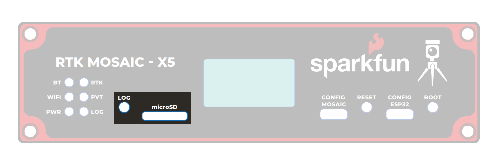{ width="750" }](./assets/img/hookup_guide/Log.png "Click to enlarge")
<figcaption markdown>&micro;SD slot and ++"LOG"++ button.</figcaption>
</figure>

<figure markdown>
[{ width="400" }](./assets/img/hookup_guide/Log-PCB.png "Click to enlarge")
<figcaption markdown>&micro;SD socket and ++"Log"++ button on the RTK mosaic-X5 PCB.</figcaption>
</figure>

??? info "Operation Instructions"

	!!! success "Initial Configuration"
		Before logging can take place, it is necessary to define a "logging stream" using the **Logging** page or **RxTools**. Streams can contain NMEA or SBF (Septentrio Binary Format) data; SBF can contain RTCM and/or RINEX.

		<figure markdown>
		[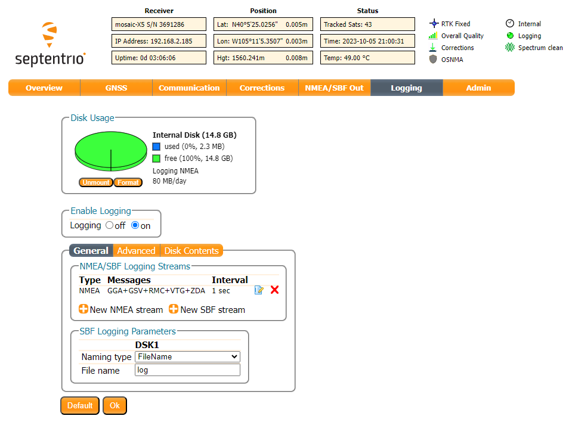{ width="400" }](./assets/img/hookup_guide/Logging.png "Click to enlarge")
		<figcaption markdown>&micro;SD logging stream configuration.</figcaption>
		</figure>
		
		!!! tip "Instructional Video"
			:material-youtube: [How to log data to the SD card of the Septentrio mosaic receiver module](https://youtu.be/Y9tvOebnoxk)

	Once the stream is defined, users can control the data logging operation through the ++"LOG"++ button.

	* A short press of the ++"LOG"++ button *(< 5s)* toggles data logging to the SD card on and off.
		* The red `LOG` LED will flash while logging is taking place.
	* A long press, holding the ++"LOG"++ button for more than 5 seconds *(> 5s)* and then releasing it, will force the board to:
		* Unmount the SD card if it was mounted
		* Mount the SD card if it was unmounted

## SMA Connectors
The RTK mosaic-X5 has robust SMA connectors for the mosaic-X5 GNSS antenna and the ESP32 WiFi / BT antenna.

<figure markdown>
[{ width="750" }](./assets/img/hookup_guide/Ant-GNSS.png "Click to enlarge")
<figcaption markdown>The SMA connector for the GNSS antenna.</figcaption>
</figure>

<figure markdown>
[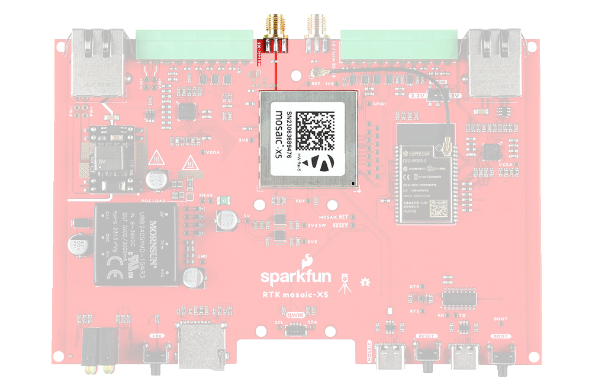{ width="400" }](./assets/img/hookup_guide/RF-GNSS.png "Click to enlarge")
<figcaption markdown>The connection for the GNSS antenna to the mosaic-X5.</figcaption>
</figure>

The mosaic-X5 SMA connector is standard polarity and provides 5V power for an active antenna.

<figure markdown>
[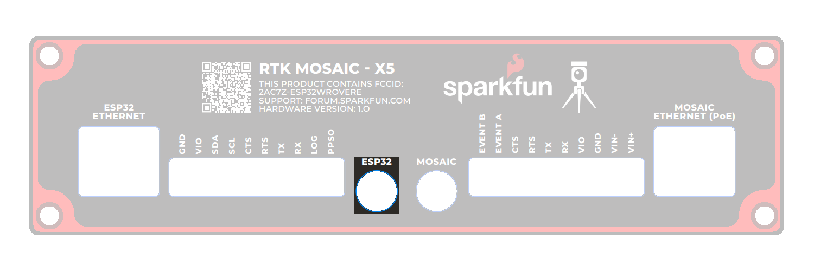{ width="750" }](./assets/img/hookup_guide/Ant-WiFi.png "Click to enlarge")
<figcaption markdown>The RP-SMA connector for the WiFi/BLE antenna.</figcaption>
</figure>

<figure markdown>
[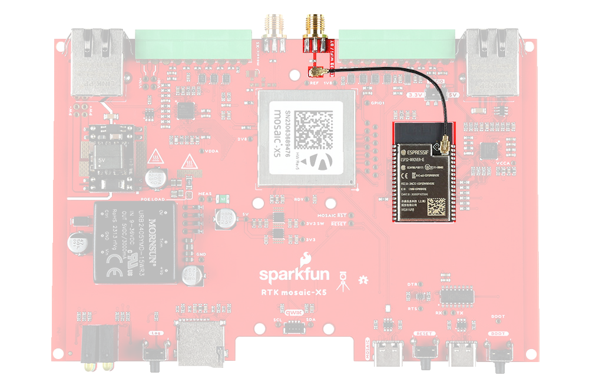{ width="400" }](./assets/img/hookup_guide/RF-WiFi.png "Click to enlarge")
<figcaption markdown>The connection for the WiFi / BLE antenna to the ESP32.</figcaption>
</figure>

The ESP32 WiFi / BT SMA connector is reverse-polarity (RP). A short u.FL cable connects the SMA connector to the ESP32-WROVER itself.

!!! tip "Connector Polarity"
	When selecting antennas and/or cables for the RTK mosaic-X5, double-check the polarity for the connections.

## I/O Terminals
The RTK moasic-X5 is equipped with two [10-way 3.5mm screw cage terminal connectors](https://www.sparkfun.com/products/22461).

<figure markdown>
[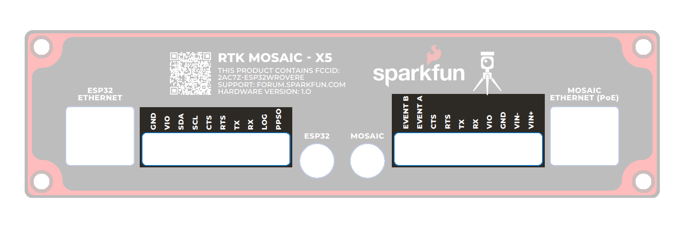{ width="750" }](./assets/img/hookup_guide/IO.png "Click to enlarge")
<figcaption markdown>I/O Screw Terminal Connections.</figcaption>
</figure>

<figure markdown>
[{ width="400" }](./assets/img/hookup_guide/IO-PCB.png "Click to enlarge")
<figcaption markdown>I/O Screw Terminal Connections on the RTK mosaic-X5 PCB.</figcaption>
</figure>

These terminals are described in the tabs below. For more information on the I/O terminals, you can refer to the [schematic](./assets/board_files/schematic.pdf).

=== "External Power"

	The `VIN+` and `VIN-` terminals allow the RTK mosaic-X5 to be powered by an external DC power source - typically a 12V / 24V vehicle battery.

	

	| **Terminal** | 
**Function**
               |
	| :----------: | :------------------------------------------ |
	| **VIN+**     | External voltage: **Min: 9V**; **Max: 36V** |
	| **VIN-**     | Ground / Chassis / 0V                       |

	

	!!! info
		The DC-DC converter in the RTK mosaic-X5 provides 1.5kV isolation between `VIN+`/`VIN-` and **5V**/**GND**. There is no direct electrical connection between `VIN-` and `GND`.

	!!! warning "Ground Loop"
		If desired, users can link `VIN-` to the adjacent `GND` screw cage terminal. However, this will bypass the voltage isolation and could introduce an unwanted ground loop, particularly if the GNSS antenna ground (shield, 0V) is also connected to the chassis.

=== "VIO & GND"
	The I/O terminal voltage can be set to 3.3V or 5V via the small internal slide switch highlighted below:

	<figure markdown>
	[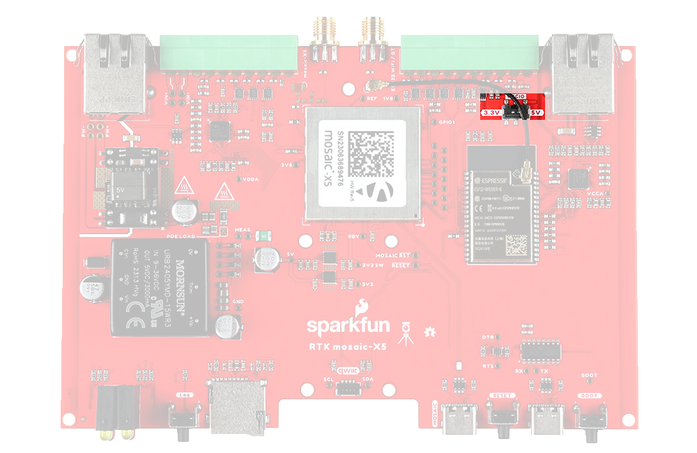{ width="400" }](./assets/img/hookup_guide/VCCIO.png "Click to enlarge")
	<figcaption markdown>I/O voltage selection switch.</figcaption>
	</figure>

	The `VIO` terminals can be used as power outputs or logic-high references. Likewise, the `GND` terminals can be used for power return or as logic-low references.

	

	| **Terminal** | 
**Function**
                   |
	| :----------: | :---------------------------------------------- |
	| **VIO**      | 3.3V or 5V power output or logic-high reference |
	| **GND**      | Ground / 0V or logic-low reference              |

	

	!!! info
		The default position of the `VIO` switch is **3.3V**.

	!!! tip
		The `VIO` and `GND` pins could be used to power (e.g.) a LoRa module. We recommend limiting the current draw from `VIO` to **200mA** and never drawing more than 500mA peak. The upstream 3.3V regulator is rated at 1A but it also provides power for the ESP32 processor.

=== "mosaic-X5 `COM1`"
	The mosaic-X5 UART COM1 connections are adjacent to the **EVENTA** and **EVENTB** terminals and are connected as follows:

	

	| **Terminal** | 
**Function**
          | **Notes**                                                     |
	| :----------: | :------------------------------------- | :------------------------------------------------------------ |
	| **RX**       | COM1 UART Receive - **Input**          |                                                               |
	| **TX**       | COM1 UART Transmit - **Output**        |                                                               |
	| **RTS**      | COM1 UART Request To Send - **Output** | The module drives this pin low when ready to receive data     |
	| **CTS**      | COM1 UART Clear To Send - **Input**    | Must be driven low when ready to receive data from the module |

	

	!!! tip
		The COM1 I/O voltage is set by the I/O voltage selection switch.

	!!! tip
		The **CTS** input floats low. Pull CTS up to VIO to disable UART Transmit.

=== "EVENT A & B"
	The mosaic-X5 **EVENTA** and **EVENTB** inputs can be used to mark or timestamp external events:

	

	| **Terminal** | **Function**    |
	| :----------: | :-------------: |
	| **EVENTA**   | Event A : Input |
	| **EVENTB**   | Event B : Input |

	

	!!! tip
		The EVENT voltage level is set by the I/O voltage selection switch.

	!!! tip
		The EVENT inputs are pulled low internally. Pull up to VIO to trigger an event.

	!!! tip
		An easy way to observe the events is with **RxTools** \ **RxControl** \ **Expert Console** (under **Tools**) \ **ExEvent** tab:

		<figure markdown>
		[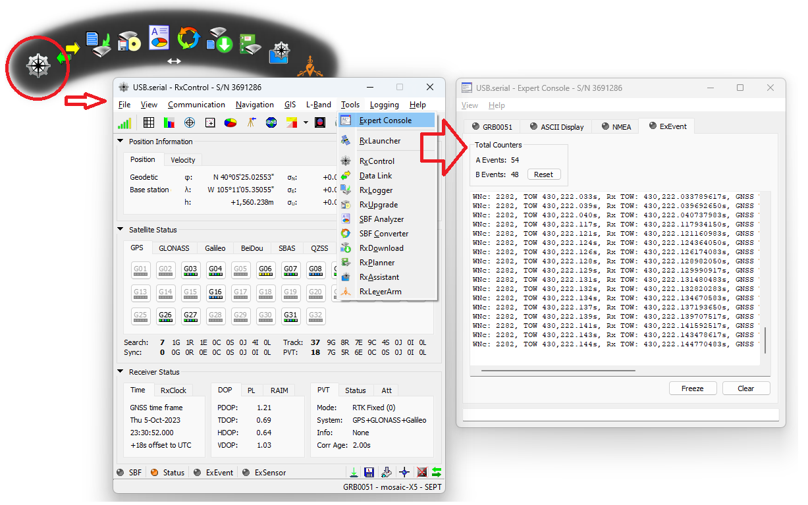{ width="400" }](./assets/img/hookup_guide/EVENT.png "Click to enlarge")
		<figcaption markdown>Capturing external events from EVENTA and EVENTB.</figcaption>
		</figure>

=== "PPSO"
	The mosaic-X5 **PPSO** is a configurable Pulse-Per-Second output. By default, PPSO is high for 5ms at 1Hz. The polarity, frequency and pulse width can be adjusted with the **`setPPSParameters`** command.

	

	| **Terminal** | **Function**              |
	| :----------: | :-----------------------: |
	| **PPSO**     | Pulse-Per-Second : Output |

	

	!!! tip
		The PPSO voltage is set by the I/O voltage selection switch.

=== "LOG"
	The mosaic-X5 **LOG** input starts and stops &micro;SD logging. It is also used to mount and dismount the &micro;SD card.

	

	| **Terminal** | **Function** |
	| :----------: | :----------: |
	| **LOG**      | Log : Input  |

	

	!!! tip
		The LOG voltage level is set by the I/O voltage selection switch.

	!!! tip
		The LOG input is pulled up to VIO internally. Pull low to GND to start or stop logging.

	!!! tip
		Internal resistors allow the `LOG` I/O terminal and ++"Log"++ button to be used simultaneously. It is OK to press the ++"Log"++ button while the `LOG` terminal is being driven high (VIO).

=== "ESP32 `UART`"
	Four ESP32 GPIO pins are connected to I/O screw terminals as follows. These pins are not used by version 1.0.0 of the RTK mosaic-X5 ESP32 firmware. They are available for you to use if you are developing your own firmware.

	

	| **Terminal** | 
**Suggested Function**
 | **Notes**                                                     |
	| :----------: | :-------------------------------------- | :------------------------------------------------------------ |
	| **RX**       | UART Receive                            | **Input** - connected to GPIO pin 34 through a level-shifter  |
	| **TX**       | UART Transmit                           | **Output** - connected to GPIO pin 32 through a level-shifter |
	| **RTS**      | UART Request To Send                    | **Output** - connected to GPIO pin 33 through a level-shifter |
	| **CTS**      | UART Clear To Send                      | **Input** - connected to GPIO pin 35 through a level-shifter  |

	

	!!! tip
		The I/O voltage is set by the I/O voltage selection switch.

	!!! info
		These pins are not used by version 1.0.0 of the ESP32 firmware.

=== "SDA & SCL"
	The ESP32 I2C (`Wire`) bus **SDA** and **SCL** signals are available via the I/O terminals. Internally, the I2C bus is used to configure the Qwiic OLED display. If you connect a logic analyzer to the SDA and SCL I/O terminals, you will be able to see the OLED traffic (address 0x3D). We made the SDA and SCL signals accessible in case you are developing your own firmware for the RTK mosaic-X5. The I/O terminals are fully level-shifted. It is OK to have a 5V I2C peripheral connected while also using the internal 3.3V Qwiic bus for the OLED.

	

	| **Terminal** | **Function**         |
	| :----------: | :------------------: |
	| **SDA**      | I2C Data  |
	| **SCL**      | I2C Clock |

	

	!!! tip
		The I/O voltage is set by the I/O voltage selection switch.

	??? tip "What is Qwiic?"

		<!-- Qwiic Banner -->
		

		[{ width=400 }](https://www.sparkfun.com/qwiic)
		[{ width=400 }](https://www.sparkfun.com/qwiic)
		

		---

		The [Qwiic connect system](https://www.sparkfun.com/qwiic) is a solderless, polarized connection system that allows users to seamlessly daisy chain I2C boards together. Play the video below to learn more about the Qwiic connect system or click on the banner above to learn more about [Qwiic products](https://www.sparkfun.com/qwiic).

		

		

		<iframe src="https://www.youtube.com/embed/x0RDEHqFIF8" title="SparkFun's Qwiic Connect System" frameborder="0" allow="accelerometer; encrypted-media; gyroscope; picture-in-picture" allowfullscreen></iframe>
		

		

		!!! info "Features of the Qwiic System"

			=== "No Soldering"

				{ align="left" width="90" }
				{ align="left" width="90" }

				Qwiic cables (4-pin JST) plug easily from development boards to sensors, shields, accessory boards and more, making easy work of setting up a new prototype.

			=== "Polarized Connector"

				{ align="left" width="90" }
				{ align="left" width="90" }

				There's no need to worry about accidentally swapping the SDA and SCL wires on your breadboard. The Qwiic connector is polarized so you know you’ll have it wired correctly every time, right from the start.

				The PCB connector is part number SM04B-SRSS ([Datasheet](https://cdn.sparkfun.com/assets/parts/1/2/2/8/9/Qwiic_Connector_Datasheet.pdf)) or equivalent. The mating connector used on cables is part number SHR04V-S-B or an equivalent *(1mm pitch, 4-pin JST connector)*.

			=== "Daisy Chain-able"

				{ align="left" width="90" }
				{ align="left" width="90" }

				It’s time to leverage the power of the I2C bus! Most Qwiic boards will have two or more connectors on them, allowing multiple devices to be connected.

## Status LEDs
There are six status LEDs on the RTK mosaic-X5:

* `PWR` - Power *(Red)*
	* Illuminates when power is applied
* `LOG` - &micro;SD Logging *(Red)*
	* Solid Red - &micro;SD card is mounted
	* Blinking Red - Data is being logged
	* Off - &micro;SD is dismounted or not present
* `WiFi` - WiFi *(Green)*
	* The ESP32 firmware is using WiFi
	* Connected to ESP32 GPIO pin 12
* `PVT` - Position Velocity Time *(Green)*
	* Solid Green - The mosaic-X5 has valid Position, Velocity and Time
	* Off - Satellite signal not present or acquired
* `BT` - Bluetooth *(Yellow)*
	* The ESP32 firmware is using BT
	* Connected to ESP32 GPIO pin 13
	* *Not used by firmware v1.0.0*
* `RTK` - Real-Time Kinematic *(Yellow)*
	* Solid Yellow - The mosaic-X5 has an RTK Fixed solution
	* Blinking Yellow - The mosaic-X5 has an RTK Float solution
	* Off - No RTK solution

<figure markdown>
[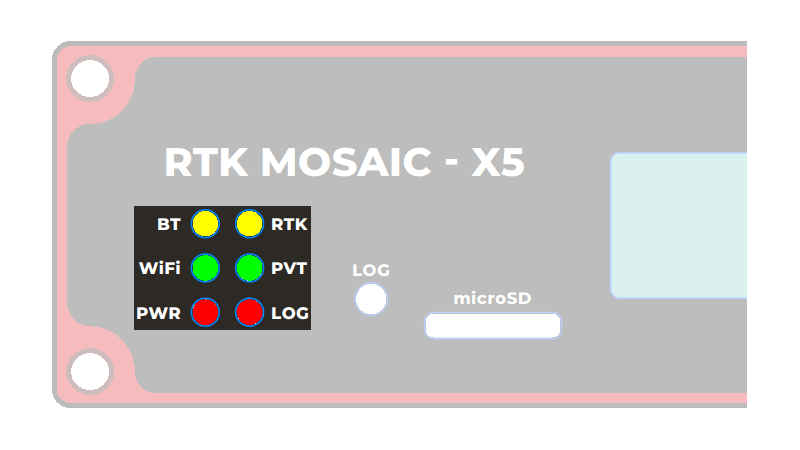{ width="400" }](./assets/img/hookup_guide/LEDs.png "Click to enlarge")
<figcaption markdown>
The status indicator LEDs on the RTK mosaic-X5.
</figcaption>
</figure>

<figure markdown>
[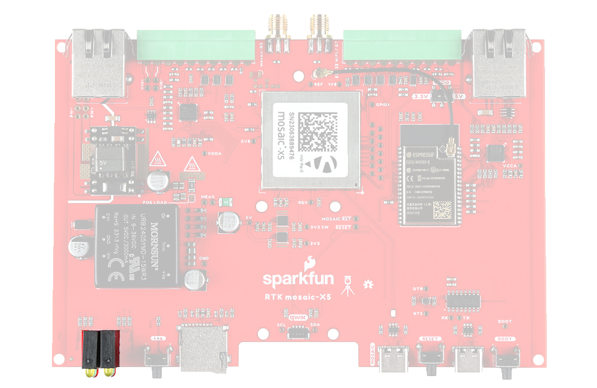{ width="400" }](./assets/img/hookup_guide/LEDs-PCB.png "Click to enlarge")
<figcaption markdown>
The status indicator LEDs on the RTK mosaic-X5 PCB.
</figcaption>
</figure>

## OLED Display
The RTK mosaic-X5 has a 128x64 pixel OLED display, controlled by the ESP32 via I2C. After some initial diagnostic messages, the display will show position, time and other data from the mosaic-X5 NMEA **GGA** message, plus the Ethernet / WiFi IP address.

<figure markdown>
[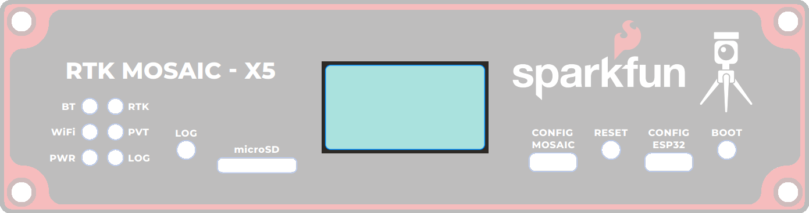{ width="750" }](./assets/img/hookup_guide/OLED3.png "Click to enlarge")
<figcaption markdown>
The OLED display on the RTK mosaic-X5.
</figcaption>
</figure>

* **Time:** - Universal Time Coordinate (UTC) in `HHMMSS.SS` format
	* Note: the display is updated approximately every 2 seconds. The time shown may not be precise.
* **Lat:** - Latitude in `DDMM.MMMMMMM` `N`/`S` format (this is the format used by the GGA message)
* **Long:** - Longitude in `DDDMM.MMMMMMM` `E`/`W` format (this is the format used by the GGA message)
* **Fix:** - the GNSS fix type
* **Sat:** - the number of satellites used in the navigation solution
	* Note: this is not the same as "Satellites In View"
* **HDOP:** - Horizontal Dilution Of Precision
	* Note: this is a dimensionless number indicating the horizontal position accuracy
* **Alt:** - the Altitude in meters
	* Note: this is the altitude above Mean Sea Level, not Geoid
* **IP:** - the mosaic-X5 IP address, obtained via Ethernet or WiFi
	* The X5's internal configuration page can be viewed at this address

??? example "Example Data"
	Below, is an example data set recorded on the RTK mosaic-X5 at SparkFun HQ; where the antenna was located on the roof of the building. The antenna was above the loading dock, just about where it is displayed on the map. The table, below, is an example of how to convert the information on the display into the time and coordinate values.

	

	

	<figure markdown>
	[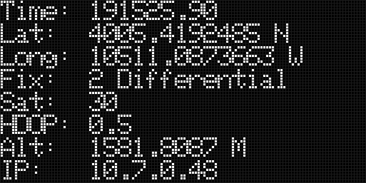{ width="500" }](./assets/img/hookup_guide/OLED-sparkfun.png "Click to enlarge")
	<figcaption markdown>
	Example information on the OLED display of the RTK mosaic-X5.
	</figcaption>
	</figure>

	

	

	

	|    | Data | Format | Value |
	| :- | :--- | :----- | :---- |
	| Time | `191525.90` | `HHMMSS.SS` | 7:15:25.90 PM (UTC) 12:15:25.90 PM (MST) |
	| Latitude | `4005.4192485 N` | `DDMM.MMMMMMM` `N`/`S` | 40&deg; 5.4162485' N 40&deg; 5' 24.97491" N 40.090270808&deg; N |
	| Longitude | `10511.0873663 W` | `DDDMM.MMMMMMM` `E`/`W` | 105&deg; 11.0873663' W 105&deg; 11' 5.241978" W 105.184789438&deg; W |

	

	

	

	<figure markdown>
	<iframe src="https://www.google.com/maps/embed?pb=!1m17!1m12!1m3!1d642.644955184578!2d-105.18511963541232!3d40.0903902657445!2m3!1f0!2f0!3f0!3m2!1i1024!2i768!4f13.1!3m2!1m1!2zNDDCsDA1JzI1LjAiTiAxMDXCsDExJzA1LjIiVw!5e1!3m2!1sen!2sus!4v1700260975996!5m2!1sen!2sus" width="800" height="400" style="border:0;" allowfullscreen="" loading="lazy" referrerpolicy="no-referrer-when-downgrade"></iframe>
	<figcaption markdown>
	The location of the antenna on Google Maps, as determined from the coordinates on the OLED display. Source: [Google Maps](https://www.google.com/maps/@40.0838666,-105.18528,15z?entry=ttu)
	</figcaption>
	</figure>

## Buttons
There are three buttons on the RTK mosaic-X5: ++"RESET"++, ++"BOOT"++, and ++"LOG"++.

<figure markdown>
[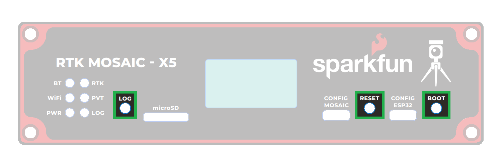{ width="750" }](./assets/img/hookup_guide/Buttons.png "Click to enlarge")
<figcaption markdown>Buttons on the RTK mosaic-X5.</figcaption>
</figure>

<figure markdown>
[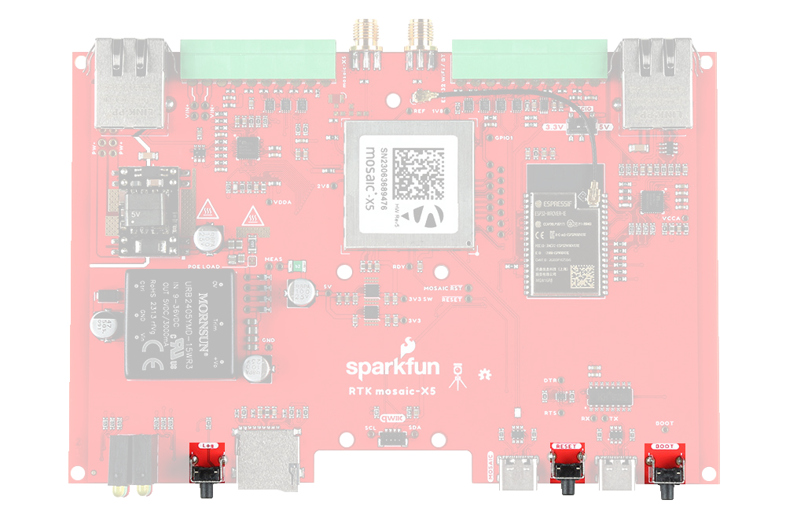{ width="400" }](./assets/img/hookup_guide/Buttons-PCB.png "Click to enlarge")
<figcaption markdown>Buttons on the RTK mosaic-X5 PCB.</figcaption>
</figure>

=== ":septentrio-logo:&nbsp;mosaic-X5: Data Logging"
	Once a [logging stream](#sd-socket) is defined, users can control the data logging operation through the ++"LOG"++ button.

	* A short press of the ++"LOG"++ button *(< 5s)* toggles data logging to the SD card on and off.
		* The red `LOG` LED will flash while logging is taking place.
	* Holding the ++"LOG"++ button for more than 5 seconds *(> 5s)* and then releasing it, will force the board to:
		* Unmount the SD card if it was mounted
		* Mount the SD card if it was unmounted

	!!! tip "Instructional Video"
		:material-youtube: [How to log data to the SD card of the Septentrio mosaic receiver module](https://youtu.be/Y9tvOebnoxk)

=== ":espressif-logo:&nbsp;ESP32: Reset"
	The ++"RESET"++ button allows users to reset the firmware running on the ESP32-WROVER module without disconnecting the power.

=== ":espressif-logo:&nbsp;ESP32: Boot Control"
	The ++"BOOT"++ button can be used to force the ESP32 into the serial bootloader. Holding down the ++"BOOT"++ button, while connecting the RTK mosaic-X5 to a computer through its USB-C connector or resetting the board will cause it to enter the <a href="https://docs.espressif.com/projects/esptool/en/latest/esp32/advanced-topics/boot-mode-selection.html#manual-bootloader">Firmware Download mode</a>. The ESP32 will remain in this mode until it power cycles (happens automatically after uploading new firmware) or the ++"RESET"++ button is pressed.

	1. Hold the ++"BOOT"++ button down.
	2. Reset the MCU.
		* While unpowered, connect the board to a computer through the USB-C connection.
		* While powered, press the ++"RESET"++ button.
	3. Release the ++"BOOT"++ button.
	4. After programming is completed, reboot the MCU.
		* Press the ++"RESET"++ button.
		* Power cycle the board.

	!!! info "BOOT and GPIO0"
		The ESP32 GPIO pin 0 is connected to the BOOT button. But is also used by the firmware to generate the 50MHz clock for the RMII Ethernet PHY interface.

		Pressing the BOOT button while the firmware is running in mode 2 (WiFi) will interrupt the clock and cause Ethernet communication with the mosaic-X5 to fail.

## Jumpers

??? note "Never modified a jumper before?"
	Check out our <a href="https://learn.sparkfun.com/tutorials/664">Jumper Pads and PCB Traces tutorial</a> for a quick introduction!

	

	-   <a href="https://learn.sparkfun.com/tutorials/664">
		<figure markdown>
		
		</figure>

		---

		**How to Work with Jumper Pads and PCB Traces**</a>

	

There are several jumpers on the RTK moasic-X5 PCB which can be used to (e.g.) disable the LEDs or allow measurement of the board's current draw.

<figure markdown>
[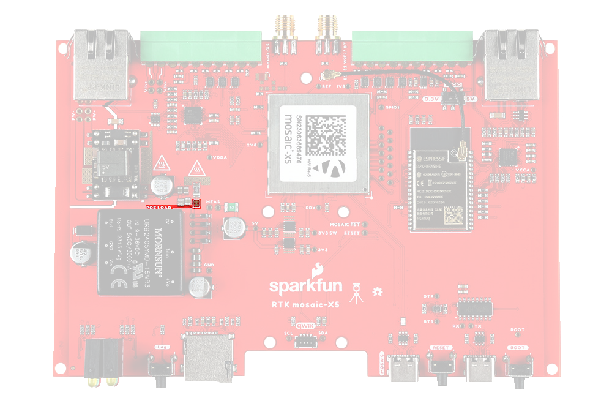{ width="400" }](./assets/img/hookup_guide/Jumpers-top.png "Click to enlarge")
<figcaption markdown>
The jumpers on the top of the RTK mosaic-X5 PCB.
</figcaption>
</figure>

<figure markdown>
[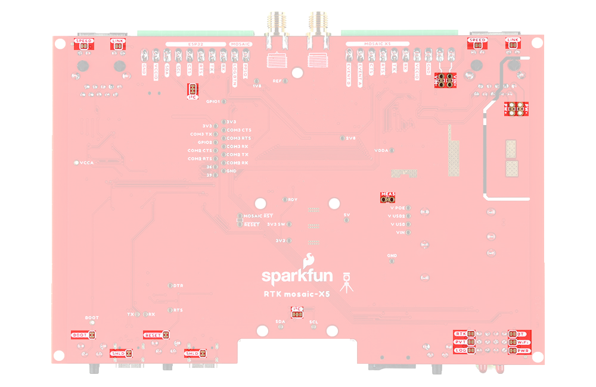{ width="400" }](./assets/img/hookup_guide/Jumpers-bottom.png "Click to enlarge")
<figcaption markdown>
The jumpers on the bottom of the RTK mosaic-X5 PCB.
</figcaption>
</figure>

=== "Top"
	* **POE LOAD** - This jumper can be used to disconnect the Power-over-Ethernet (PoE) module 50&ohm; load.
		* The PoE module has a minimum load of 100mA. We included the 50&ohm; load to ensure this is met. If you can ensure this by other means, open this jumper to disconnect the load.

=== "Bottom"
	* LED Jumpers
		* **LINK** (x2) - open these jumpers to disable the Ethernet Link LEDs.
		* **SPEED** (x2) - open these jumpers to disable the Ethernet Speed LEDs.
		* **RTK** - open this jumper to disable the mosaic-X5 Real-Time Kinetic LED.
		* **PVT** - open this jumper to disable the mosaic-X5 Position Velocity Time LED.
		* **LOG** - open this jumper to disable the mosaic-X5 Log LED.
		* **BT** - open this jumper to disable the ESP32 BT LED.
		* **WiFi** - open this jumper to disable the ESP32 WiFi LED.
		* **PWR** - open this jumper to disable the Power LED.
	* Button Jumpers
		* **BOOT** - open this jumper to disconnect the ESP32 BOOT pushbutton.
		* **RESET** - open this jumper to disconnect the ESP32 RESET pushbutton.
	* **SHLD** (x2) - open these jumpers to isolate the USB-C connector shield from GND.
	* **I2C** - open this dual jumper to disconnect the pull-ups for the SDA and SCL I/O terminals.
		* Note: the internal 3.3V Qwiic bus has its own pull-ups which are disconnected by default. These can be enabled by closing the dual jumper under the OLED Qwiic connector. We suggest you only do this if you are disconnecting the OLED.
	* **VIN+** and **VIN-**
		* Open these jumpers if you wish to isolate (disconnect) the external DC power terminals. The breakout pads can then be used to feed in power from an alternate source.
	* **PW+** and **PW-**
		* Open these jumpers if you wish to isolate (disconnect) the Power-over-Ethernet pins on the MOSAIC Ethernet magjack. The breakout pads can then be used to feed in power from an alternate source.
	* **MEAS**
		* Open the **MEAS** jumper if you wish to measure the total current drawn by the RTK mosaic-X5, or (e.g.) wish to add an ON/OFF switch. The breakout pads can then be used to attach a multimeter or a mechanical power switch.
		* **MEAS** is _upstream_ of the two 3.3V regulators and _downstream_ of the four power source combination and protection diodes.
