The RTK mosaic-X5 is inspired by the [Septentrio mowi (mosaic wireless) open-source design](https://github.com/septentrio-gnss/mowi). The SparkFun design builds upon mowi, adding: separate Ethernet ports with mag jacks and Power-over-Ethernet; robust I/O headers with screw cage connections and configurable I/O voltage (3.3V or 5V); microSD data storage; and an OLED display.

We have intentionally kept the ESP32 firmware as simple as possible - supporting only two modes: Ethernet (mode **1**) and WiFi (mode **2**). The intention being that you can easily develop your own firmware for the RTK mosaic-X5 using the Espressif ESP IDF if the SparkFun firmware does not meet your needs.

You can of course modify the hardware too, should you want to. The design is completely open-source.

In this section we walk you through the hardware design, interfaces, I/O connections, power options and more.

## Schematic
Users can download the [full schematic for the RTK mosaic-X5](/docs/assets/board_files/schematic.pdf) in .pdf format.

## Board Dimensions
The board dimensions are illustrated in the drawing below; the listed measurements are in inches.

<figure markdown>
[{ width="400" }](./assets/board_files/dimensions.png "Click to enlarge")
<figcaption markdown>
[Board dimensions (PNG)](./assets/board_files/dimensions.png) for the RTK mosaic-X5 PCB, in inches.
</figcaption>
</figure>

??? tip "Need more measurements?"
	For more information about the board's dimensions, users can download the [Eagle files](./assets/board_files/eagle_files.zip) for the board. These files can be opened in Eagle and additional measurements can be made with the dimensions tool.

	??? info ":octicons-download-16:{ .heart } Eagle - Free Download!"
		Eagle is a [CAD]("computer-aided design") program for electronics that is free to use for hobbyists and students. However, it does require an account registration to utilize the software.

		

		[Download from :autodesk-primary:{ .autodesk }](https://www.autodesk.com/products/eagle/free-download "Go to downloads page"){ .md-button .md-button--primary width="250px" }
		

	
	??? info ":straight_ruler: Dimensions Tool"
		This video from Autodesk demonstrates how to utilize the dimensions tool in Eagle, to include additional measurements:

		

		

		<iframe src="https://www.youtube.com/embed/dZLNd1FtNB8" title="EAGLE Dimension Tool" frameborder="0" allow="accelerometer; autoplay; clipboard-write; encrypted-media; gyroscope; picture-in-picture" allowfullscreen></iframe>
		

		{ .qr }
		

## Septentrio mosaic-X5
The heart of our product is of course the mosaic-X5 GNSS module from Septentrio. It is a _very_ sophisticated chip with multiple interfaces: UARTS, USB and Ethernet. The COM2 and COM3 UART pins, plus GPIO1 and GPIO2, are available as 0.1" test points should you need access to them.

<figure markdown>
[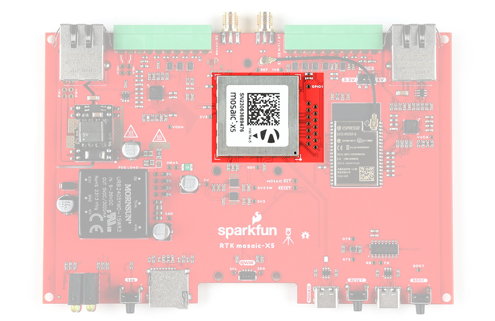{ width="400" }](./assets/img/hookup_guide/X5.jpg "Click to enlarge")
<figcaption markdown>The Septentrio mosaic-X5 GNSS module.</figcaption>
</figure>

## Espressif ESP32-WROVER
The only interface the mosaic-X5 doesn't offer is WiFi and that's why we've included an Espressif ESP32-WROVER processor (16MB flash, 8MB PSRAM) with its own Ethernet connection. You can connect the mosaic-X5 directly to your Ethernet network - our product supports Power-over-Ethernet too. Or you can link the mosaic-X5 Ethernet port to the ESP32 Ethernet port and have the ESP32 provide WiFi connectivity. In that mode, the ESP32 becomes an Ethernet to WiFi Bridge, seamlessly passing WiFi traffic to and from the mosaic-X5 via Ethernet.

<figure markdown>
[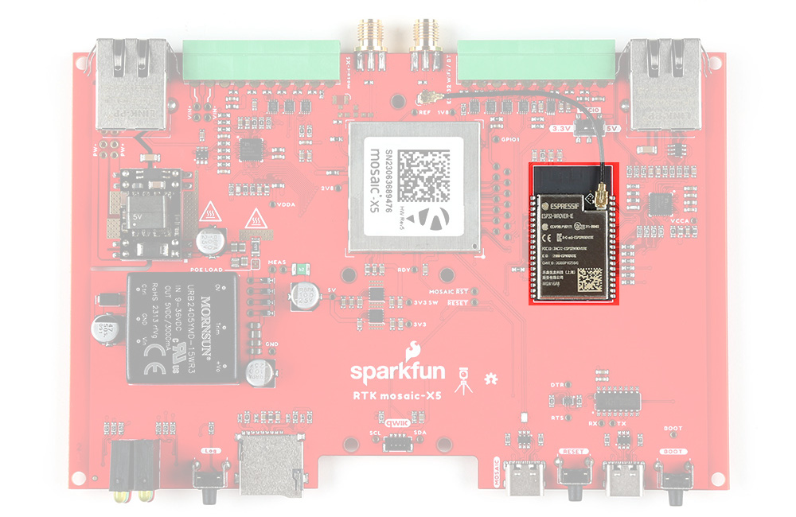{ width="400" }](./assets/img/hookup_guide/ESP32.jpg "Click to enlarge")
<figcaption markdown>The Espressif ESP32-WROVER processor.</figcaption>
</figure>

Think of the ESP32 as a co-processor, or riding shotgun... The mosaic-X5 COM4 UART is linked to the ESP32, allowing the two to communicate directly without needing the Ethernet link. In our firmware, the ESP32 requests NMEA GGA data over this link and then displays it on the I2C OLED display.

## Ethernet PHY Interfaces and Connections
The mosaic-X5 and ESP32 have identical KSZ8041NLI Ethernet PHY interfaces, both connected using Reduced Media-Independent Interfaces (RMII). These allow the mosaic-X5 and ESP32 to be linked directly to your Ethernet network or router, or to each other when the ESP32 is acting as an Ethernet-to-WiFi Bridge.

<figure markdown>
[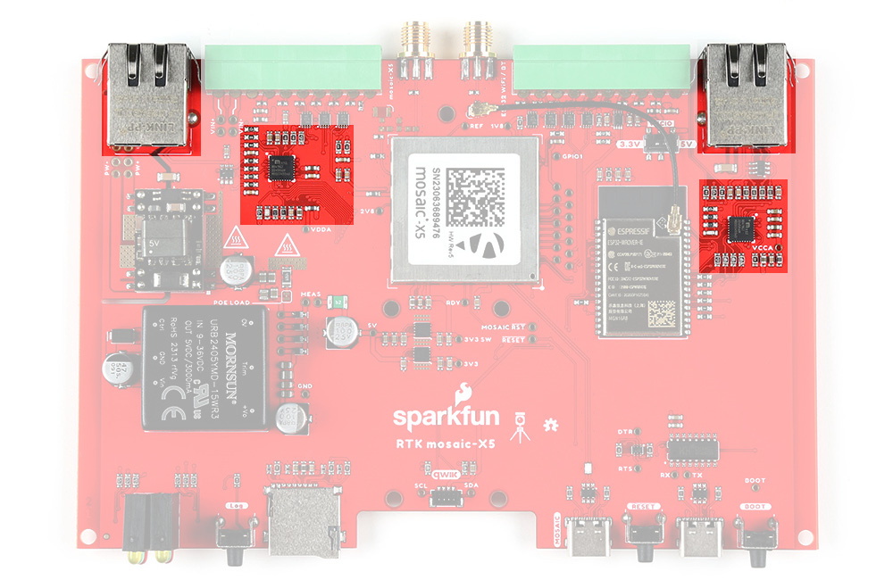{ width="400" }](./assets/img/hookup_guide/PHY.jpg "Click to enlarge")
<figcaption markdown>The dual Ethernet physical layer interfaces anbd connections.</figcaption>
</figure>

## Power-over-Ethernet (PoE)
The mosaic-X5 Ethernet port supports Power-over-Ethernet (PoE), allowing the RTK mosaic-X5 to be powered by the network. This is very useful when the RTK mosaic-X5 is mounted remotely - perhaps in a weatherproof box up on the roof. Data and power can be delivered through a single cable, avoiding the need for a separate power connection.

<figure markdown>
[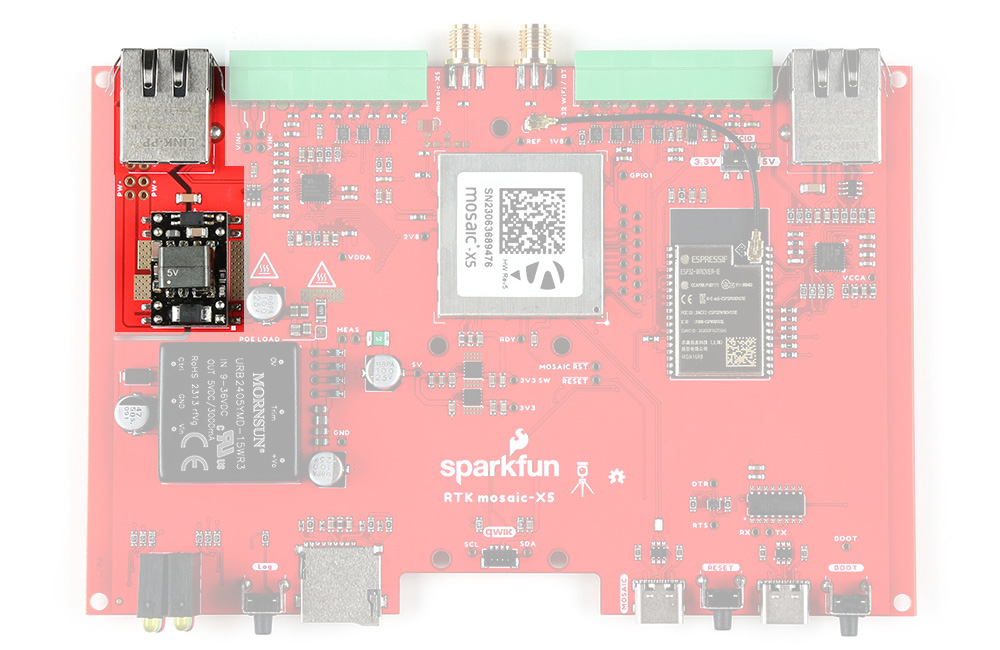{ width="400" }](./assets/img/hookup_guide/POE.jpg "Click to enlarge")
<figcaption markdown>The Power-over-Ethernet (PoE) circuit.</figcaption>
</figure>

## External DC Power (VIN)
The RTK mosaic-X5 includes a fully-isolated DC-DC converter, for applications where you may want to power the unit from a vehicle. The DC-DC converter accepts DC voltages between 9V and 36V, regulating this down to 5V. The converter is fully isolated to 1.5kV and operates with ~90% efficiency.

For 12V or 24V vehicle power: connect 12V or 24V to the **VIN+** screw cage terminal; connect 0V (chassis) to the **VIN-** screw cage terminal.

If desired, you can link **VIN-** to the adjacent **GND** screw cage terminal. But doing so bypasses the voltage isolation and could introduce an unwanted ground loop, particularly if the GNSS antenna ground (shield, 0V) is also connected to the chassis.

<figure markdown>
[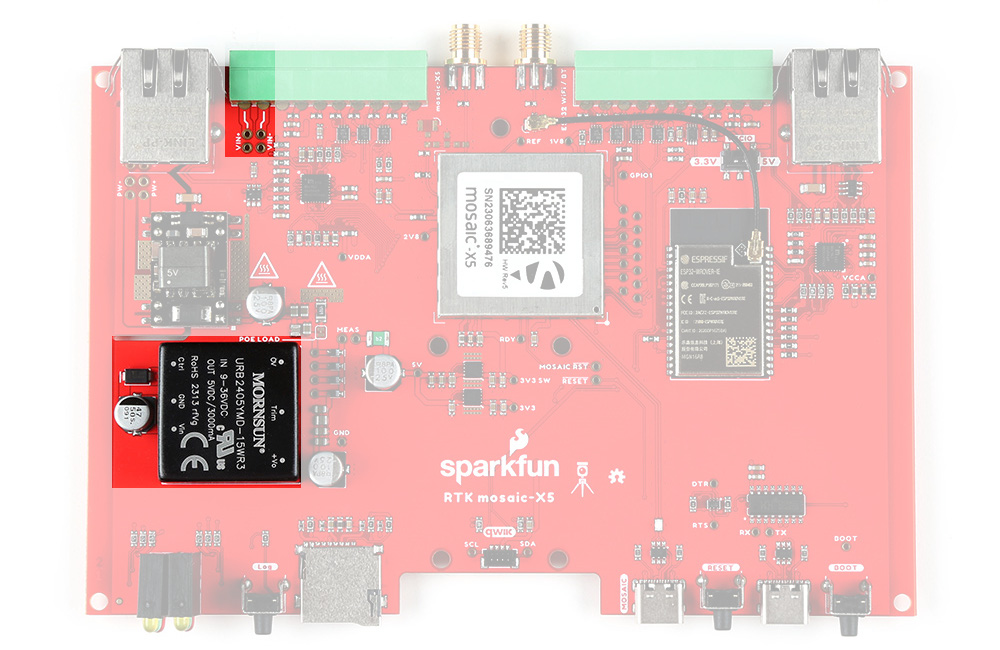{ width="400" }](./assets/img/hookup_guide/VIN.jpg "Click to enlarge")
<figcaption markdown>The DC-DC converter and external power screw terminals.</figcaption>
</figure>

## USB-C Connectors
The mosaic-X5 and ESP32 both have USB-C connections. The MOSAIC USB port is high-speed and connected to the X5 through a balancing transformer. The ESP32 USB port is connected through a CH340 USB-UART IC.

The RTK mosaic-X5 can draw power from either or both USB ports, in addition to Power-over-Ethernet and the DC-DC external input described above.

<figure markdown>
[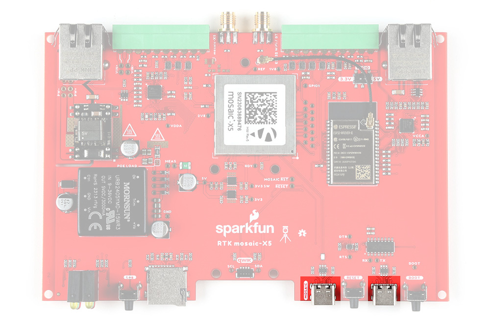{ width="400" }](./assets/img/hookup_guide/USB.jpg "Click to enlarge")
<figcaption markdown>USB-C connectors: mosaic-X5 (left) and ESP32 (right).</figcaption>
</figure>

The CH340 allows the ESP32-WROVER to communicate with a computer/host device through the USB-C connection. This allows the board to show up as a device on the serial (or COM) port of the computer. Users will need to install the latest drivers for the computer to recognize the board *(see [**Quick Start**](/SparkFun_RTK_mosaic-X5/quick_start/#WiFi) section)*.

## Power Options
The mosaic-X5 and the ESP32 both required 3.3V power. To simplify the power circuitry, the four power sources are combined into a common 5V rail which then feeds individual 3.3V 1A regulators for the mosaic-X5 and the ESP32. Diodes are used to combine and protect the power sources from each other.

If you want to measure the board's current draw, you can open the **MEAS** jumper and measure the current via a pair of breakout pads *(see the **[Jumpers](#jumpers)** section)*.

A 2A resettable fuse (green) provides additional protection.

<figure markdown>
[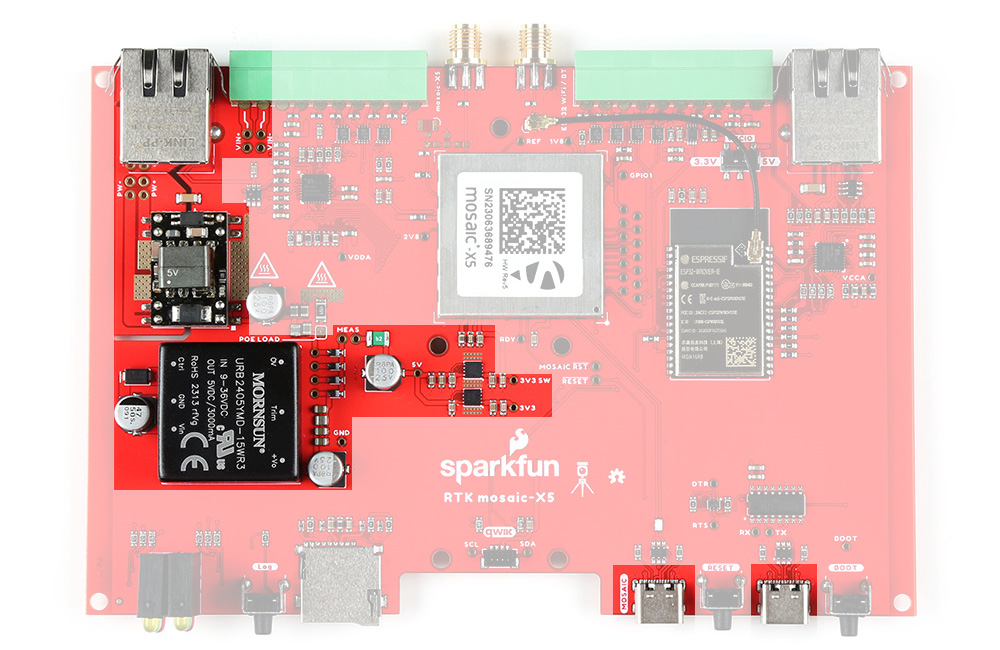{ width="400" }](./assets/img/hookup_guide/Power.jpg "Click to enlarge")
<figcaption markdown>RTK mosaic-X5 power connections.</figcaption>
</figure>

The RTK mosaic-X5 can draw power from any or all of:
* **`MOSAIC CONFIG (USB-C)`** - **5V**.
* **`ESP32 CONFIG (USB-C)`** - **5V**.
* **`Power-over-Ethernet`** - **Min: 36V**; **Max: 57V**; delivered via the **MOSAIC ETHERNET** RJ45 magjack.
* **`External DC Power`** - **Min: 9V**; **Max: 36V**; delivered via the **VIN+** and **VIN-** screw cage terminals.

!!! info
	For more details, users can reference the [schematic](./assets/board_files/schematic.pdf) and the datasheets of the individual components on the board.

## microSD storage and Log button
The microSD socket is connected directly to the mosaic-X5 via a one-bit SDIO interface for fast data logging. The mosaic-X5 supports FAT32 cards up to 32GB in size.

<figure markdown>
[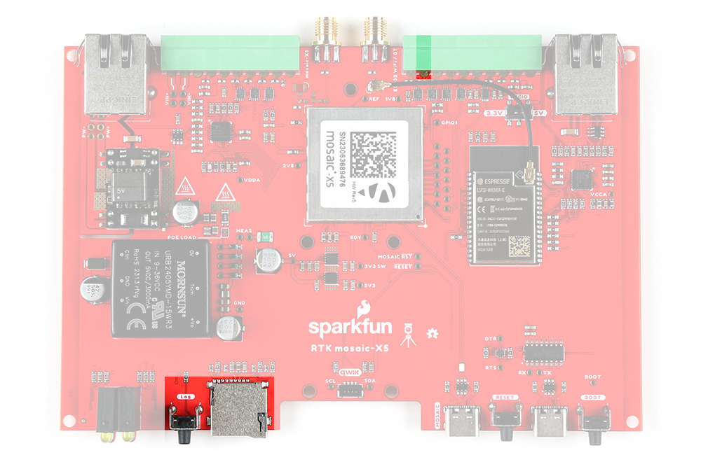{ width="400" }](./assets/img/hookup_guide/Log.jpg "Click to enlarge")
<figcaption markdown>microSD socket and Log button.</figcaption>
</figure>

Before logging can take place, it is necessary to define a "logging stream" using the **Logging** page or **RxTools**. Streams can contain NMEA or SBF (Septentrio Binary Format) data; SBF can contain RTCM and/or RINEX.

Once the stream is defined, a short press of the Log button will start or stop logging. The red Log LED will flash while logging is taking place.

A long press (> 5 seconds) on the Log button will dismount or mount the SD card. 

<figure markdown>
[{ width="400" }](./assets/img/hookup_guide/Logging.png "Click to enlarge")
<figcaption markdown>microSD logging stream configuration.</figcaption>
</figure>

## SMA RF Connections
The RTK mosaic-X5 has robust SMA connectors for the mosaic-X5 GNSS antenna and the ESP32 WiFi / BT antenna.

<figure markdown>
[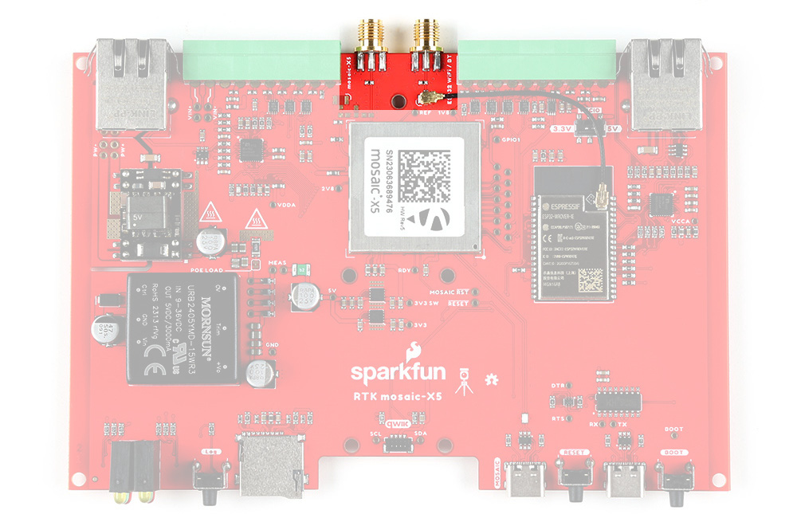{ width="400" }](./assets/img/hookup_guide/RF.jpg "Click to enlarge")
<figcaption markdown>SMA RF Connections.</figcaption>
</figure>

The mosaic-X5 SMA connector is standard polarity and provides 5V power for an active antenna.

The ESP32 WiFi / BT SMA connector is reverse-polarity. A short u.FL cable connects the SMA connector to the ESP32-WROVER itself.

## I/O Terminals
The RTK moasic-X5 is equipped with two 10-way 3.5mm screw cage terminal connectors.

<figure markdown>
[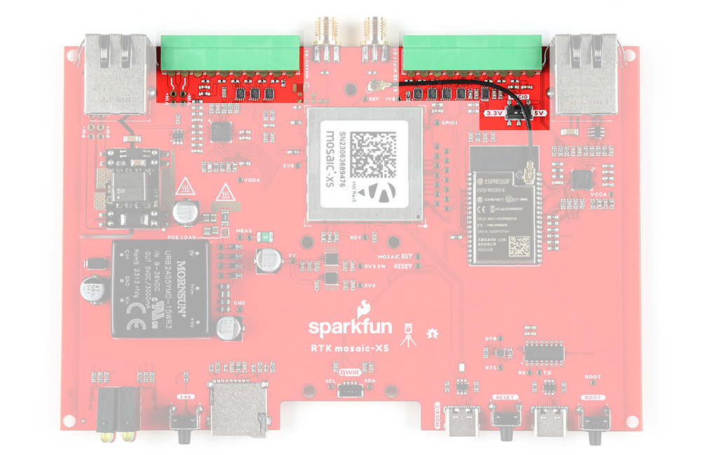{ width="400" }](./assets/img/hookup_guide/IO.jpg "Click to enlarge")
<figcaption markdown>I/O Screw Terminal Connections.</figcaption>
</figure>

These terminals are described in the tabs below. For more information on the I/O terminals, you can refer to the [schematic](./assets/board_files/schematic.pdf).

=== "External DC Power"
	The **VIN+** and **VIN-** terminals allow the RTK mosaic-X5 to be powered by an external DC power source - typically a 12V / 24V vehicle battery.

	

	| **Terminal** | **Function** |
	| :----------------- | :------------: |
	| **VIN+**   | External voltage: **Min: 9V**; **Max: 36V** |
	| **VIN-**   | Ground / Chassis / 0V |
	
	

	!!! tip
		The DC-DC converter in the RTK mosaic-X5 provides 1.5kV isolation between **VIN+**/**VIN-** and **5V**/**GND**. There is no direct electrical connection between **VIN-** and **GND**. If desired, you can link **VIN-** to the adjacent **GND** screw cage terminal. But doing so bypasses the voltage isolation and could introduce an unwanted ground loop, particularly if the GNSS antenna ground (shield, 0V) is also connected to the chassis.

=== "VIO and GND"
	The I/O terminal voltage can be set to 3.3V or 5V via the small internal slide switch highlighted below:

	<figure markdown>
	[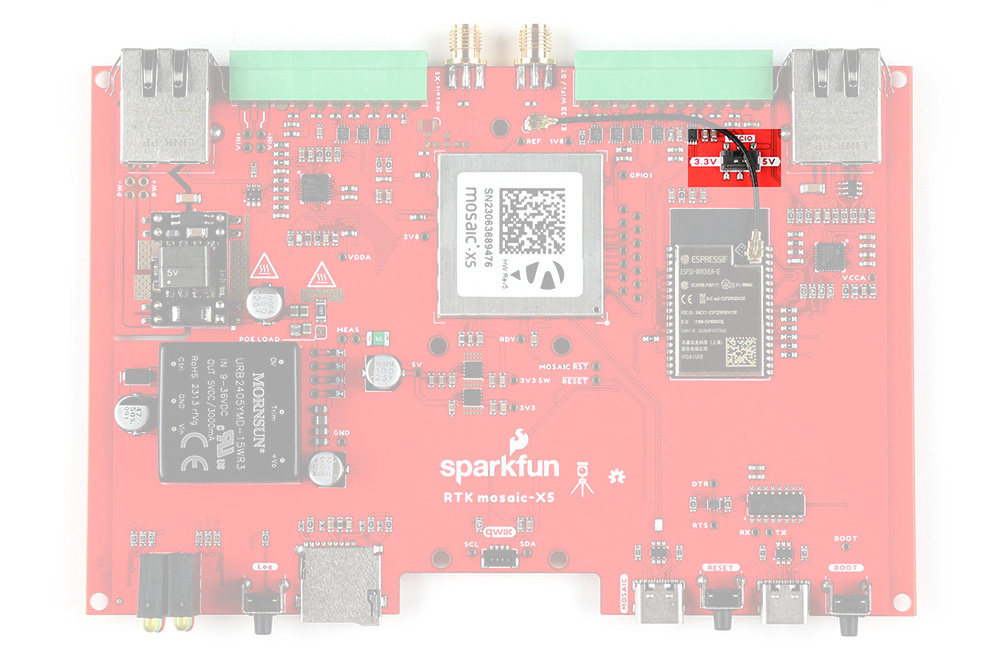{ width="400" }](./assets/img/hookup_guide/VCCIO.jpg "Click to enlarge")
	<figcaption markdown>I/O voltage selection switch.</figcaption>
	</figure>

	The **VIO** terminals can be used as power outputs or logic-high references. Likewise the **GND** terminals can be used for power return or as logic-low references.

	

	| **Terminal** | **Function** |
	| :----------------- | :------------: |
	| **VIO**   | 3.3V or 5V power output or logic-high reference |
	| **GND**   | Ground / 0V or logic-low reference |
	
	

	!!! tip
		The **VIO** and **GND** pins could be used to power (e.g.) a LoRa module. We recommend limiting the current draw from **VIO** to 200mA, and never drawing more than 500mA peak. The upstream 3.3V regulator is rated at 1A but it also provides power for the ESP32 processor.
	
=== "mosaic-X5 COM1"
	The mosaic-X5 UART COM1 connections are adjacent to the **EVENTA** and **EVENTB** terminals and are connected as follows:

	

	| **Terminal** | **Function** | **Notes** |
	| :----------------- | :------------: | :------------: |
	| **RX**   | COM1 UART Receive : Input | |
	| **TX**   | COM1 UART Transmit : Output | |
	| **RTS**  | COM1 UART Ready To Send : Output | The module drives this pin low when ready to receive data |
	| **CTS**  | COM1 UART Clear To Send : Input | Must be driven low when ready to receive data from the module.|
	
	

	!!! tip
		The COM1 I/O voltage is set by the I/O voltage selection switch.

	!!! tip
		The **CTS** input floats low by default. Pull CTS up to VIO to disable UART Transmit.

=== "mosaic-X5 EVENT A & B"
	The mosaic-X5 **EVENTA** and **EVENTB** inputs can be used to mark or timestamp external events:

	

	| **Terminal** | **Function** |
	| :----------------- | :------------: |
	| **EVENTA**   | Event A : Input |
	| **EVENTB**   | Event B : Input |
	
	

	!!! tip
		The EVENT I/O voltage is set by the I/O voltage selection switch.

	!!! tip
		The EVENT inputs are pulled low by default. Pull up to VIO to trigger an event.

	!!! tip
		An easy way to observe the events is with **RxTools** \ **RxControl** \ **Expert Console** (under **Tools**) \ **ExEvent** tab:

		<figure markdown>
		[{ width="400" }](./assets/img/hookup_guide/Event.png "Click to enlarge")
		<figcaption markdown>Capturing external events from EVENTA and EVENTB.</figcaption>
		</figure>

## Status LEDs
There are six status LEDs on the RTK mosaic-X5:

* `PWR` - Power *(Red)*
	* Iluminates when power is applied
* `LOG` - microSD Logging *(Red)*
	* Solid Red : microSD card is mounted
	* Blinking Red : data is being logged
	* Off : microSD is dismounted or not present
* `WiFi` - WiFi *(Green)*
	* The ESP32 firmware is using WiFi
	* Connected to ESP32 GPIO pin 
* `PVT` - Position Velocity Time *(Green)*
	* Solid Green : the mosaic-X5 has valid Position, Velocity and Time
	* Off : satellite signal not present or aquired
* `BT` - BT *(Yellow)*
	* The ESP32 firmware is using BT
	* Connected to ESP32 GPIO pin 
	* *Not used by firmware v1.0.0*
* `RTK` - Real-Time Kinematic *(Yellow)*
	* Solid Yellow : the mosaic-X5 has a RTK Fixed solution
	* Blinking Yellow: the mosaic-X5 has a RTK Float solution
	* Off : no RTK solution

<figure markdown>
[{ width="400" }](./assets/img/hookup_guide/LEDs.jpg "Click to enlarge")
<figcaption markdown>
The status indicator LEDs on the RTK mosaic-X5.
</figcaption>
</figure>

## Buttons
There are three buttons on the RTK mosaic-X5: ++"RST"++, ++"BOOT"++, and ++"LOG"++.

<figure markdown>
[{ width="400" }](./assets/img/hookup_guide/buttons.jpg "Click to enlarge")
<figcaption markdown>Buttons on the IoT Motor Driver.</figcaption>
</figure>

### Reset Button
The ++"RST"++ *(reset)* button allows users to reset the firmware running on the ESP32-WROVER module without unplugging the board.

### Boot Control
The ++"BOOT"++ button can be used to force the board into the serial bootloader. Holding down the ++"BOOT"++ button, while connecting the board to a computer through its USB-C connector or resetting the board will cause it to enter the <a href="https://docs.espressif.com/projects/esptool/en/latest/esp32/advanced-topics/boot-mode-selection.html#manual-bootloader">Firmware Download mode</a>. The board will remain in this mode until it power cycles (happens automatically after uploading new firmware) or the ++"RST"++ button is pressed.

1. Hold the ++"BOOT"++ button down.
2. Reset the MCU.
	* While unpowered, connect the board to a computer with through the USB-C connection.
	* While powered, press the ++"RST"++ button.
3. Release the ++"BOOT"++ button.
4. After programming is completed, reboot the MCU.
	* Press the ++"RST"++ button.
	* Power cycle the board.

## Jumpers

??? note "Never modified a jumper before?"
	Check out our <a href="https://learn.sparkfun.com/tutorials/664">Jumper Pads and PCB Traces tutorial</a> for a quick introduction!

	

	-   <a href="https://learn.sparkfun.com/tutorials/664">
		<figure markdown>
		
		</figure>

		---
		
		**How to Work with Jumper Pads and PCB Traces**</a>

	

There are nine jumpers on the back of the board that can be used to easily modify a hardware connections on the board.

* **SHLD** - This jumper can be used to disconnect the shield of the USB-C connector from `GND`.
* **MEAS** - This jumper can be used to measure the current consumption of the board.
* **BYP** - This jumper can be used to bypass the thermal fuse.
* LED Jumpers
	* **PWR** - This jumper can be used to remove power from the red, power LED on the AP2112 LDO regulator.
	* **MPWR** - This jumper can be used to remove power from the red, power LED on the AP63357 LDO regulator.
	* **STBY** - This jumper can be used to remove power from the blue, standby LED.
	* **DIAG** - This jumper can be used to remove power from the green, diagnostic LED.
* **INT** - This jumper can be used to remove the pull-up resistor from the `INT` pin of the hall-effect sensor.
* **I2C** - This jumper can be used to remove the pull-up resistors on the I2C bus.

<figure markdown>
[{ width="400" }](./assets/img/hookup_guide/jumpers.jpg "Click to enlarge")
<figcaption markdown>
The jumpers on the back of the IoT Motor Driver.
</figcaption>
</figure>

## Primary I2C Bus
The Qwiic connector and hall-effect sensor are attached to the primary I2C bus. The primary I2C bus for this board utilizes the pin connections, detailed in the table below:

<figure markdown>
[{ width="400" }](./assets/img/hookup_guide/i2c_connections.jpg "Click to enlarge")
<figcaption markdown>I2C bus connections on the IoT Motor Driver.</figcaption>
</figure>

	<table>
		<tr>
			<th style="text-align:center">
				Connection
			</th>
			<td align="center"><code>VDD</code></td>
			<td align="center"><code>GND</code></td>
			<td align="center"><code>SCL</code></td>
			<td align="center"><code>SDA</code></td>
		</tr>
		<tr>
			<th style="text-align:center; vertical-align:middle">
				Hall-Effect Sensor 
				<i>(TMAG5273)</i>
			</th>
			<td style="text-align:center; vertical-align:middle"><code>3V3</code></td>
			<td style="text-align:center; vertical-align:middle"><b>GND</b></td>
			<td style="text-align:center; vertical-align:middle"><code>GPIO 22</code></td>
			<td style="text-align:center; vertical-align:middle"><code>GPIO 21</code></td>
		</tr>
		<tr>
			<th style="text-align:center; vertical-align:middle">
				Qwiic Connector
			</th>
			<td style="text-align:center; vertical-align:middle"><code>3V3</code></td>
			<td style="text-align:center; vertical-align:middle"><b>GND</b></td>
			<td style="text-align:center; vertical-align:middle"><code>GPIO 22</code></td>
			<td style="text-align:center; vertical-align:middle"><code>GPIO 21</code></td>
		</tr>
	</table>

### Qwiic Connector
A Qwiic connector is provided for users to seamlessly integrate with <a href="https://www.sparkfun.com/qwiic">SparkFun's Qwiic Ecosystem</a>. Otherwise, users can connect their I2C devices through the PTH pins broken out on the board.

<figure markdown>
[{ width="400" }](./assets/img/hookup_guide/i2c_qwiic.jpg "Click to enlarge")
<figcaption markdown>Qwiic connector and I2C pins on the IoT Motor Driver.</figcaption>
</figure>

??? tip "What is Qwiic?"

	<!-- Qwiic Banner -->
	

	[{ width=400 }](https://www.sparkfun.com/qwiic)
	[{ width=400 }](https://www.sparkfun.com/qwiic)
	

	
	---
	
	The [Qwiic connect system](https://www.sparkfun.com/qwiic) is a solderless, polarized connection system that allows users to seamlessly daisy chain I2C boards together. Play the video below to learn more about the Qwiic connect system or click on the banner above to learn more about [Qwiic products](https://www.sparkfun.com/qwiic).
	
	
	

	

	<iframe src="https://www.youtube.com/embed/x0RDEHqFIF8" title="SparkFun's Qwiic Connect System" frameborder="0" allow="accelerometer; encrypted-media; gyroscope; picture-in-picture" allowfullscreen></iframe>
	

	

	!!! info "Features of the Qwiic System"

		=== "No Soldering"

			{ align="left" width="90" }
			{ align="left" width="90" }

			Qwiic cables (4-pin JST) plug easily from development boards to sensors, shields, accessory boards and more, making easy work of setting up a new prototype.

		=== "Polarized Connector"
	
			{ align="left" width="90" }
			{ align="left" width="90" }

			There's no need to worry about accidentally swapping the SDA and SCL wires on your breadboard. The Qwiic connector is polarized so you know you’ll have it wired correctly 	every time, right from the start.

			The PCB connector is part number SM04B-SRSS ([Datasheet](https://cdn.sparkfun.com/assets/parts/1/2/2/8/9/Qwiic_Connector_Datasheet.pdf)) or equivalent. The mating connector used on cables is part number SHR04V-S-B or an equivalent *(1mm pitch, 4-pin JST connector)*.
	
		=== "Daisy Chain-able"

			{ align="left" width="90" }
			{ align="left" width="90" }
	
			It’s time to leverage the power of the I2C bus! Most Qwiic boards will have two or more connectors on them, allowing multiple devices to be connected.
