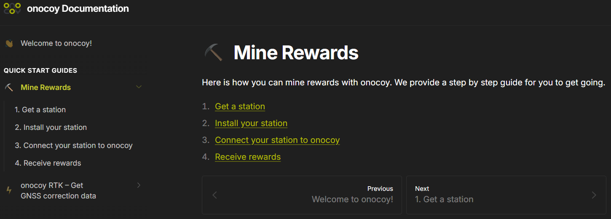
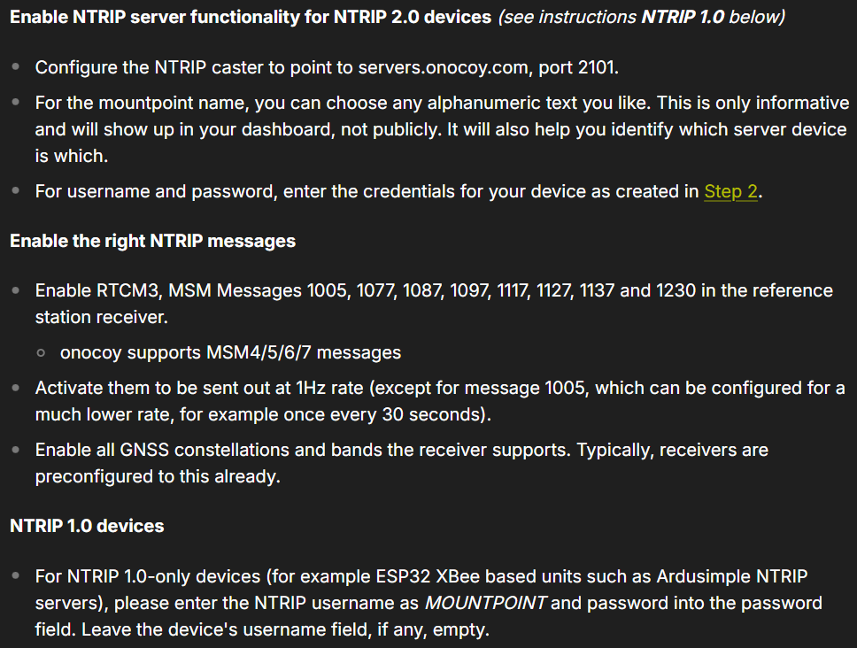
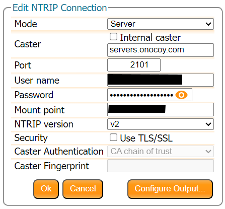
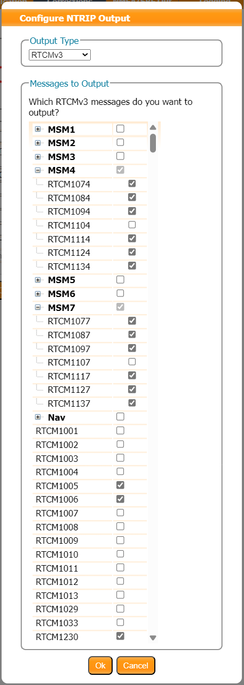

Some RTK networks, such as [Onocoy](https://www.onocoy.com/), offer users incentives for operating a reference station and contributing RTK corrections to their network. These incentives are often tied to a form of cryptocurrency, which is rewarded based upon a performance scale after the data is validated.

!!! warning
	This section is for educational purposes only!

	This section doesn't contain nor should it be represented as an endorsement of any of the projects mentioned nor as financial advice. Don’t invest anything you aren’t willing to lose.

## Onocoy Documentation
Onocoy provides users with documentation for [mining rewards](https://docs.onocoy.com/documentation/quick-start-guides/mine-rewards) with an RTK reference station. To get started, users will need to have installed and mounted the hardware of their RTK mosaic-X5 and created a user account with Onocoy. Then, users can [obtain NTRIP server credentials from their account](https://docs.onocoy.com/documentation/quick-start-guides/mine-rewards/3.-connect-your-station-to-onocoy#create-credentials-for-your-device), to connect their reference station to the Onocoy network.

<figure markdown>
[{ width="400" }](./assets/img/hookup_guide/onocoy-docs.png "Click to enlarge")
<figcaption markdown>
Onocoy documentaion for [mining rewards](https://docs.onocoy.com/documentation/quick-start-guides/mine-rewards).
</figcaption>
</figure>

## Configure the RTK mosaic-X5
In order to connect their RTK mosaic-X5 to the Onocoy network, users will need to adjust the configurations of the mosaic-X5 and setup an NTRIP server to the Onocoy network.

### :material-video-input-antenna: &nbsp;Enable L5 Band Reception
Before setting up the RTK mosaic-X5 as an NTRIP server, users will need to enable the GPS L5 frequency band in order to provide corrections for it. These steps, are documented in the [**Enable the L5 Band**](../L5/#l5-signal-reception) section of this tutorial:

-   **L5 Signal Reception**

	*Below, are instructions to enable the RTK mosaic-X5 to receive GNSS signals from the GPS L5 frequency band.*

	---

	--8<-- "./docs/L5.md:123:160"

### :material-router-network-wireless: &nbsp;Connect to the Onocoy Network
In order to connect the RTK mosaic-X5 to the Onocoy network, users will need to set up an NTRIP caster in the mosaic-X5 configuration settings. In order to receive the rewards, Onocoy expects a [specific set of configurations as listed in their online documentation](https://docs.onocoy.com/documentation/quick-start-guides/mine-rewards/3.-connect-your-station-to-onocoy).

<figure markdown>
[{ width="400" }](./assets/img/hookup_guide/onocoy-ntrip_settings.png "Click to enlarge")
<figcaption markdown>
The [specific parameters](https://docs.onocoy.com/documentation/quick-start-guides/mine-rewards/3.-connect-your-station-to-onocoy#head-back-to-your-receiver-firmware) for connecting an NTRIP server to the Onocoy network, as listed in their documentation.
</figcaption>
</figure>

Most of steps for these requirements, are documented in the [**Configure the NTRIP Server**](../ntrip_server/#configure-the-ntrip-server) section of this tutorial:

-   **Configure the NTRIP Server**

	---

	--8<-- "./docs/ntrip_server.md:49:65"

	??? failure "Ignore this information for this step"
		<s>
		--8<-- "./docs/ntrip_server.md:67:74"
		</s>

	!!! success
		Instead of the *confirmation email*, use the information provided in the [Onocoy documentation](https://docs.onocoy.com/documentation/quick-start-guides/mine-rewards/3.-connect-your-station-to-onocoy):

		> - Configure the NTRIP caster to point to `servers.onocoy.com`, port `2101`.
		> - For the `mountpoint` name, you can choose any alphanumeric text you like. This is only informative and will show up in your dashboard, not publicly. It will also help you identify which server device is which.
		> - For `username` and `password`, enter the credentials for your device as created in [Step 2](https://docs.onocoy.com/documentation/quick-start-guides/mine-rewards/3.-connect-your-station-to-onocoy#create-credentials-for-your-device).

		<figure markdown>
		[{ width="400" }](./assets/img/hookup_guide/onocoy-ntrip_server.png "Click to enlarge")
		<figcaption markdown>
		[Configuring the NTRIP server (PNG)](./assets/img/hookup_guide/onocoy-ntrip_server.png).
		</figcaption>
		</figure>

	--8<-- "./docs/ntrip_server.md:76:83"

	??? failure "Ignore this information for this step"
		<s>
		--8<-- "./docs/ntrip_server.md:85:92"
		</s>

	!!! success
		Instead, also select the RTCM messages listed in the [Onocoy documentation](https://docs.onocoy.com/documentation/quick-start-guides/mine-rewards/3.-connect-your-station-to-onocoy). Below, are the RTCM messages we selected:

		> - Enable RTCM3, MSM Messages `1005`, `1077`, `1087`, `1097`, `1117`, `1127`, `1137`, and `1230` in the reference station receiver.
		> - onocoy supports MSM4/5/6/7 messages

		<figure markdown>
		[{ width="400" }](./assets/img/hookup_guide/onocoy-rtcm_messages.png "Click to enlarge")
		<figcaption markdown>
		[RTCMv3 messages (PNG)](./assets/img/hookup_guide/onocoy-rtcm_messages.png).
		</figcaption>
		</figure>

	--8<-- "./docs/ntrip_server.md:94:95"

### :fontawesome-solid-map-location-dot: &nbsp;Enable L5 Corrections
The last step in configuring the NTRIP server, users will need to enable the GPS L5 signal to be included in the MSM output messages. This will allow the RTK mosaic-X5 to provide RTK corrections for the GPS L5 frequency band. These steps, are documented in the [**Output L5 Corrections**](../L5/#output-l5-corrections) section of this tutorial:

-   **Output L5 Corrections**

	*Below, are instructions for outputting RTK corrections for the GPS L5 frequency band, from the RTK mosaic-X5.*

	---

	--8<-- "./docs/L5.md:173"

## :fontawesome-solid-money-bill-trend-up: &nbsp;Receive Rewards
Once users have connected the RTK mosaic-X5 as an NTRIP server on the Onocoy network, there are a few additional steps in that need to be completed, a specified in their [online documentation](https://docs.onocoy.com/documentation/quick-start-guides/mine-rewards/4.-receive-rewards).

:material-pickaxe::material-gold:&nbsp; Happy Mining! :material-pickaxe::material-gold:

