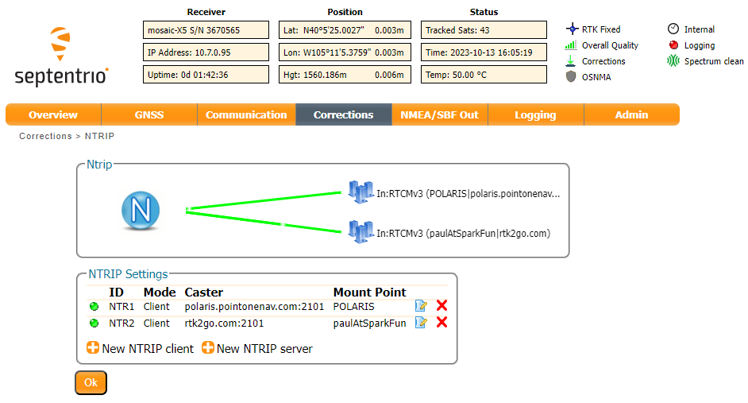
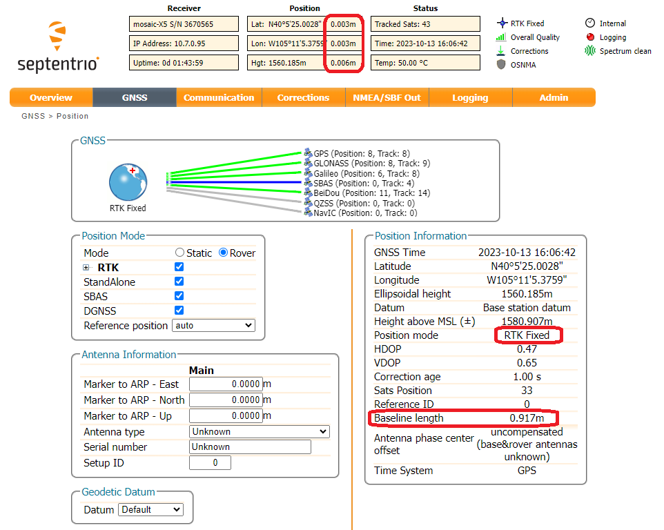

Now that the Base mosaic-X5 is sending RTCM corrections to RTK2go via NTRIP, we can configure our Rover mosaic-X5 to use those corrections. We've mentioned before that the mosaic-X5 is a very clever GNSS module. We can configure it to use more than one NTRIP Caster or Correction Service. It will use the best data available to give an RTK fix. This is very handy if one of your correction sources goes offline, the mosaic-X5 will fall back to another.

The configuration process is exactly the same as we used for the [Correction Service](correction_service.md). We simply add another NTRIP Client.

In the **Corrections** tab, select **New NTRIP client**:

<figure markdown>
[{ width="400" }](./assets/img/hookup_guide/NTRIP_client_1.png "Click to enlarge")
<figcaption markdown>
[Configuring the NTRIP client (PNG)](./assets/img/hookup_guide/NTRIP_client_1.png).
</figcaption>
</figure>

Enter the details of your RTK2go mount point. You don't need a password, but you do need to enter a username (email address) - a fake one is OK. The **Mount point** pull-down is populated after you enter the **Caster** and **Port**.

<figure markdown>
[{ width="400" }](./assets/img/hookup_guide/NTRIP_client_6.png "Click to enlarge")
<figcaption markdown>
[Configuring the NTRIP client (PNG)](./assets/img/hookup_guide/NTRIP_client_6.png).
</figcaption>
</figure>

Remember to press **OK** after each change - and save the configuration.

All being well, you should now see two green lines for your two NTRIP correction sources:

<figure markdown>
[{ width="400" }](./assets/img/hookup_guide/NTRIP_client_7.png "Click to enlarge")
<figcaption markdown>
[Configuring the NTRIP client (PNG)](./assets/img/hookup_guide/NTRIP_client_7.png).
</figcaption>
</figure>

Just for giggles, I placed the Rover and Base antennas 3' (3 feet = 0.914m) apart on the SparkFun building parapet. The Rover mosaic-X5 is showing 3mm horizontal accuracy and a Base-Rover baseline length of 0.917m. I am very happy with that!

<figure markdown>
[{ width="400" }](./assets/img/hookup_guide/NTRIP_client_8.png "Click to enlarge")
<figcaption markdown>
[RTK Baseline Length (PNG)](./assets/img/hookup_guide/NTRIP_client_8.png).
</figcaption>
</figure>

If you want to temporarily disable an NTRIP client, click the **Edit NTRIP settings** icon and then set the **Mode** to **off**. If you have two clients configured, this allows you to disable one and use the corrections from the other.

<figure markdown>
[{ width="400" }](./assets/img/hookup_guide/NTRIP_client_9.png "Click to enlarge")
<figcaption markdown>
[Disable NTRIP client (PNG)](./assets/img/hookup_guide/NTRIP_client_9.png).
</figcaption>
</figure>

