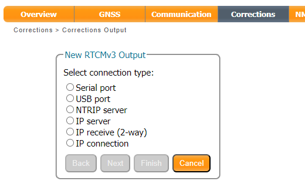
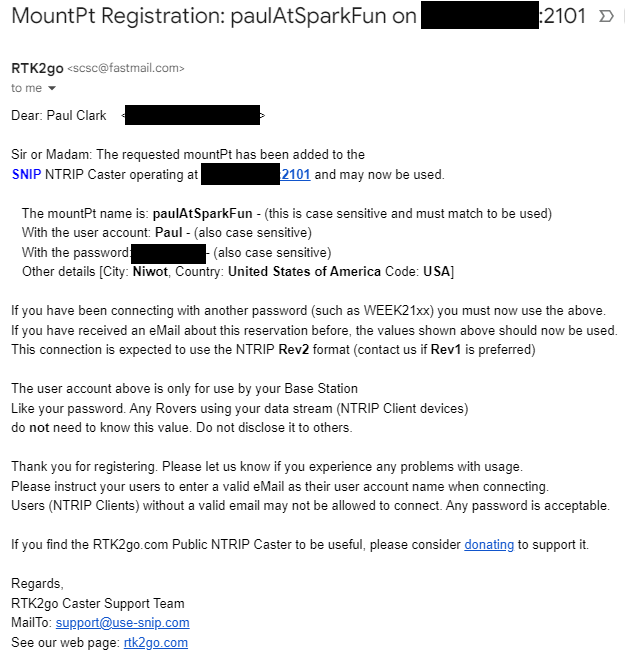
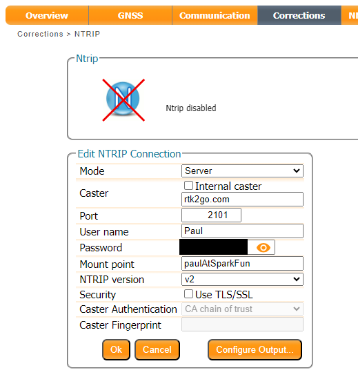
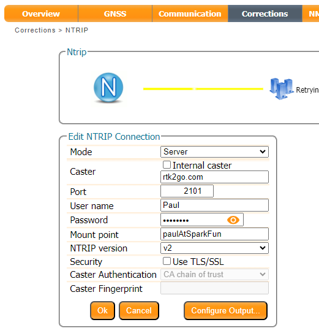
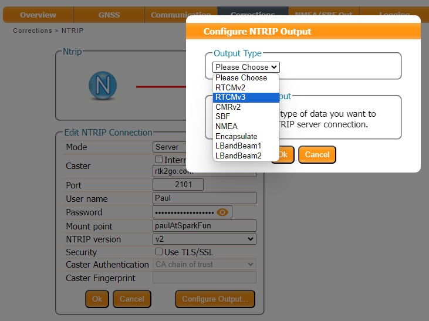
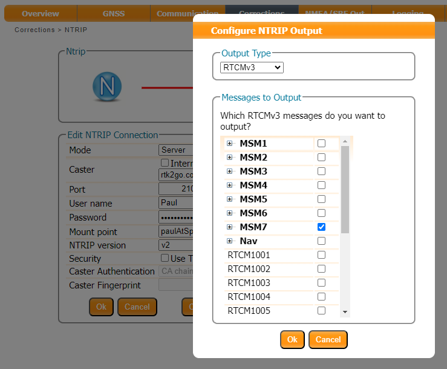
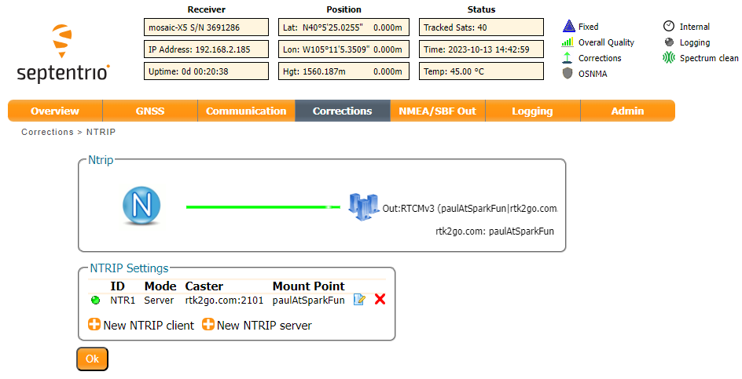
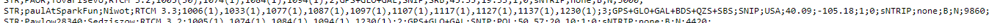
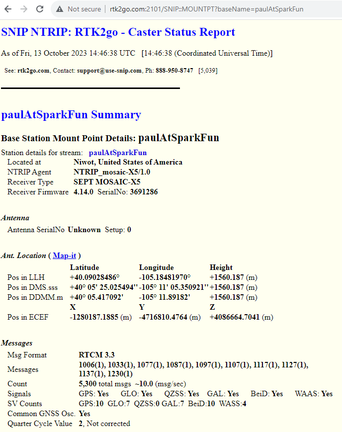

Now we know the Base's antenna position accurately, we can generate and share RTK corrections in a number of ways. The mosaic-X5 is a very clever module and is able to share corrections through an NTRIP Caster, or direct using Serial, USB, or an IP connection. For example, here are the output options available for RTCMv3:

<figure markdown>
[{ width="400" }](./assets/img/hookup_guide/RTCM_output.png "Click to enlarge")
<figcaption markdown>
[Selecting the RTCMv3 Output Type (PNG)](./assets/img/hookup_guide/RTCM_output.png).
</figcaption>
</figure>

In the Advanced Settings, you can also define which messages to output and at what internal:

<figure markdown>
[{ width="400" }](./assets/img/hookup_guide/RTCM_output_2.png "Click to enlarge")
<figcaption markdown>
[Advanced settings for RTCMv3 Output (PNG)](./assets/img/hookup_guide/RTCM_output_2.png).
</figcaption>
</figure>

In this section, we are going to concentrate on sharing the corrections using an NTRIP Caster. Think of an NTRIP Caster as an intermediary, a way of sharing RTCM corrections between Bases and Rovers. There are several good free-to-use NTRIP Caster services available, including:

* [RTK2go](http://rtk2go.com/)
* [Emlid Caster](https://emlid.com/ntrip-caster/)

Here we are going to use RTK2go.

## Create a New Base Station Reservation

Creating a New Reservation for your base station is really easy. Simply follow [the instructions](http://rtk2go.com/sample-page/new-reservation/)...

At SparkFun, we use **MountPt** names like **`bldr_dwntwn2`** , **`bldr_dwntwn3`** , **`bldr_SparkFun1`** - bldr is short for Boulder. Choose a name that is short, easy to remember and - we suggest - includes clues about who you are or where your server is. You can see the full list of all active bases at [rtk2go.com:2101](http://www.rtk2go.com:2101/).

The mosaic-X5 is a high-end receiver so be sure to select **NTRIP Rev2** as the protocol and provide a login user name. IBAN - the banking network - provides a handy list of [three-letter country codes](https://www.iban.com/country-codes).

The registration process typically takes under 8 hours to complete, somewhat longer on weekends. Once your mount point has been set up, RTK2go will send you a nice email confirming the mount point (**mountPt**) name, password and other details (Country, Country Code etc..). Make a note of those details, as we need to enter them into the mosaic-X5 NTRIP Server configuration.

<figure markdown>
[{ width="400" }](./assets/img/hookup_guide/NTRIP_server_0.png "Click to enlarge")
<figcaption markdown>
[RTK 2 Go Confirmation Email (PNG)](./assets/img/hookup_guide/NTRIP_server_0.png).
</figcaption>
</figure>

## Configure the NTRIP Server

Check that the **Position Mode** is set to **Static**, using either the precise position from your RINEX post-process data or an *automatic* **Reference Position**.

<figure markdown>
[{ width="400" }](./assets/img/hookup_guide/NTRIP_server_1.png "Click to enlarge")
<figcaption markdown>
[Configuring the Reference Position (PNG)](./assets/img/hookup_guide/NTRIP_server_1.png).
</figcaption>
</figure>

In the **Corrections** tab, select **New NTRIP server**:

<figure markdown>
[{ width="400" }](./assets/img/hookup_guide/NTRIP_server_2.png "Click to enlarge")
<figcaption markdown>
[Configuring the NTRIP server (PNG)](./assets/img/hookup_guide/NTRIP_server_2.png).
</figcaption>
</figure>

Enter the details from the confirmation email:

<figure markdown>
[{ width="400" }](./assets/img/hookup_guide/NTRIP_server_3.png "Click to enlarge")
<figcaption markdown>
[Configuring the NTRIP server (PNG)](./assets/img/hookup_guide/NTRIP_server_3.png).
</figcaption>
</figure>

Then use the **Configure Output** button to select the RTCM Output Type and which RTCM messages to send. Here we select **RTCMv3**. The mosaic-X5 supports both **RTCMv2** and **RTCMv3**, but **v3** has better data compression and message integrity so we will use that.

<figure markdown>
[{ width="400" }](./assets/img/hookup_guide/NTRIP_server_4.png "Click to enlarge")
<figcaption markdown>
[Configure Output (PNG)](./assets/img/hookup_guide/NTRIP_server_4.png).
</figcaption>
</figure>

We also need to select which type of RTCM message to send. Here we select **MSM7** since these are the longest highest precision messages. The message length does not matter since we are using Ethernet and WiFi, but it could be important if we were using Serial (UART) or LoRa to carry the correction messages.

<figure markdown>
[{ width="400" }](./assets/img/hookup_guide/NTRIP_server_5.png "Click to enlarge")
<figcaption markdown>
[Configure Output (PNG)](./assets/img/hookup_guide/NTRIP_server_5.png).
</figcaption>
</figure>

Remember to press **OK** after each change - and save the configuration.

All being well, you should see a green line for NTRIP showing that your corrections are being forwarded to the caster:

<figure markdown>
[{ width="400" }](./assets/img/hookup_guide/NTRIP_server_6.png "Click to enlarge")
<figcaption markdown>
[NTRIP connection (PNG)](./assets/img/hookup_guide/NTRIP_server_6.png).
</figcaption>
</figure>

We can check [RTK2go.com:2101](http://www.rtk2go.com:2101/) to see if the corrections are being received:

<figure markdown>
[{ width="400" }](./assets/img/hookup_guide/NTRIP_server_7.png "Click to enlarge")
<figcaption markdown>
[Caster Status (PNG)](./assets/img/hookup_guide/NTRIP_server_7.png).
</figcaption>
</figure>

We can see more details by opening the Caster Status Report. Here I am using the Mount Point **paulAtSparkFun**, so the full report is available at [rtk2go.com:2101/SNIP::MOUNTPT?baseName=paulAtSparkFun](http://rtk2go.com:2101/SNIP::MOUNTPT?baseName=paulAtSparkFun):

<figure markdown>
[{ width="400" }](./assets/img/hookup_guide/NTRIP_server_8.png "Click to enlarge")
<figcaption markdown>
[Caster Status Report (PNG)](./assets/img/hookup_guide/NTRIP_server_8.png).
</figcaption>
</figure>

We've mentioned before that the mosaic-X5 is a very clever GNSS module. We can configure it to send corrections to *multiple* NTRIP Casters if desired, simply by adding extra NTRIP Caster Server connections.
