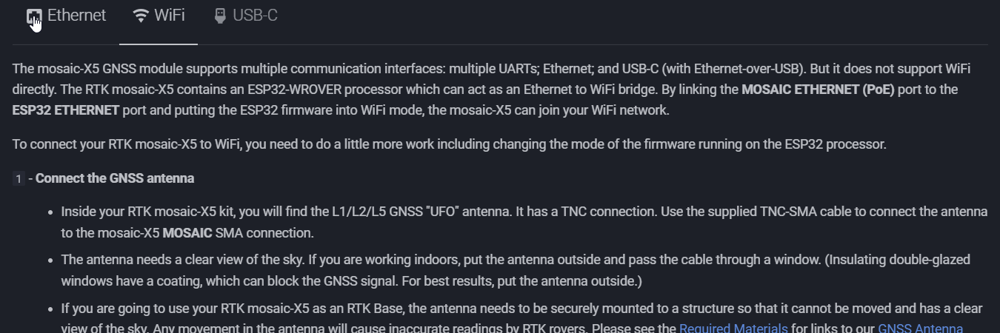
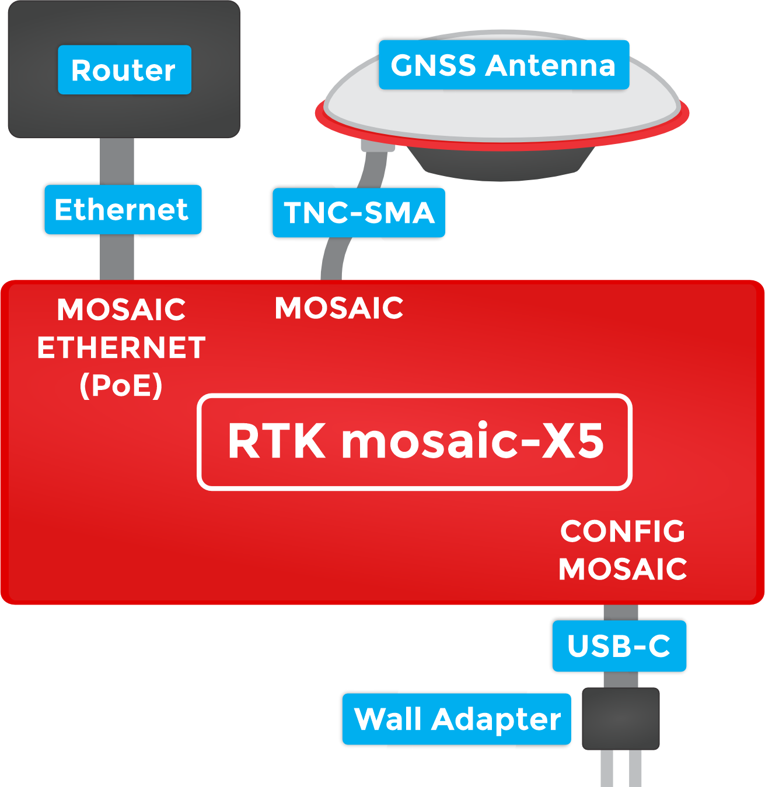
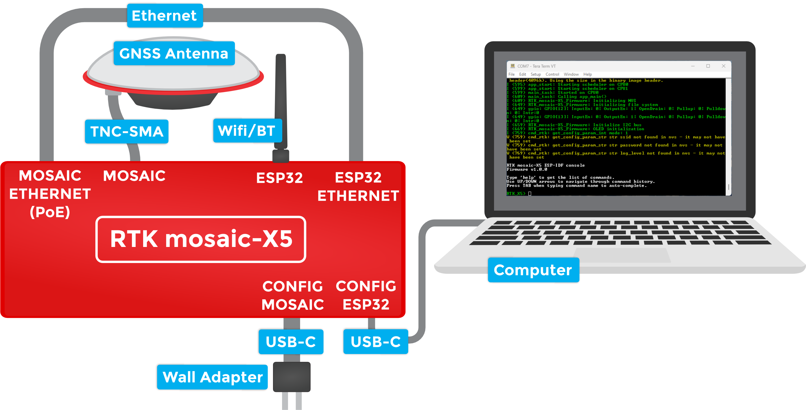
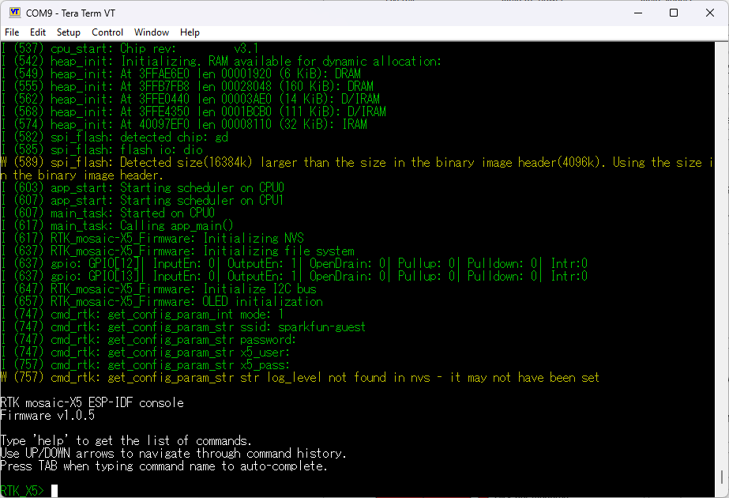
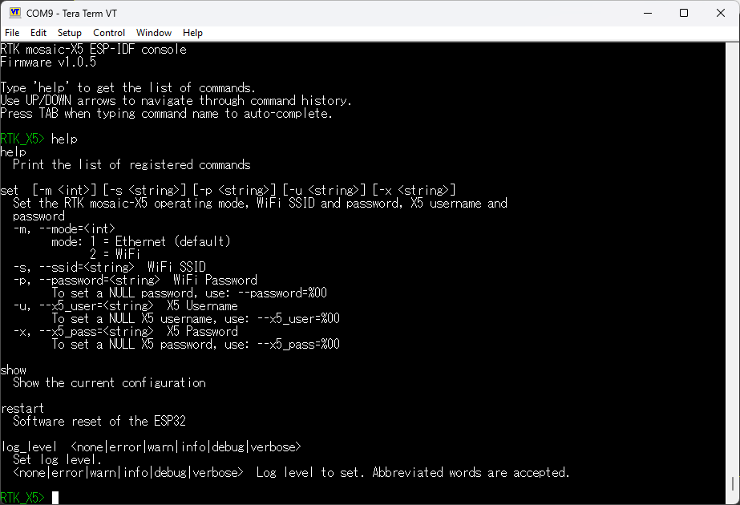
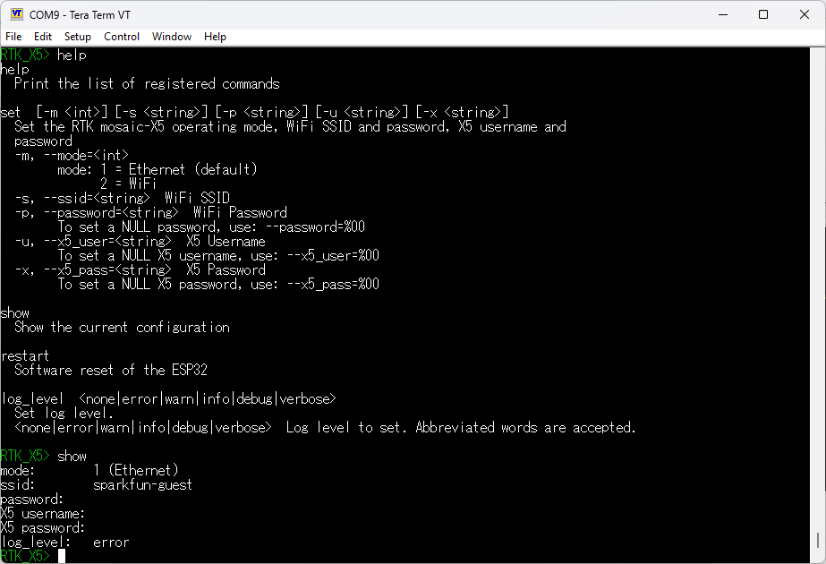
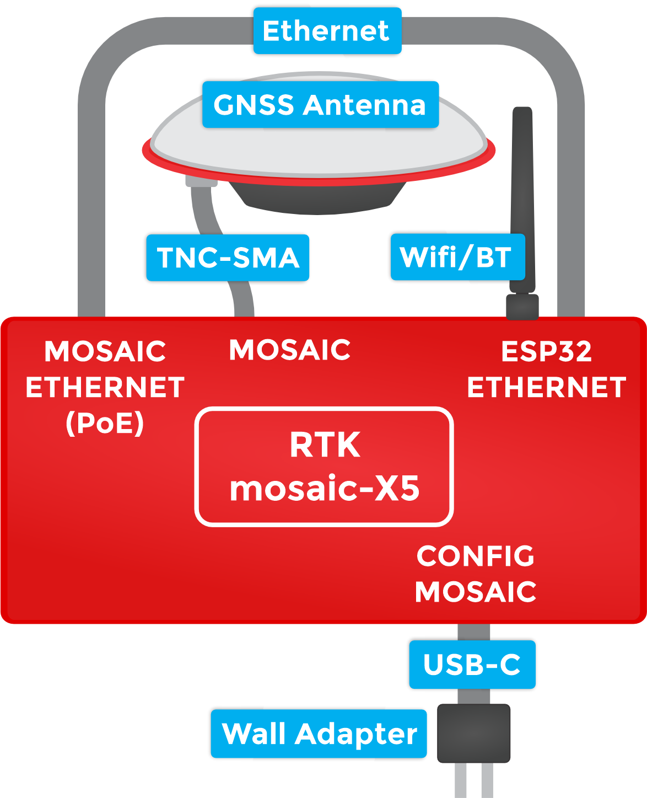
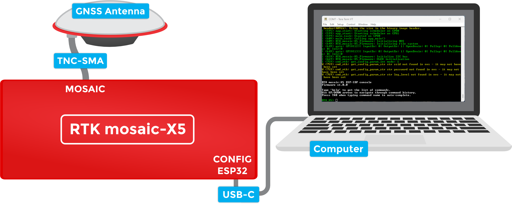

!!! abstract "Directions"

	This *quick start* guide is intended to help users get started with their RTK mosaic-X5, without having to review the technical details of the product. It includes the minimum instructions to initially set up the RTK mosaic-X5, depending on the primary interface that users would like to utilize:

	<div class="grid" markdown>

	<div markdown>

	**Ethernet**

	: Instructions to connect the RTK mosaic-X5 to a network with an ethernet cable. This will provide the mosaic-X5 with network connectivity for its web server. Users can then pull up the configuration web page from any computer connected to that network.

	**WiFi**

	: Instructions for remote/exterior installations, where a WiFi connection is preferred. This will provide WiFi connectivity to mosaic-X5's web server; where users can then access the configuration web page from any device on the WiFi network.

	**USB-C**

	: For users that just want to interface and set up the RTK mosaic-X5, directly through their computer.

	</div>

	<div markdown>

	<figure markdown>
	[](./assets/img/hookup_guide/quick_start.gif "Click to enlarge")
	<figcaption markdown>
	Click on the tab of your preferred interface (below), to get started with the RTK mosaic-X5.
	</figcaption>
	</figure>

	</div>

	</div>


	??? info ":material-printer: Quick Start Pamphlet"
		For users who have lost the pamphlet in their kit, please check out the links below to download the `*.pdf` file:

		<figure markdown>
		[{ width="150" }]( "Click to enlarge")
		<figcaption markdown>
		[:octicons-download-16:{ .heart } Download the Quick Start Guide :fontawesome-solid-file-pdf:](./assets/quick_start_guide-v10.pdf "Click to Download"){ .md-button .md-button--primary }
		</figcaption>
		</figure>
		<center>
		*Click on the button (above) or scan the QR code with a mobile device, to download the `*.pdf` file of the quick start pamphlet.*
		</center>


=== "<H2>:material-ethernet:&nbsp;Ethernet</H2>"

	The simplest way to get your RTK mosaic-X5 up and running is to connect it to your Ethernet network or an Ethernet port on your broadband router:

	<figure markdown>
	[{ width="400" }](./assets/img/hookup_guide/Ethernet_Connections.png "Click to enlarge")
	<figcaption markdown>
	[Ethernet Connections (PNG)](./assets/img/hookup_guide/Ethernet_Connections.png) for the RTK mosaic-X5.
	</figcaption>
	</figure>

	**`1`** - **Connect the GNSS antenna**
	: * Inside your RTK mosaic-X5 kit, you will find the L1/L2/L5 GNSS "UFO" antenna. It has a TNC connection. Use the supplied TNC-SMA cable to connect the antenna to the mosaic-X5 **MOSAIC** SMA connection.
		* The antenna needs a clear view of the sky. If you are working indoors, put the antenna outside and pass the cable through a window. (Insulating double-glazed windows have a coating which can block the GNSS signal. For best results, put the antenna outside.)
		* If you are going to use your RTK mosaic-X5 as an RTK Base, the antenna needs to be securely mounted to a structure so that it cannot be moved and has a clear view of the sky. Any movement in the antenna will cause inaccurate readings by RTK rovers. Please see the [Required Materials](./introduction.md#required-materials) for links to our [GNSS Antenna Mounting Hardware Kit](https://www.sparkfun.com/products/22197) and [GNSS Magnetic Antenna Mount - 5/8" 11-TPI](https://www.sparkfun.com/products/21257)
	**`2`** - **Connect the RTK mosaic-X5 to your Ethernet network or router**
	: * Use the supplied CAT-6 Ethernet cable to connect the **MOSAIC ETHERNET (PoE)** port to your network or an Ethernet port on your router.
		* If your router provides Power-over-Ethernet (PoE), you're all set! You should see the red power (PWR) LED light up and text start to scroll up the OLED display.
		* If your router does not provide PoE, move on to step 3.
	**`3`** - **Provide power**
	: * You can power the RTK mosaic-X5 using the supplied USB power supply (5V 1A wall adapter).
		* Plug the power supply into the wall.
		* Use the supplied USB-C cable to connect the power supply to either the **CONFIG MOSAIC** or the **CONFIG ESP32** USB-C port. It does not matter which.
		* You should see the red power (PWR) LED light up and text start to scroll up the OLED display.

	Once the mosaic-X5 has acquired a satellite signal and is connected to the Ethernet network, the OLED will display: the antenna's position as Latitude (Lat), Longitude (Long) and Altitude (Alt); the Ethernet IP (Internet Protocol) network address.

	Connect your computer, tablet or phone to the same network, open a web browser and navigate to the IP address shown on the OLED display. You should see the mosaic-X5's internal web page. The web page displays a lot of helpful information and can also be used to fully configure the mosaic-X5.

	<figure markdown>
	
	<figcaption markdown>
	[mosaic X5 web page (GIF)](./assets/img/hookup_guide/x5_web_page.gif) for the RTK mosaic-X5.
	</figcaption>
	</figure>

	!!! tip "Not working?"
		The following sections will help if your RTK mosaic-X5 is not working as expected:

		??? info "No power?"
			The red power (PWR) LED will light up when the RTK mosaic-X5 has power. If the PWR LED is off, make sure the wall adapter has power and the USB cable is connected.

			If you use your own Ethernet cable for Power-over-Ethernet, check it has all eight pins connected. Some cables only have four pins connected and do not support Power-over-Ethernet.

		??? info "No position information?"
			The OLED display will only show position information (Lat, Long, Alt etc.) once a satellite signal has been acquired. If you see only the IP address on the display, check the SMA to TNC cable is connected correctly and that the antenna is outside with a clear view of the sky. Use a [male-female SMA extension cable](https://www.sparkfun.com/products/21281) if needed to increase the cable length.

		??? info "No IP address?"
			By default, the mosaic-X5 Ethernet port is configured for Dynamic Host Configuration Protocol (DHCP). It expects the router / Ethernet switch to provide it with an IP address. If the IP address is all zeros (0.0.0.0), check that your router has DHCP enabled. Most do.

			If you need a static IP address, you can configure this through the mosaic-X5's **Communication \ Ethernet** sub-page.

			Subnet 3 is reserved for the mosaic-X5's USB-C connection (Ethernet-over-USB). If your router / switch is allocating addresses using subnet 3 (192.168.3.***), please change its settings so it uses a different subnet.

		??? info "No web page?"
			If you can not see the mosaic-X5's internal web page, please check that your computer / tablet / phone is connected to the same network. Most broadband routers support both Ethernet and WiFi simultaneously using the same subnet. If you are using a phone, check it is connected to the router WiFi - and not using its mobile data connection.

			Subnet 3 is reserved for the mosaic-X5's USB-C connection (Ethernet-over-USB). If your router / switch is allocating addresses using subnet 3 (192.168.3.***), please change its settings so it uses a different subnet. If it is using subnet 3, both the mosaic-X5 and your device will appear to have valid IP addresses but will not be able to communicate.

		??? info "Wrong mode?"
			If you still can not see the mosaic-X5's internal web page, please check that the ESP32 firmware is in the correct mode. Press the **RESET** button to restart the ESP32 and watch the text, which scrolls up the OLED display. You should see **Mode 1: Ethernet** displayed briefly. If you see **Mode 2: WiFi**, the firmware is in the wrong mode. Follow the instructions in the next section to change the mode back to **1** (Ethernet).

=== "<H2>:material-wifi:&nbsp;WiFi</H2>"

	The mosaic-X5 GNSS module supports multiple communication interfaces: multiple UARTs; Ethernet; and USB-C (with Ethernet-over-USB). But it does not support WiFi directly. The RTK mosaic-X5 contains an ESP32-WROVER processor which can act as an Ethernet to WiFi bridge. By linking the **MOSAIC ETHERNET (PoE)** port to the **ESP32 ETHERNET** port and putting the ESP32 firmware into WiFi mode, the mosaic-X5 can join your WiFi network.

	To connect your RTK mosaic-X5 to WiFi, you need to do a little more work including changing the mode of the firmware running on the ESP32 processor.

	`1` - **Connect the GNSS antenna**
	:	* Inside your RTK mosaic-X5 kit, you will find the L1/L2/L5 GNSS "UFO" antenna. It has a TNC connection. Use the supplied TNC-SMA cable to connect the antenna to the mosaic-X5 **MOSAIC** SMA connection.
		* The antenna needs a clear view of the sky. If you are working indoors, put the antenna outside and pass the cable through a window. (Insulating double-glazed windows have a coating, which can block the GNSS signal. For best results, put the antenna outside.)
		* If you are going to use your RTK mosaic-X5 as an RTK Base, the antenna needs to be securely mounted to a structure so that it cannot be moved and has a clear view of the sky. Any movement in the antenna will cause inaccurate readings by RTK rovers. Please see the [Required Materials](./introduction.md#required-materials) for links to our [GNSS Antenna Mounting Hardware Kit](https://www.sparkfun.com/products/22197) and [GNSS Magnetic Antenna Mount - 5/8" 11-TPI](https://www.sparkfun.com/products/21257)
	`2` - **Attach the WiFi antenna**
	: * Screw the supplied WiFi/BT antenna onto the **ESP32** SMA connection.
		* To minimize wear of the SMA connector, we recommend: holding the antenna body with one hand - to prevent it from rotating - while screwing the SMA connector into place with your other hand.
		* Fold the antenna up if needed, so the antenna body is vertical.
	`3` - **Link the Ethernet ports**
	: * Link the **MOSAIC ETHERNET (PoE)** and **ESP32 ETHERNET** ports using the supplied cable.
		* The Ethernet ports support Auto-MDIX. You can use a standard Ethernet patch cable to link the ports. You do not need a crossover cable.
	`4` - **Connect to the CONFIG ESP32 USB port**
	: * To change the ESP32 firmware mode, you need to connect a computer to the **CONFIG ESP32** USB-C port and use a Serial Terminal to change the mode.
		* You may need to install a driver, first, so that the CH340 serial interface chip is recognized. Please click the bar below for more details.

		<figure markdown>
		[{ width="400" }](./assets/img/hookup_guide/WiFi_Mode.png "Click to enlarge")
		<figcaption markdown>
		[WiFi Mode (PNG)](./assets/img/hookup_guide/WiFi_Mode.png) for the RTK mosaic-X5.
		</figcaption>
		</figure>

		??? tip "Install CH340 Driver"
			Users may need to install the appropriate USB driver for their computer to recognize the serial-to-UART chip on their board/adapter. Most of the latest operating systems will recognize the CH340C chip on the board and automatically install the required driver. *To manually install the CH340 driver on their computer, users can download it from the [WCH website](http://www.wch-ic.com/products/CH340.html?).*

			<center>
			[:octicons-download-16:{ .heart } Download the latest CH340 USB driver from WCH](https://www.wch-ic.com/downloads/CH341SER_ZIP.html){ .md-button .md-button--primary target="blank" }
			</center>

			??? abstract "Need Directions?"
				For more information, check out our video and hookup guide:

				<div class="grid" markdown align="center">

				<div markdown>

				<div class="video-500px">
				<iframe src="https://www.youtube.com/embed/MM9Fj6bwHLk" title="Tutorial: Installing CH340 Drivers" frameborder="0" allow="accelerometer; autoplay; clipboard-write; encrypted-media; gyroscope; picture-in-picture" allowfullscreen></iframe>
				</div>

				</div>

				<div class="grid cards" markdown>

				-   <a href="https://learn.sparkfun.com/tutorials/908">
					<figure markdown>
					
					</figure>

					---

					**How to Install CH340 Drivers**</a>

				</div>

				</div>

	`5` - **Open a Serial Terminal**
	: * If you are using Windows, we still recommend the [Tera Term](https://learn.sparkfun.com/tutorials/terminal-basics/tera-term-windows) serial terminal but there are plenty of alternatives. Please see our [Serial Terminal Basics tutorial](https://learn.sparkfun.com/tutorials/terminal-basics) for more details.
		* Open the connection to the CH340 using **115200 baud** 
	`6` - **Put the ESP32 firmware into WiFi mode**
	: * When you have the Serial Terminal open, you should see the **`RTK_X5>`** console prompt. If you do not, hit Enter on your keyboard. If needed, click the ++"RESET"++ button on the front of the RTK mosaic-X5 to restart the ESP32 firmware.

		<figure markdown>
		[{ width="400" }](./assets/img/hookup_guide/Console_Prompt.png "Click to enlarge")
		<figcaption markdown>
		[Console Prompt (PNG)](./assets/img/hookup_guide/Console_Prompt.png) for changing the RTK mosaic-X5 firmware mode.
		</figcaption>
		</figure>

		* Type **`help`** and hit enter to see the help.

			<figure markdown>
			[{ width="400" }](./assets/img/hookup_guide/Console_Help.png "Click to enlarge")
			<figcaption markdown>
			[Console Help (PNG)](./assets/img/hookup_guide/Console_Help.png) for changing the RTK mosaic-X5 firmware mode.
			</figcaption>
			</figure>

		* Type **`show`** to see the current configuration.

			<figure markdown>
			[{ width="400" }](./assets/img/hookup_guide/Console_Show.png "Click to enlarge")
			<figcaption markdown>
			[Console Show (PNG)](./assets/img/hookup_guide/Console_Show.png) for changing the RTK mosaic-X5 firmware mode.
			</figcaption>
			</figure>

		* By default the firmware will be in **Mode: `1`** (Ethernet). To change the mode to **Mode: `2`** (WiFi), we type:

			!!! terminal
				``` bash
				set -m 2
				```

				!!! tip "Long Arguments"
					The console supports both short and long args, so we could type:

					``` bash
					set --mode=2
					```

		* To set the WiFi SSID, type one of:

			!!! terminal
				``` bash
				set -s YOUR_SSID
				set --ssid=YOUR_SSID
				```

			* Likewise, to set the WiFi password, type one of:

				!!! terminal
					``` bash
					set -p YOUR_PASSWORD
					set --password=YOUR_PASSWORD
					```

			* To save time, you can set all three together with one of:

				!!! terminal
					``` bash
					set -m 2 -s YOUR_SSID -p YOUR_PASSWORD
					set --mode=2 --ssid=YOUR_SSID --password=YOUR_PASSWORD
					```

		* Finally, type **`restart`** to restart the firmware with the new settings:

			!!! terminal
				``` bash
				restart
				```

			??? tip "NULL (empty) password"
				To clear the password - making it NULL / empty - type one of:

				!!! terminal
					``` bash
					set -p %00
					set --password=%00
					```


	Once the mosaic-X5 has acquired a satellite signal and is connected to the WiFi network, the OLED will display: the antenna's position as Latitude (Lat), Longitude (Long) and Altitude (Alt); the WiFi IP (Internet Protocol) network address.

	When powering the RTK mosaic-X5 on for the first time, you may see the firmware restart (reboot) several times while it waits for the mosaic-X5 to initialize. This is not an error or anything to be concerned about.

	Connect your computer, tablet or phone to the same network, open a web browser and navigate to the IP address shown on the OLED display. You should see the mosaic-X5's internal web page. The web page displays a lot of helpful information and can also be used to fully configure the mosaic-X5.

	The firmware mode, SSID and password are stored in flash (non-volatile) memory. After changing them, you can disconnect the computer and power the RTK mosaic-X5 using the supplied wall adapter.

	<figure markdown>
	[{ width="400" }](./assets/img/hookup_guide/WiFi_Connections.png "Click to enlarge")
	<figcaption markdown>
	[WiFi Connections (PNG)](./assets/img/hookup_guide/WiFi_Connections.png) for the RTK mosaic-X5.
	</figcaption>
	</figure>


	!!! tip "Not working?"
		The following sections will help if your RTK mosaic-X5 is not working as expected:

		??? info "No power?"
			The red power (PWR) LED will light up when the RTK mosaic-X5 has power. If the PWR LED is off, make sure the wall adapter has power and the USB cable is connected.

		??? info "No position information?"
			The OLED display will only show position information (Lat, Long, Alt etc.) once a satellite signal has been acquired. If you see only the IP address on the display, check the SMA to TNC cable is connected correctly and that the antenna is outside with a clear view of the sky. Use a [male-female SMA extension cable](https://www.sparkfun.com/products/21281) if needed to increase the cable length.

		??? info "No IP address?"
			The mosaic-X5 Ethernet port is configured for Dynamic Host Configuration Protocol (DHCP). It expects the WiFi network to provide it with an IP address. If the IP address is all zeros (0.0.0.0), check that your router has DHCP enabled. Most do.

			Subnet 3 is reserved for the mosaic-X5's USB-C connection (Ethernet-over-USB). If your router / switch is allocating addresses using subnet 3 (192.168.3.***), please change its settings so it uses a different subnet.

		??? info "No web page?"
			If you can not see the mosaic-X5's internal web page, please check that your computer / tablet / phone is connected to the same network. If you are using a phone, check it is connected to the router WiFi - and not using its mobile data connection.

			Subnet 3 is reserved for the mosaic-X5's USB-C connection (Ethernet-over-USB). If your router / switch is allocating addresses using subnet 3 (192.168.3.***), please change its settings so it uses a different subnet. If it is using subnet 3, both the mosaic-X5 and your device will appear to have valid IP addresses but will not be able to communicate.

		??? info "Wrong mode?"
			If you still can not see the mosaic-X5's internal web page, please check that the ESP32 firmware is in the correct mode. Press the **RESET** button to restart the ESP32 and watch the text, which scrolls up the OLED display. You should see **Mode 2: WiFi** displayed briefly. If you see **Mode 1: Ethernet**, the firmware is in the wrong mode. Follow the instructions above to change the mode to **2** (WiFi).


=== "<H2>:material-usb-port:&nbsp;USB-C</H2>"

	The mosaic-X5 has a built-in high-speed USB port which supports Ethernet-over-USB. To take advantage of this interface, you first need to install the Septentrio drivers.

	<figure markdown>
	[{ width="400" }](./assets/img/hookup_guide/USB_Connections.png "Click to enlarge")
	<figcaption markdown>
	[USB Connections (PNG)](./assets/img/hookup_guide/USB_Connections.png) for the RTK mosaic-X5.
	</figcaption>
	</figure>

	`1` - **Connect the GNSS antenna**
	: * Inside your RTK mosaic-X5 kit, you will find the L1/L2/L5 GNSS "UFO" antenna. It has a TNC connection. Use the supplied TNC-SMA cable to connect the antenna to the mosaic-X5 **MOSAIC** SMA connection.
		* The antenna needs a clear view of the sky. If you are working indoors, put the antenna outside and pass the cable through a window. (Insulating double-glazed windows have a coating which can block the GNSS signal. For best results, put the antenna outside.)
		* If you are going to use your RTK mosaic-X5 as an RTK Base, the antenna needs to be securely mounted to a structure so that it cannot be moved and has a clear view of the sky. Any movement in the antenna will cause inaccurate readings by RTK rovers. Please see the [Required Materials](./introduction.md#required-materials) for links to our [GNSS Antenna Mounting Hardware Kit](https://www.sparkfun.com/products/22197) and [GNSS Magnetic Antenna Mount - 5/8" 11-TPI](https://www.sparkfun.com/products/21257)
	`2` - **Download and install Septentrio RxTools**
	: * The [Septentrio mosaic-X5 Resources page](https://www.septentrio.com/en/products/gps/gnss-receiver-modules/mosaic-x5#resources) has download links for the mosaic-X5 datasheet, firmware, firmware guide, hardware manual, how-to videos and the **RxTools** support tool suite.
		* **RxTools** includes the driver for the USB-C port plus several tools, which you can use to control and configure the mosaic-X5, forward data, log data, analyze the log files, convert the log files to other formats, and configure the module for use with other GIS software.
		* Download and install **RxTools**.
	`3` - **Connect the RTK mosaic-X5 to your computer**
	: * Use the supplied USB-C cable to connect the **CONFIG MOSAIC** port to your computer.

	<!-- Needed to break from list -->
	`4` - **Open the X5 web page**
	: * Open a web browser on your computer and navigate to **192.168.3.1** to view the mosaic-X5's internal web page.

	You can now use the RxTools suite to take full advantage of the sophisticated mosaic-X5.

	!!! tip "Not working?"
		The following sections will help if your RTK mosaic-X5 is not working as expected:

		??? info "No power?"
			The red power (PWR) LED will light up when the RTK mosaic-X5 has power. If the PWR LED is off, make sure the USB cable is connected.

		??? info "No position information?"
			The OLED display will only show position information (Lat, Long, Alt etc.) once a satellite signal has been acquired. If you see only an IP address on the display, check the SMA to TNC cable is connected correctly and that the antenna is outside with a clear view of the sky. Use a [male-female SMA extension cable](https://www.sparkfun.com/products/21281) if needed to increase the cable length.

		??? info "No web page?"
			If you can not see the mosaic-X5's internal web page at **192.168.3.1**, please check that your computer / tablet / phone is connected correctly to the USB-C port.

			Subnet 3 is reserved for the mosaic-X5's USB-C connection (Ethernet-over-USB). If your computer is simultaneously connected to an Ethernet or WiFi network that also uses subnet 3 (192.168.3.***), please change the network settings so it uses a different subnet.

		??? info "Firmware mode"
			You can have the mosaic-X5 connected to your computer via USB-C, while it is also simultaneously connected via Ethernet (firmware mode **1**) or WiFi (firmware mode **2**). If you connect the mosaic-X5 Ethernet port directly to your network or router, ensure the firmware is in mode **1**. If you have the mosaic and ESP32 Ethernet ports linked for WiFi mode, ensure the firmware is in mode **2**.
