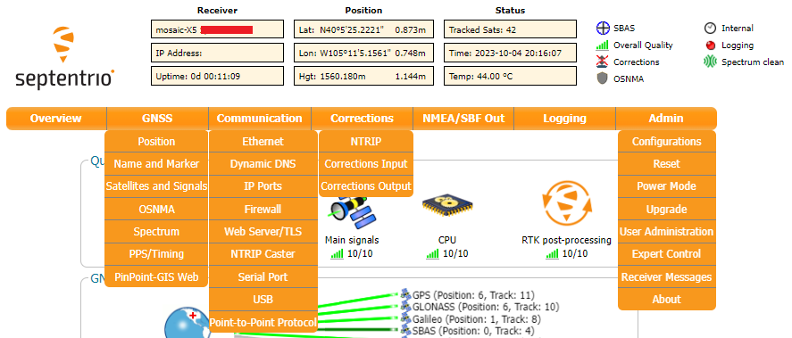

!!! code "ESP32 Firmware"
	We have intentionally kept the ESP32 firmware as simple as possible - supporting only two modes: Ethernet (mode **1**) and WiFi (mode **2**). The intention is that you can easily develop your own firmware for the RTK mosaic-X5 using the Espressif ESP IDF if the SparkFun firmware does not meet your needs.

	You can of course modify the hardware too, should you want to. The design is completely open-source.

	!!! warning "Limitations"
		The ESP32 firmware we provide is only compatible with basic `SSID` and `Password` WiFi authentication. The firmware is not compatible with networks that implement other provisioning methods such as a QR code or a [captive portal](https://en.wikipedia.org/wiki/Captive_portal).

!!! note
	The mosaic-X5 module has numerous capabilities and a multitude of ways to configure and interface with them. Without regurgitating all the information that is documented in Septentrio's user manuals and videos, we have tried to highlight a good majority of the module's aspects.

	With that said, please feel free to [file an issue](../github/file_issue/#discrepancies-in-the-documentation) if you feel we have missed something that may benefit other users. *(Don't forget to provide us with a link to the documentation and what section the information is located.)*


## :septentrio-logo:&nbsp;mosaic-X5

### RxTools Software Suite

!!! tip
	Even if you aren't necessarily interested in it, we highly recommend that users install the [RXTools software suite](https://www.septentrio.com/en/products/gps-gnss-receiver-software/rxtools) before plugging in their board. For Windows PCs, it also includes the USB driver for the module that enables the Ethernet-over-USB support and virtual `COM` ports.

Users should install the [RXTools software suite](https://www.septentrio.com/en/products/gps-gnss-receiver-software/rxtools) on their computer to interact with the mosaic-X5 module through the USB interface. The software package includes the USB-IP driver[^1] necessary to recognize the board as an ethernet device on Windows PCs (1).
{ .annotate }

1. On Linux, the standard Linux CDC-ACM driver is suitable.

[^1]: On Linux, the standard Linux CDC-ACM driver is suitable.


<center>
[:octicons-download-16:{ .heart } Download the RxTools Software from Septentrio](https://www.septentrio.com/en/products/gps-gnss-receiver-software/rxtools){ .md-button .md-button--primary target="blank" }
</center>

??? info "System Requirements[^2]"

	=== "Operating Systems"

		* Windows 7
		* Windows 8
		* Windows 10
		* Fedora 23 *(or later)* using Qt technology.
			* The standalone tools (except `bin2asc`) will run on older distributions.

	=== "Hardware Requirements"
		The minimal hardware requirements *(1Hz update[^3])*:

		* CPU: 1 GHz processor
		* RAM: 1 GB RAM
		* Screen Resolution: 1024×768 or higher resolution

	[^2]: The system requirements and installation instructions are from the RxTools *v22.1.0* user manual. This information may change in later iterations of the software suite. Please refer to the user manual *(of the version you are utilizing)* for the most accurate information.
	[^3]: Higher data rates will require higher CPU speed and more memory capacity.


??? info "Installation Instructions[^2]"

	=== "Windows"
		Users can install RxTools software suite by running the installation executable[^4](1), located in the `RxTools\windows` directory of the downloaded `*.zip` file[^5]. During the installation process, users will be notified if a previous version of RxTools is already installed then the previous version will be uninstalled. Next, users will need to provide an installation directory for the RxTools software suite. Users will then select which of the following applications[^6] are installed:
		{ .annotate }

		1. For RxTools v22.1.0, the installation filename is `RxTools_22_1_0_Installer.exe` for Windows PCs.

		<!-- Create Break from Annotation (list won't render without comment)-->

		<div class="grid" markdown>

		<div markdown>

		* RxControl
		* SBF Converter
		* SBF Analyzer
		* RxLogger

		</div>

		<div markdown>

		* RxUpgrade
		* RxDownload
		* RxPlanner

		</div>

		<div markdown>

		* Data Link
		* RxAssistant
		* RxLauncher

		</div>

		</div>


	=== "Linux[^1]"
		!!! warning
			It is recommended that users **<span style="color:red">NOT</span>** install RxControl as `root`, for security reasons and to avoid installation overwrites of other system settings. To make RxTools available to more than one user, provide a shared installation directory.

		Users can install RxTools software suite by running the installation binary[^4](1), located in the `RxTools/linux-i386/` directory of the downloaded `*.zip` file[^5]. During the installation, users will be prompted for an installation directory. If there are any previous installations of RxControl, please use a different directory to avoid conflicts.
		{ .annotate }

		1. For RxTools v22.1.0, the installation filename is `RxTools_22_1_0_Installer.bin` for Linux.

		??? info "Permission Settings"
			Once installed, users may need to reconfigure their permission settings:

			<div class="annotate" markdown>

			* RxTools will need rights to access the `/dev/ttyS*` serial ports.

				* To access the serial ports, users must be part of the `uucp` and `lock` groups (1). This can be configured by editing the `/etc/group`[^7] file and adding the username to the lines defining the `uucp` group and the `lock` group.

					For example, when adding the user `jsmith` to the `uucp` group, users would modify the `/etc/group` file as shown below:

					```bash
					{--uucp:x:14:uucp--} # (2)!
					{++uucp:x:14:uucp,jsmith++} # (3)!
					```

				* On Linux machine administered centrally on a local network, ask your system administrator to be included in the `uucp` and `lock` groups.
			* RxTools also needs read/write (`rw`) access(4) to the `/dev/ttyS*` serial ports.

				* Users can change the permissions with the `chmod`[^8] command:

					```bash
					chmod 660 /dev/ttyS<add port> # (5)!>
					```

			</div>

			1. On most Linux operating systems, the `/dev/ttyS*` devices are owned by `root` and belong to the `uucp` group with read/write (`rw`) access. Additionally, the devices are normally locked by writing a file in the `/var/lock/` directory, with the same permissions.
			2. Remove
			3. Replace with this line
			4. By default, users will normally have read/write (`rw`) access to the `/dev/ttyS*` serial ports.
			5. where users must specify the port number<br>*e.g. `/dev/ttyS0` might be port `COM1`*

			!!! note
				In order for these changes to take effect, users must update their environment by logging out and back in.

				Be aware that the X-session has to be restarted as well. On most systems, this can be done by pressing the key combination ++ctrl++ + ++alt++ + ++backspace++

		??? info "64-bit OS"
			In order to run the RxTools on a 64-bit Linux operating system, users might have to install the 32-bit version of the `C` standard library.

			* For Fedora installations, this is the `glibc.i686` package.
			* The equivalent for Debian(/Ubuntu) installations is the `ia32-libs` package.

	[^4]: Users will need administrative privileges to install the RxTools software.
	[^5]: Users may need to extract the RxTools installation files from the downloaded, compressed file.
	[^6]: Please see the release notes for the issues and limitations of the RxTools applications.
	[^7]: Requires c privileges.
	[^8]: Changing these permissions also requires `root` privileges.


### USB Driver
=== "Windows"
	If users haven't already installed the [RxTools software suite](https://www.septentrio.com/en/products/gps-gnss-receiver-software/rxtools) on their Windows PC, they will need to install the USB driver[^1] necessary to recognize and interact with the mosaic-X5 module through the USB interface.

	A Windows USB driver for the mosaic-X5 can be installed through two methods:

	<div class="annotate" markdown>

	* RxTools Software Suite (1)
	* mosaic-X5 GNSS Receiver Module (2)

	</div>

	1. The driver is installed during the installation process.
	2. The installation file for the Windows USB driver will be available from the mass-storage device when the board is initially connected to the computer.

	Once installed, the driver emulates two virtual serial ports, which can be accessed as standard `COM` ports to the receiver.

	??? tip "Terminal Emulators"
		Most [terminal emulation programs](https://learn.sparkfun.com/tutorials/112) will not make a distinction between virtual or native COM ports. However, for virtual serial ports, the port settings *(i.e. baud rate, etc.)* are not relevant and the default configuration is used in the terminal emulation program. However, the physical/native `COM` ports will have the following default setting: 

		* Baudrate: 115200bps
		* Data Bits: 8
		* Parity: No
		* Stop Bits: 1
		* Flow Control: None

	??? tip "Having Trouble?"
		For users who are having trouble installing the USB driver, we have an archived version *(v3.0.2[^9])* of the installation file. Users can download [**version 3.0.2**](https://docs.sparkfun.com/SparkFun_GNSS_mosaic-X5/assets/component_documentation/driver/USB_driver_3_0_2_Installer.exe) of the driver, by clicking on the button below.

		[^9]:
			For the latest USB driver from Septentrio, please install their driver through the [RxTools software suite](../rxtools).<br>
			*This driver version was archived at the time that the [mosaic-X5 hookup guide](https://docs.sparkfun.com/SparkFun_GNSS_mosaic-X5/) was written. Please do not request for the file to be updated.*

		<center>
		[:octicons-download-16:{ .heart } Download USB Driver *(v3.0.2)*](https://docs.sparkfun.com/SparkFun_GNSS_mosaic-X5/assets/component_documentation/driver/USB_driver_3_0_2_Installer.exe){ .md-button .md-button--primary target="blank" }
		</center>


=== "Linux"
	On Linux, the standard Linux CDC-ACM driver is suitable for the mosaic-X5 module.


### Web Interface
With the USB driver installed, the mosaic-X5 module supports Ethernet-over-USB. The default IP address allocated for the Ethernet-over-USB interface is `192.168.3.1`. This IP can be entered in any browser to open a connection to the receiver's Web Interface as shown below.

<div class="grid" markdown>

<div markdown>

<figure markdown>
[{ width="600" }](./assets/img/hookup_guide/navigation_tabs.png "Click to enlarge")
<figcaption markdown>All the drop-down navigation tabs in the web interface.</figcaption>
</figure>

</div>

<div markdown>

<center>
<article class="video-500px">
<iframe src="https://www.youtube.com/embed/hrL5J6Q5gX8" title="Septentrio: Getting started with the Septentrio mosaic receiver module" frameborder="0" allow="accelerometer; autoplay; clipboard-write; encrypted-media; gyroscope; picture-in-picture" allowfullscreen></iframe>
</article>
</center>

</div>

</div>


!!! info
	The default IP address cannot be changed; this feature is only to be used when a single receiver is connected to your computer.

??? failure "Invalid IP Address *(WiFi Only)*"
	[One of the documentation pages on Septentrio's website](https://customersupport.septentrio.com/s/article/What-is-the-default-IP-address-to-connect-via-WiFi), specifies a default IP address of `192.168.20.1` for the web interface. However, that address is for a WiFi enabled product and cannot be used with this product.


## :espressif-logo:&nbsp;ESP32

### USB Driver
Users will need to install a USB driver for the CH340 serial-to-USB chip, in order to communicate with the ESP32 module.	The latest USB drivers for the CH340 are available from the manufacturer, on the [WCH website](https://www.wch-ic.com/products/CH340.html?):

<center>
[:octicons-download-16:{ .heart } Download the latest CH340 USB driver from WCH](https://www.wch-ic.com/products/CH340.html?){ .md-button .md-button--primary target="blank" }
</center>

??? abstract "Need Directions?"
	For users having trouble installing the CH340 USB driver, check out our video and hookup guide:

	<div class="grid" markdown align="center">

	<div markdown>

	<div class="video-500px">
	<iframe src="https://www.youtube.com/embed/MM9Fj6bwHLk" title="Tutorial: Installing CH340 Drivers" frameborder="0" allow="accelerometer; autoplay; clipboard-write; encrypted-media; gyroscope; picture-in-picture" allowfullscreen></iframe>
	</div>

	</div>

	<div class="grid cards" markdown>

	-   <a href="https://learn.sparkfun.com/tutorials/908">
		<figure markdown>
		
		</figure>

		---

		**How to Install CH340 Drivers**</a>

	</div>

	</div>


### Terminal Emulator
In order to configure the WiFi settings on the ESP32, users will need to install a [serial terminal emulator](https://learn.sparkfun.com/tutorials/terminal-basics) on their computer.

=== "Windows"
	For Windows computers, we highly recommend [TeraTerm](https://teratermproject.github.io/index-en.html).

=== "Linux"
	Some Linux operating systems will already have the `screen` terminal emulator preinstalled.

!!! abstract "Need Directions?"
	Check out our hookup guide to install your favorite terminal emulator:

	<div class="grid cards" markdown align="center">

	-   <a href="https://learn.sparkfun.com/tutorials/112">
		<figure markdown>
		
		</figure>

		---

		**Serial Terminal Basics**</a>

	</div>

### WiFi Credentials for the Network Bridge
With the CH340 USB driver and a terminal emulator installed, users will now be able to configure the WiFi credentials on the ESP32. In order for the firmware to operate properly, users should have their RTK mosaic-X5 assembled with the network bridge in *WiFi Mode*.

--8<-- "./docs/quick_start.md:140:145"


`1` - **Open a Serial Terminal**
: Open the connection to the CH340 using a baud rate of **115200bps**

`2` - **Put the ESP32 firmware into WiFi mode**
--8<-- "./docs/quick_start.md:186:265"


Once the mosaic-X5 has acquired a satellite signal and is connected to the WiFi network, the OLED will display the antenna's position as Latitude (Lat), Longitude (Long) and Altitude (Alt); the WiFi IP (Internet Protocol) network address. The firmware mode, SSID and password are stored in flash (non-volatile) memory. After changing them, you can disconnect the computer and power the RTK mosaic-X5 using the supplied wall adapter.

--8<-- "./docs/quick_start.md:276:281"

!!! info
	When powering the RTK mosaic-X5 on for the first time, you may see the firmware restart (reboot) several times while it waits for the mosaic-X5 to initialize. This is not an error or anything to be concerned about.

With the RTK mosaic-X5 operating with the configured WiFi network bridge, users should be able to open a web browser on any connected device and navigate to the IP address shown on the OLED display. The browser should be able to access the mosaic-X5's internal web page, where users can configure the mosaic-X5.

