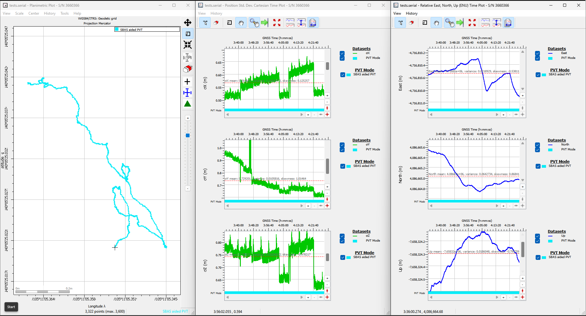
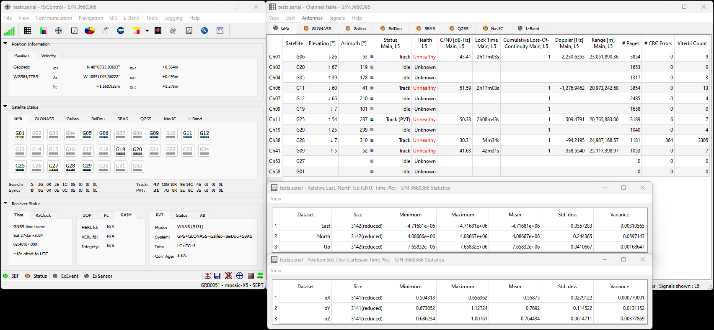
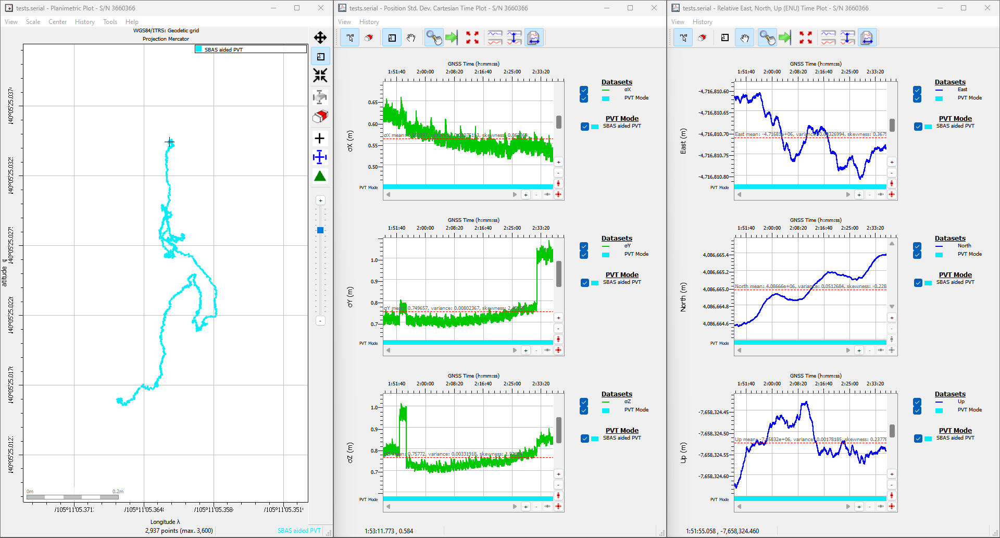
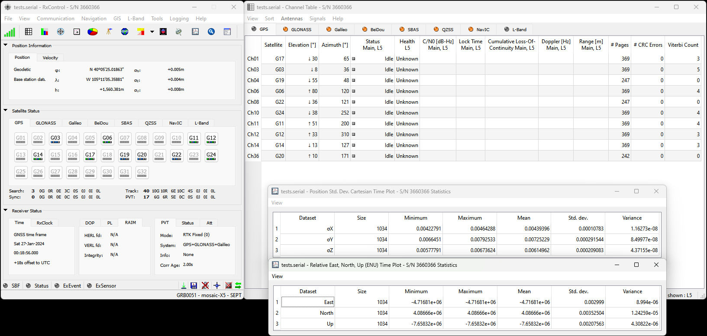
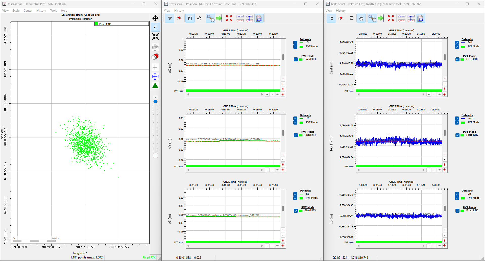
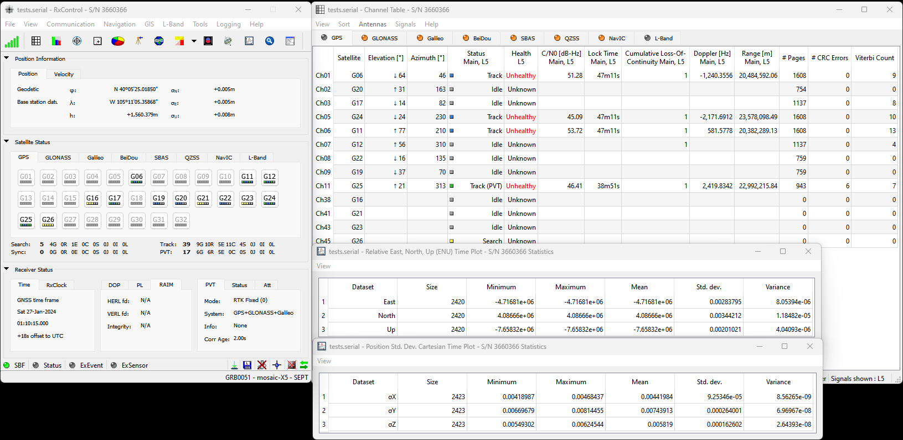
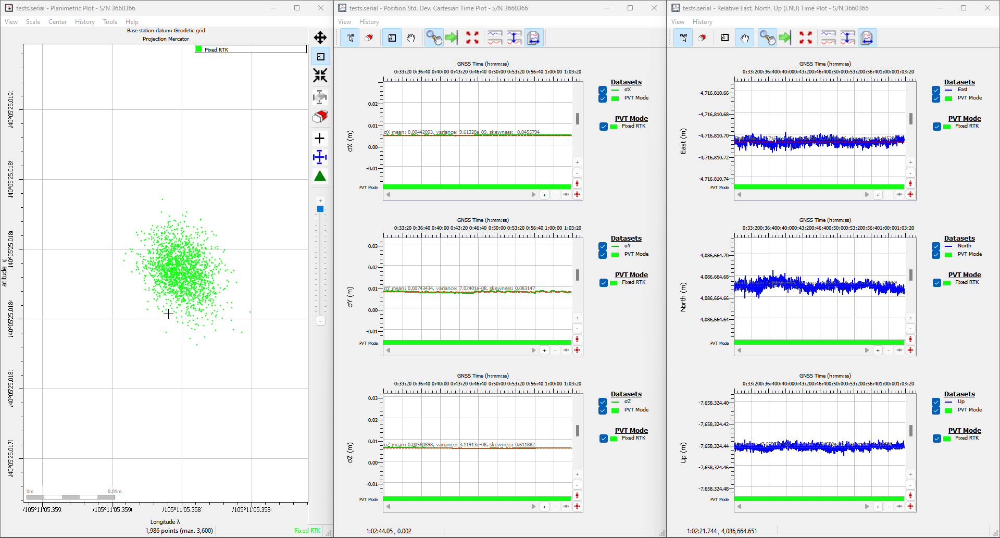

!!! warning "Need Help?"
	If you need technical assistance or more information on a product that is not working as you expected, we recommend heading over to the [SparkFun Technical Assistance](https://www.sparkfun.com/technical_assistance) page for some initial troubleshooting.

	

	[SparkFun Technical Assistance Page](https://www.sparkfun.com/technical_assistance){ .md-button .md-button--primary }
	

	If you can't find what you need there, the [SparkFun GNSS Forum](https://forum.sparkfun.com/viewforum.php?f=116) is a great place to ask questions.

	!!! info "Account Registration Required"
		If this is your first visit to our forum, you'll need to create a [Forum Account](https://forum.sparkfun.com/ucp.php?mode=register) to post questions.

## What is in the Box?
The RTK mosaic-X5 comes packaged as a complete kit, with all the accessories you'd need to set up an RTK base station. Inside the box, users will find the [GNSS antenna](https://www.sparkfun.com/products/21801), RTK mosaic-X5 in its aluminum enclosure, and another box containing additional accessories. Inside, the accessory box, users will find the [CAT-6 Ethernet cable](https://www.sparkfun.com/products/8915), [USB cable](https://www.sparkfun.com/products/15424), [SMA to TNC cable](https://www.sparkfun.com/products/21740), [USB power supply](https://www.sparkfun.com/products/11456), [WiFi antenna](https://www.sparkfun.com/products/145), and [32GB SD card](https://www.sparkfun.com/products/19041).

<figure markdown>
[{ width="300" }](https://cdn.sparkfun.com//assets/parts/2/4/0/7/2/23748-RTK-Mosaic-X5-Kit-All-Feature.jpg "Click to enlarge")
<figcaption markdown>
Everything that is included in the RTK mosaic-X5 kit.
</figcaption>
</figure>

<figure markdown>
[{ width="300" }](./assets/img/hookup_guide/packaged_box.jpg "Click to enlarge")
<figcaption markdown>
The contents of the RTK mosaic-X5 package.
</figcaption>
</figure>

<figure markdown>
[{ width="300" }](https://cdn.sparkfun.com//assets/parts/2/4/0/7/2/23748-RTK-Mosaic-X5-Kit-Accessories.jpg "Click to enlarge")
<figcaption markdown>
Products in the accessories box.
</figcaption>
</figure>

If you are missing any of these items, please reach out to us in our forum.

[:sfe-logo: SparkFun Forum - GNSS Topic](https://forum.sparkfun.com/viewforum.php?f=116){ .md-button .md-button--primary }

## WiFi Connectivity
For WiFi connectivity issues, here are some simple troubleshooting tips:

* Verify that the RTK mosaic-X5 is operating in **Mode: `2`** for WiFi functionality.
* Double-check the WiFi credentials used in the ESP32 configuration.
* Make sure that the configured WiFi network is broadcasting on a 2.4GHz band. The ESP32 cannot access the 5GHz band.
* Make sure that the Ethernet cable is not coiled around/near the WiFi antenna. This will cause data packets to be lost and the mosaic-X5 web page to hang/freeze.

## WiFi Provisioning
The ESP32 firmware we provide is only compatible with basic `SSID` and `Password` WiFi authentication. The firmware is not compatible with networks that implement other provisioning methods such as a [captive portal](https://en.wikipedia.org/wiki/Captive_portal), a QR code, or [Wi-Fi protected setup](https://en.wikipedia.org/wiki/Wi-Fi_Protected_Setup "WPS"). Our intention was that users could easily develop their, own firmware to suit their needs.

!!! tip
	Here are some resources that might be useful for getting started with other provisioning methods:

	

	

	* [ESP-IDF: Wi-Fi Provisioning](https://docs.espressif.com/projects/esp-idf/en/latest/esp32/api-reference/provisioning/wifi_provisioning.html)
	* [ESP-IDF: Example - Wi-Fi Provisioning Manager](https://github.com/espressif/esp-idf/blob/master/examples/provisioning/wifi_prov_mgr/README.md)
	* [AutoConnect: Captive Portal](https://hieromon.github.io/AutoConnect/adcpcontrol.html)

	

	

	:material-youtube: Video Tutorials:

	* [QR Code](https://www.youtube.com/watch?v=JYtDibqJMs0)
	* [Access Point/Web Server](https://www.youtube.com/watch?v=VnfX9YJbaU8) and [Guide](https://dronebotworkshop.com/wifimanager/)

	

	

## Data Logging
For data logging issues, here are some simple troubleshooting tips:

* Make sure that your SD card is formatted to a `FAT32` file system.
	* The `FAT32` file system also limits the maximum capacity of the card to less than **32GB** *(i.e. a 256GB SD card will not work)*.
* Make sure that the mosaic-X5 module has a configured data stream output.
* Use the mosaic-X5 web page to verify that the SD card is mounted as a storage drive.

## OLED Dead Pixels
Got a few dead pixels on your OLED display? Please reach out to us in our forum.

[:sfe-logo: SparkFun Forum - GNSS Topic](https://forum.sparkfun.com/viewforum.php?f=116){ .md-button .md-button--primary }

## Vehicle Power - Dead Battery
Is the RTK mosaic-X5 killing your vehicle's battery?

Make sure that the external power source for the RTK mosaic-X5 is not directly tied to the vehicle's battery, `Always On`, or accessory circuits. Otherwise, users will risk killing the battery while the engine is off. We recommend locating the *ignition on* or *switched power* circuit, which is only powered when the key is in the `On` position *and the engine is running*.

!!! note
	The `On` position, is where a key normally rests after the engine is started. However, users can still move the key from the `Off` position and into the `On` position without starting the engine. In this case, the alternator is not running and keeping the battery charged.

	Modern *eco-efficient* vehicles may automatically shut down the engine if the vehicle is idling too long. Therefore, cutting off the vehicle's alternator that keeps the battery charged. Luckily, most vehicles with this *automatic start/stop* technology will monitor the battery's voltage and restart the engine when required. With this in mind, users may want to initially monitor their battery voltage, in case their vehicle isn't *"so smart"* :sweat_smile:.

## L5 Band
By default, the L5 band is disabled on the mosaic-X5. To enable reception of the L5 band on the mosaic-X5, we have provided instructions on the [Enable the L5 Band](../L5) page.

## Expected Accuracy
Here is a reference of the accuracy that can be expected from the RTK mosaic-X5 at a stationary position in `Rover` mode.

=== "Factory Settings"
	With the factory settings for the mosaic-X5, our location had a standard deviation of &sigma;~x~ = 0.499m and &sigma;~y~ = 0.595m

	

	

	<figure markdown>
	[{ width="400" }](./assets/img/accuracy/summary-default.png "Click to enlarge")
	<figcaption markdown>A summary of the GPS signals and the standard deviation of the antenna's location.</figcaption>
	</figure>

	

	

	<figure markdown>
	[{ width="400" }](./assets/img/accuracy/precision-default.png "Click to enlarge")
	<figcaption markdown>Data recorded from the RTK mosaic-X5 with the default/factory settings.</figcaption>
	</figure>

	

	

	**Conditions:** L1/L2/L5 band antenna, statically mounted to the rooftop of our building, featuring a significant ground plane, with no obstructions for multi-path signals. The RTK mosaic-X5 was connected with a low-loss cable, fully powered at 5V, and default settings.

=== "L5 Band Enabled"
	With the default settings and the `L5` band enabled for the mosaic-X5, our location had a standard deviation of &sigma;~x~ = 0.504m and &sigma;~y~ = 0.673m

	

	

	<figure markdown>
	[{ width="400" }](./assets/img/accuracy/summary-L5.png "Click to enlarge")
	<figcaption markdown>A summary of the GPS signals and the standard deviation of the antenna's location.</figcaption>
	</figure>

	

	

	<figure markdown>
	[{ width="400" }](./assets/img/accuracy/precision-L5.png "Click to enlarge")
	<figcaption markdown>Data recorded from the RTK mosaic-X5 with the L5 band enabled.</figcaption>
	</figure>

	

	

	**Conditions:** L1/L2/L5 band antenna, statically mounted to the rooftop of our building, featuring a significant ground plane, with no obstructions for multi-path signals. The RTK mosaic-X5 was connected with a low-loss cable, fully powered at 5V, and had the `L5` band enabled.

=== "NTRIP - RTK Corrections"
	With the default setting and RTK corrections enabled for the mosaic-X5, our location had a standard deviation of &sigma;~x~ = 4.29mm and &sigma;~y~ = 6.65mm

	

	

	<figure markdown>
	[{ width="400" }](./assets/img/accuracy/summary-RTK.png "Click to enlarge")
	<figcaption markdown>A summary of the GPS signals and the standard deviation of the antenna's location.</figcaption>
	</figure>

	

	

	<figure markdown>
	[{ width="400" }](./assets/img/accuracy/precision-RTK.png "Click to enlarge")
	<figcaption markdown>Data recorded from the RTK mosaic-X5 with the RTK corrections.</figcaption>
	</figure>

	

	

	**Conditions:** L1/L2/L5 band antenna, statically mounted to the rooftop of our building, featuring a significant ground plane, with no obstructions for multi-path signals. The RTK mosaic-X5 was connected with a low-loss cable, fully powered at 5V, and configured as an NTRIP client with corrections from [RTK2go](http://www.rtk2go.com:2101/SNIP::STATUS).

=== "Ideal *(RTK & L5 Band)*"
	Under *"ideal conditions"*, our location had a standard deviation of &sigma;~x~ = 4.68mm and &sigma;~y~ = 6.70mm

	

	

	<figure markdown>
	[{ width="400" }](./assets/img/accuracy/summary-RTK_L5.png "Click to enlarge")
	<figcaption markdown>A summary of the GPS signals and the standard deviation of the antenna's location.</figcaption>
	</figure>

	

	

	<figure markdown>
	[{ width="400" }](./assets/img/accuracy/precision-RTK_L5.png "Click to enlarge")
	<figcaption markdown>Data recorded from the RTK mosaic-X5 with the RTK corrections and the `L5` band enabled.</figcaption>
	</figure>

	

	

	**Ideal:** L1/L2/L5 band antenna, statically mounted to the rooftop of our building, featuring a significant ground plane, with no obstructions for multi-path signals. The RTK mosaic-X5 was connected with a low-loss cable, fully powered at 5V, RTK corrections enabled, and configured to enable the `L5` band.

## Reprogramming the ESP32
In case users accidentally reprogram or corrupt the flash memory on the ESP32, the [factory firmware is available in our GitHub repository](https://github.com/sparkfun/SparkFun_RTK_mosaic-X5/tree/main/Firmware/RTK_mosaic-X5_Firmware).

The batch files in the linked directory are used to flash our factory firmware onto the ESP32 in the RTK mosaic-X5. The batch file relies on the tools from the Arduino IDE and the ESP32 Arduino core and therefore, they will need to be installed before the batch file can be executed.

!!! note
	The batch file is only compatible with Windows computers. For Linux and MacOS, users will need to manually flash the [binary files](https://github.com/sparkfun/SparkFun_RTK_mosaic-X5/tree/main/Firmware/RTK_mosaic-X5_Firmware/build) onto the ESP32.

!!! note
	To compile the firmware, users will need to install the [ESP-IDF](https://idf.espressif.com/), Espressif's development framework for the ESP32. However, the compilation instructions are outside the scope of our support for this product. However, users can refer to the programming guide for the ESP-IDF to figure out how to compile the firmware.

## Enclosure Disassembly
Due to the ESD sensitivity of the mosaic-X5 module, we don't recommend disassembling the RTK mosaic-X5. However, if users must access the PCB to troubleshoot an issue, make a modification, or repair a component, we highly recommend that they take the necessary ESD precautions to avoid damaging the mosaic-X5 module.

!!! warning "Read Before Disassembly!"
	!!! danger "ESD Sensitivity"
		The mosaic-X5 module is sensitive to [ESD](https://en.wikipedia.org/wiki/Electrostatic_discharge "Electrostatic Discharge"). Use a proper grounding system to make sure that the working surface and the components are at the same electric potential.

	??? info "ESD Precaution"
		As recommended by the manufacturer, we highly encourage users to take the necessary precautions to avoid damaging their module.

		- The RTK mosaic-X5 features ESD protection on the USB-C connectors and ethernet jacks.
		- The mosaic-X5 module features internal ESD protection to the `ANT_1` antenna input.

		

		

		

		<article class="video-500px">
		<iframe src="https://www.youtube.com/embed/hrL5J6Q5gX8?si=jOPBat8rzMnL7Uz4&amp;start=26;&amp;end=35;" title="Septentrio: Getting Started Video (playback starts at ESD warning)" frameborder="0" allow="accelerometer; autoplay; clipboard-write; encrypted-media; gyroscope; picture-in-picture" allowfullscreen></iframe>
		</article>
		

		

		-   <a href="https://www.sparkfun.com/products/25572">
			<figure markdown>
			
			</figure>		

			---

			**iFixit Anti-Static Wrist Strap** 
			TOL-25572</a>

		

Before disassembling the enclosure, users should disconnect the power and all cables from the RTK mosaic-X5. This will prevent users from creating any shorts and will facilitate the teardown process further on.

The RTK mosaic-X5 PCB is held in place by the front and rear panels of the enclosure. While users can remove the panels first, we recommend that users disconnect the screw terminal blocks first. Users may find it more difficult to separate the terminal block from the connector later in the disassembly process.

!!! tip "Remove the Screw Terminal Block First"
	Users may find it easiest to remove the screw terminal blocks first; as opposed to later in the teardown process.

	<figure markdown>
	[{ width="400" }](./assets/img/hookup_guide/disassembly-terminal_block.jpg "Click to enlarge")
	<figcaption markdown>Using a soft/rigid object to carefully pry the terminal block off.</figcaption>
	</figure>

	Users can wiggle or use a soft/rigid object to carefully pry the terminal block off. In the picture above, a plastic name tag (~1.5mm thick) is used to carefully pry the terminal block up. We have also found the edge of a [PCB ruler](https://www.sparkfun.com/products/15295) works great too.

Once the terminal blocks have been removed, users can remove the front and rear panels of the enclosure. They are held in place with four, M3, Phillips head screws on the corners of each panel.

!!! tip
	We recommend removing the front panel first to prevent the Qwiic cable from being yanked off the OLED display or main PCB. Once the front panel is free, carefully lift the panel and disconnect the Qwiic cable from the top connector on the OLED display.

At this point, if users have previously disconnected all the cables and the terminal blocks from the back, the RTK mosaic-X5 PCB should slide out of the enclosure. Users can then, remove the rear panel from the enclosure to complete the teardown process.
